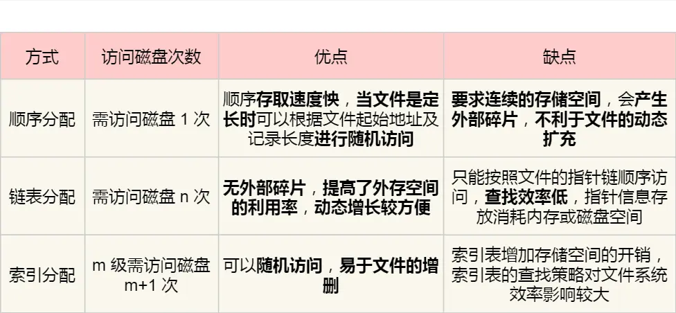
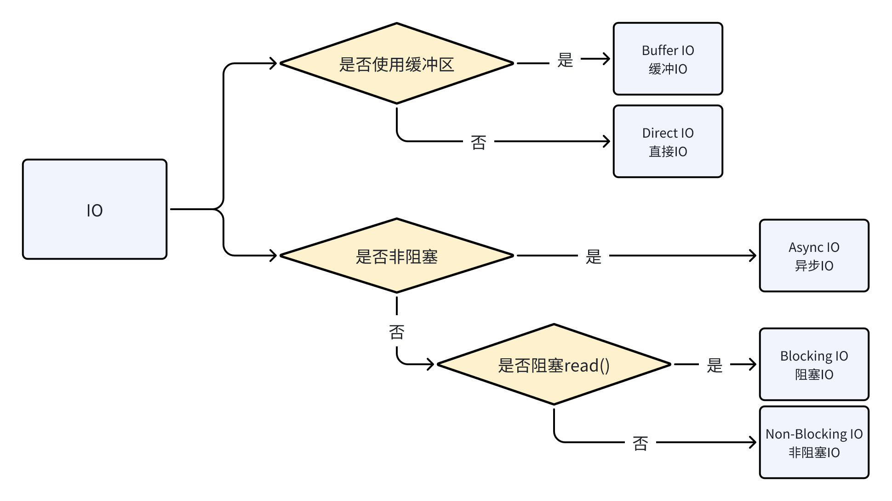

## 一、虚拟文件系统VFS

因为有很多种文件系统（磁盘、内存、网络），为了让上层应用方便使用，引入一个中间层VFS，上层只需要知道VFS的接口，不需要知道底层FS的接口。

**Linux：一切皆文件**

不管文件目录，还是socket、管道等，都是文件形式存储的

在内核中，会为每个文件分配两个数据结构

* inode 索引节点：记录文件元信息（编号、大小、访问权限等），作为唯一标识，也会存储在硬盘中

* dentry 目录项：记录文件名字，inode指针，与其他目录项的层级结构，它是内核维护的一个数据结构，不会存储在硬盘中，而是缓存在内存中。目录项的主要功能是将一个文件名映射到文件系统的inode。

**目录项与目录？**

* 目录本质上是一个特殊类型的文件，其数据结构包含了对目录下文件和子目录的引用。目录包含目录项（directory entries）的列表。也就是说dentry实际上还是有持久化的，只不过往往会被内核在内存中做一个缓冲cache。

用户进程读写文件的单位是字节，os读写文件的单位是数据块，文件系统的工作是屏蔽掉这种差异。

## 二、文件存储

> ### Unix文件存储形式
>
> 文件头inode中带有13个索引项
>
> 1-10个指向文件数据块
>
> 11指向一级索引块
>
> 12指向二级索引块
>
> 13指向三级索引块
>
> **对于小文件可以直接查找到文件，大文件可以通过索引的方式查询索引块**

> ### 软链接和硬链接
>
> 两者都是一个目录项，保存在目录文件中。
>
> 硬链接：直接指向目标inode，每个文件系统都有自己的inode，所以硬链接不能跨文件系统，所以只有删除全部硬链接和源文件，这个文件才会删除。
>
> 软链接：相当于创建一个新的文件，有自己的inode，文件内容是目标文件的路径，可以跨文件系统，所以源文件删除，文件就没了，但软链接文件还会存在。

## 三、文件I/O

文件IO有很多种

### 1. 缓冲 IO （Buffer IO）

数据先从磁盘复制到内核空间的缓冲区（page cache），然后从内核空间缓冲区复制到应用程序的地址空间。

实际的读写都是对page cache做的，而实际操作到文件中，由操作系统来做调度。

**读操作**：直接读cache，如果没有cache就从磁盘读到cache中。

**写操作**：都是先写到cache中，如果制定fsync，则立马刷到盘中然后返回，否则就立即返回，是否刷盘由操作系统决定。

**优点**：减少刷盘次数，隔离用户空间和内存空间

**缺点**：虽然可以利用DMA，但是需要把数据在用户空间、内核空间、磁盘上拷贝，对CPU、内存开销大。

`DMA：避免让cpu阻塞在大量数据搬运的操作中，DMA = Direct Memory Access直接内存存取，可以不经过CPU，实现数据复制的任务。`

> ### mmap和常规IO的差别？
>
> 常规IO会先切换到内核态，定位文件信息，找到inode，查找inode有没有在page cache里面，不在的话，通过inode定位磁盘地址，将数据**复制**到page cache，之后再发起读page cache的过程，将数据从内核空间**复制**到用户空间。
>
> mmap则是直接在进程的虚拟地址空间中，寻找一段连续的空闲的地址，然后切换到内核态，调用内核函数mmap，建立页表，实现文件地址和虚拟地址的映射关系。然后进程发起对这片映射空间的访问，引起缺页异常，实现文件内容到主存的**复制**
>
> mmap实际上可以简单理解为对用户空间的页表做了操作，使其可以映射到内核空间去。

> ### Page Cache是什么？
>
> 是os提供的一个机制，将文件缓存在内核空间中，减少文件IO操作，提高整体的性能。当读取文件时，先看看page cache中有没有，如果有就直接读取，没有的话就会读取文件到cache中。

### 2. 直接 IO （Direct IO）

一般来说缓冲IO就已经是很好用了，但有的应用（比如数据库），认为自己的应用层缓存已经做的很不错了，可以不需要缓冲IO的cache也能有比较优秀的读性能，出于节省内存和CPU，就会使用直接IO。

当应用程序需要直接访问文件而不经过page cache的时候，它打开文件的时候需要指定**O\_DIRECT**标识符。

**优点：**&#x51CF;少拷贝次数

**缺点：**&#x8BFB;写性能跟应用层缓存关系很大。

### 3. BIO - NIO

**BIO：**&#x5F53;用户程序执行read()时，线程会阻塞到内核把数据准备好，并把数据从内核缓冲区复制到用户缓冲区，这时read才会返回。

等待的是两个过程：内核数据准备 + 数据复制到用户态

**NIO：**&#x5185;核数据没准备好时会直接返回，告知没准备好，让用户程序轮询read，直到内核数据准备好，再阻塞到数据复制好。

非阻塞的过程是内核数据准备的过程。

站在应用程序的角度，一直轮询read肯定不好，所以就有了**IO多路复用技术**，比如select、poll，通过IO事件分发，如果没有数据准备好，当前线程就会阻塞，当有数据准备好时，就通知唤醒线程去做处理。

看起来似乎和NIO没啥区别，但是有个巨大优点：可以在一个线程中处理多个socket的IO请求。

以上提到的都是同步IO，都是需要等待数据拷贝的过程的。

> ### 网络通信为什么需要IO多路复用？
>
> 因为网络通信主要是基于socket模型来进行的：
>
> * 服务端&#x20;
>
>   1. bind(): 服务端会创建一个Socket并绑定到一个IP地址和端口
>
>   2. listen(): 监听这个ip:port
>
>   3. accept(): 从内核获取客户端的连接，如果没有连接，就会阻塞住
>
> * 客户端&#x20;
>
>   1. connect(): 发起三次握手连接
>
> 在TCP连接的过程中，会有半连接和全连接两个队列，如果全连接队列不是空的，accept就会从队列中拿出一个socket返回给应用程序，这之后双方就可以开始read、write
>
> 而在Linux中一切皆文件，**socket也是文件，也就会对应一个文件描述符fd**，socket文件中包含了指向发送和接收的数据包的指针。
>
> ### 同步阻塞BIO：
>
> 每次只能处理一个请求，无法并发，就算是把处理的逻辑进行多线程处理，开销也很大
>
> ### 同步非阻塞NIO：
>
> 每次先尝试accept，有连接就加入一个fds集合，没连接就立马进行下一轮循环逻辑（导致CPU忙轮询）。每轮都会遍历一遍fds，查看有没有可以读写的数据。**IO多路复用就属于NIO的一种。**
>
> ### IO多路复用：
>
> 服务端采用单线程通过 `select/poll/epoll` 等系统调用获取 fd 列表，遍历有事件的 fd 进行 `accept/recv/send` ，使其能支持更多的并发连接请求。
>
> * select/poll：
>
> * 将已连接的 Socket 都放到一个fds集合，然后把fds拷贝到内核，内核遍历fds，标记可读可写的fd，然后再将fds拷贝回用户态，用户态遍历fds，找到可以读写的socket。
>
> * 2次拷贝、2次遍历
>
> * select的fds用的是BitsMap，poll用的是链表，本质上没有太大差别。
>
> * select的最大连接数大小有 `FD_SETSIZE` 来限制，poll使用的链表没有最大连接数的限制
>
> * 当客户端越多，也就是 Socket 集合越大，Socket 集合的遍历和拷贝会带来很大的开销
>
> * epoll：
>
>   1. epoll 使用**事件驱动**的机制，内核里**维护了一个链表来记录就绪事件，当某个 socket 有事件发生时，通过回调函数**内核会将其加入到这个就绪事件列表中，当用户调用`epoll_wait()`函数时，只会返回有事件发生的文件描述符的个数。不需要像 select/poll 那样轮询扫描整个集合。
>
>   2. epoll 在内核里使用红黑树来跟踪进程所有待检测的文件描述字，把需要监控的 socket 通过 `epoll_ctl()` 函数加入内核中的红黑树里，红黑树的增删改复杂度为O(logN)。不需要像 select/poll 在每次操作时都传入整个 Socket 集合，减少了内核和用户空间大量的数据拷贝和内存分配。

### 4. AIO

真正异步的IO，上面提到的两个过程都不用等待。

具体体现就是，BIO的过程中，线程不需要阻塞等待，而是可以立即返回，等待内核拷贝数据完成之后，再来通知线程。

### 总结

IO有非常非常多分类的，不同的所谓NIO BIO DirectIO等，并不是平行的一些概念，具体还是要根据一些内容和特点来分类。

## 四、零拷贝

零：用户态和内核态间 0 次拷贝。因为这种拷贝不能通过DMA，只能由CPU拷贝，占用大量CPU资源。、

### 以文件传输为例

文件传输涉及两个步骤：

1. read：从本地把需要发送的文件读出来

2. write：把文件数据写到IO设备中，比如网卡

### 1. 传统传输方式：

主要有四个拷贝过程，2次系统调用（4次CPU上下文切换）：

read：阻塞、系统调用sys\_read

write：阻塞、系统调用sys\_write

一般来说，不需要对数据做加工处理的场景，是没有必要把数据拷贝到用户态的。这种拷贝只能CPU来进行，性能不行。

### 2. mmap + write

使用mmap来加速read过程，mmap也会做系统调用

read：

write：阻塞、系统调用sys\_write

mmap可以节省一次拷贝，一共3次拷贝，但还是有两次系统调用

### 3. sendfile

将read 和write 结合为一次系统调用

节省了一次系统调用。

但这还是有一次CPU拷贝，所以linux高版本支持了SG-DMA技术，可以把CPU拷贝的那一次节省。真正实现了零拷贝。一共两次DMA拷贝。

## 贡献者

  <!-- 贡献者 1 -->    
  

    
    
<a href="https://github.com/spaceluke" target="_blank">魏知乐</a>

  

