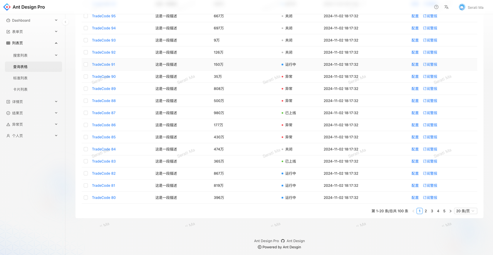

# 完成一个前端项目（vue或react）

## 前置知识储备

基础三件套，vue或react，组件库，状态管理库，路由库

### 对于基础三件套

#### Html

你需要掌握基本的布局能力，并熟悉常用的html元素

#### Css

相比于初步的html学习，css的属性有非常多，通常是无法一下子全记住的，你只需要记住常用的一些样式用于元素定位以及元素样式的修改，在业务场景中遇到无法解决的样式问题时，你可以随时gpt或是寻找相关博客

#### Js

对于js部分，同样的在开始时你只需要掌握基础的js语法与数据类型，保证你在查阅相关第三方库官方文档的时候你不会出现代码看不懂的情况即可

## 1.前期准备

在开发前，确定好项目的大体框架，避免在开发到一半发生要大改代码的情况，同时在你确定大体框架后，将使开发过程更加顺畅

### 与ui确定整个项目的大致框架

你需要在开始写代码前清楚你在做的是一个什么项目，明确这个项目的功能有哪些，实现这些功能是为了什么

在收到ui图时，前端需要自己先过一遍，检查其中是否有不合理的地方，并及时向ui反馈，避免在开发到一半时才发现这个问题，这个时候前端和ui一般都需要去大改，非常的浪费时间（也很折磨人）

### 与后端确定好接口

无论你使用的是typescript还是javascript，你都需要在开发前与后端（可能还有产品经理）确定好开发过程中可能需要使用到的接口，

确定接口包括但可能不止如下：

* 前端要传给后端的参数

* 后端需要传给你的值

* 哪些页面需要哪些接口

* 请求的类型

在项目大体框架确定好之后，在开发过程应尽可能避免修改项目开发的方向

## 2.项目初始化

### 技术选型

根据项目的需求确定你在开发这个项目所需要的框架和第三方库

创建项目

引入所需的第三方库

> 常见的网络请求库：axios
>
> 如果你是第一次创建vue3项目的话：element plus，pinia,vue-router
>
> 如果你是第一次创建react项目的话：antd，react-router-dom，antd,react-router-dom

项目所需的基础配置：如eslint，primmer

> 当你确定好项目初始化完成之后，你可以提交你这个项目的第一个commit了，如：feat：init

## 3.确定项目结构

在这一步中你将确定项目的哪些代码放在哪里，并确定你的开发模式

先把src下如views，api，types（如果是ts），contants，utils等目录创建好，并完善其中的部分目录内容

以下是一个前端项目中可能会出现的目录结构：

```javascript
src:
  ———— api
  ———— assets
  ———— component
  ———— constant
  ———— hooks
  ———— mock
  ———— request
  ———— routes
  ———— slice
  ———— store
  ———— types
  ———— utils
  ———— views
```

```javascript

const a = 1
const fun =() =>{
    
}
const fun1 =() =>{
    console.log(a)
}
```

### 完善基础配置

完成如页面布局封装组件，基础路由表，axios封装

#### 基础布局

通常情况下一个常规的前端项目都会有一个Layout组件（也就是页面布局的组件），之后开发的大部分页面都是在这个布局下开发的

你需要确定你使用的是header-content-footer布局还是header-sider-content-footer布局或是其他的布局类型，并完成相应的布局组件封装，

以antd pro为例：



antd pro采用的是header-content-footer-sider的布局

发现无论选择哪个页面，只有content内的元素在改变

```javascript
 <Layout >
      <Sider>
        <Menu />
      </Sider>
      <Layout>
        <Header />
        <Content>
           {children}
        </Content>
        <Footer >
        </Footer>
      </Layout>
    </Layout>
```


你可以基于以上的代码来实现类似的布局，确保只有content在变的核心Layout组件接收一个组件作为它的参数，再将该组件参数放在content中，就可以实现只有content部分在改变，而其他部分不改变的效果

一个基础布局组件对于前端项目的开发是很重要的，如果你一个页面一个布局，将增大开发难度和维护难度

#### 路由表封装

> 在next18中是使用约定式路由的方法来管理路由，而这里所提到的路由表封装是相对常见的路由管理方式

* 你在router文件下创建好相应页面的route对象，并在index中导出路由表

> - 通常在给路由对象配置对应的组件时，会将目标组件处理为懒加载组件

* 通常是将上述实现的基础布局组件作为最基础路由，实现无论路由如何跳转，但是布局仍是同一个布局，只有内部的content在改变

* 然后在入口文件中使用该路由表，遍历产生对应的路由（在vue项目中可能并不需要这一部分的操作，你只需要在对应位置创建好路由对象列表即可）

* 在导航栏中运用你的路由表，通常是将router自带的Link放入导航栏的子项实现点击子项跳转到对应的页面（如果项目中有导航栏的话）

#### axios封装（如果你使用axios）

axios是前端网络请求方面常使用的第三方库，你可以基于axios来实现你需要的api

通常在使用axios前，都会对axios进行相应的封装，如：在收到后端返回的404状态码之后要如何操作，在对后端请求前对请求的配置

你可以将axios封装并导出，并在api文件夹下统一创建api，提高代码的可维护性

## 4.完成通用组件

遵守先普通后特殊的原则，将一个项目中高频出现的组件封装好，以经典的图书管理系统为例，filter组件在各个table中都会出现，因此filter的封装是不可避免的，在你封装通用组件的同时，这时候也应该着手开始写通用工具类函数和hook了，同样以图书管理系统为例子，通常后端返回的数据是不能直接放入table中，因此这时候你就要写一个数据转换的工具函数来在每个table组件中对后端返回的数据进行处理，使其可以放进table中

## 5.开始写页面

在写一个页面之前，先确定该页面可能涉及的接口，并写好相关api（忌讳在前端页面中写静态假数据自测，在自测效率低之外你在前后联调时还需要再将其删除并修改相关代码，可能遇到意料之外的bug），然后可以开始写页面了，通常在完成一个页面后，前端会使用mock工具进行自测，简单的如apifox，也可以使用如mock.js等mock库模拟服务端，通常使用第三方mock相关的js库来模拟服务端，更好定制服务端，后续直接注释或删掉即可，不需要对api文件下的代码进行改动，前端自测以减少后续与后端联调的压力（如果前端未自测就跟后端联调，会浪费很多不必要的时间）

## 6.前后联调

## 7.测试

## 8.你已经完成一个属于你的前端项目
## 贡献者

<div class="contributors-list" style="display: flex; gap: 20px; flex-wrap: wrap; margin-top: 20px;">
  <!-- 贡献者 1 -->
  <div style="text-align: center;">
    
    <p style="margin-top: 8px;"><a href="https://github.com/zhuningyu3" target="_blank">吴限</a></p>
  </div>
</div>