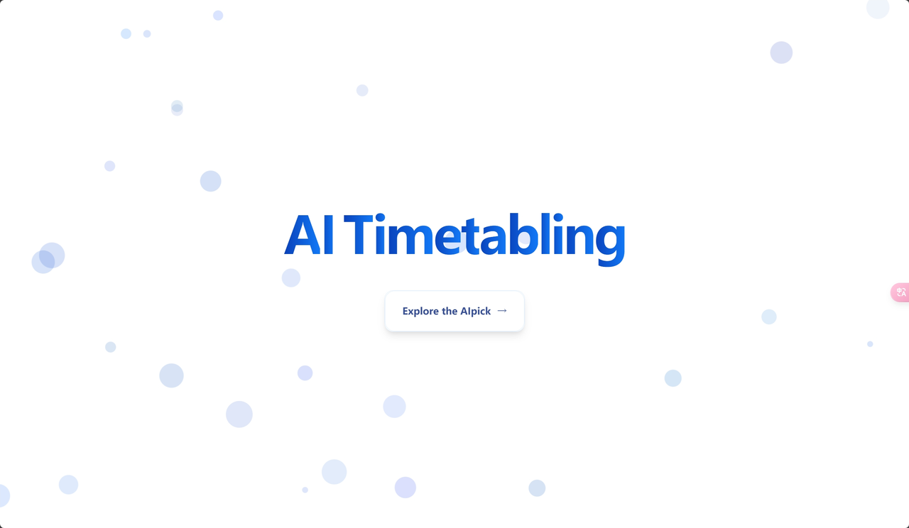

> 作为前端的技术人员来说，主要要解决的两个问题就是展示页面的实现和与后端数据对接的实现，那么接下来的这篇文档主要是要讲解一下如何在展示页面的实现里面使用动画来提高我们展示页面的上限（而展示页面的下限是由 UI 的审美设计和前端的页面复刻能力来决定的）。OK，话不多说，让我们直接进入正题

# 一、技术工具与准备工作

- **背景：**&#x6B64;文档主要用于对前端的系统动画美化

- **工具使用：vue** **js** **css Chatgpt**（你所习惯的 AI 工具，主要用来检查和修改自己发现不了的语法报错）

- **准备工作：**

  找一个舒服的位置，依据自己的习惯可以在耳机里放些音乐，毕竟修改动画和页面美化是一个很枯燥的事情，~~有条件的可以把自己的后端队友喊到旁边和自己一起工作，这样当你写红温的时候可以对其压力从而让自己放松~~

# 二、熟练掌握动画的几个要素

## 2.1 永远绕不开的 “CSS”

---

首先要注意的是 css 的基础代码太多太多，根本不可能全记在脑子里，在实际的开发中也没有说不能对 css 语法进行查询，所以说实践比看视频学习 css 要有用的多，用多了自然就熟悉了，以下主要讲的是 css 的一些小妙招，而不是基础的语法怎么学

---

### 2.1.1 CSS —— 玻璃态和阴影妙用

- 很多时候你的 UI 再给你设计页面的卡片模块时，大多数情况下是考虑不到具体的页面实现效果的（也有一部分是考虑到前端能否实现从而没有这么设计），但作为前端的我们要意识到的是玻璃态（Glassmorphism）和阴影（Shadow）是两种非常流行的设计趋势，它们可以用来创建现代感和层次感的 UI 效果

- 具体如何实现的代码如下

```css
/* 玻璃态的具体代码实现 */
backdrop-filter: blur(10px);
rgba(255, 255, 255, 0.1);
border: 1px solid rgba(255, 255, 255, 0.2);


/* 阴影效果 */
box-shadow: 0 8px 32px rgba(0, 0, 0, 0.2);
```

1. 玻璃态效果：

   - 使用 `backdrop-filter: blur(10px);` 对背景进行模糊处理。

   - 背景颜色使用半透明的 `rgba(255, 255, 255, 0.1)`，以实现玻璃态的视觉效果。

   - 添加 `border: 1px solid rgba(255, 255, 255, 0.2);` 来增强玻璃感。

2. 阴影效果：

   - 使用 `box-shadow: 0 8px 32px rgba(0, 0, 0, 0.2);` 添加阴影，增强层次感。

---

### 2.1.2 CSS —— “：hover”的妙用

- &#x20; 当你拿到 UI 的设计图时，它肯定是一个静态的图片页面而不是一个视频，那么在我们打服务外包等之类的比赛，第一轮的录视频的时候，页面的交互感就显得极为重要。那么`:hover` 作为 CSS 中的一个伪类，用于定义鼠标悬停在元素上时的样式。它在提升用户体验和交互性方面非常有用，可以为网页元素添加动态效果

- 以下为具体代码的举例

#### 1. 按钮悬停效果

通过 `:hover`，可以为按钮添加悬停时的视觉反馈，提升交互性。

```css
.btn {
  background: #4caf50;
  color: white;
  padding: 10px 20px;
  border: none;
  border-radius: 5px;
  cursor: pointer;
  transition: all 0.3s ease;
}

.btn:hover {
  background: #45a049; /* 深绿色背景 */
  transform: translateY(-2px); /* 略微上移 */
  box-shadow: 0 4px 8px rgba(0, 0, 0, 0.2); /* 添加阴影 */
}
```

#### 2. 导航菜单悬停效果

在导航菜单中，`:hover` 可以用来显示下拉菜单或改变菜单项的样式。

```css
.nav-item {
  padding: 10px 20px;
  transition: background-color 0.3s;
}

.nav-item:hover {
  background-color: #f0f0f0; /* 悬停时背景变浅 */
}

.dropdown {
  display: none;
  position: absolute;
  background: white;
  box-shadow: 0 4px 8px rgba(0, 0, 0, 0.1);
}

.nav-item:hover .dropdown {
  display: block; /* 悬停时显示下拉菜单 */
}
```

#### 3. 图片悬停效果

`:hover` 可以用来为图片添加悬停效果，例如放大、添加阴影或显示覆盖层。

```css
.image-container {
  position: relative;
  overflow: hidden;
  border-radius: 10px;
}

.image-container img {
  width: 100%;
  transition: transform 0.3s ease;
}

.image-container:hover img {
  transform: scale(1.05); /* 悬停时图片放大 */
}

.overlay {
  position: absolute;
  top: 0;
  left: 0;
  width: 100%;
  height: 100%;
  background: rgba(0, 0, 0, 0.5);
  color: white;
  display: flex;
  justify-content: center;
  align-items: center;
  opacity: 0;
  transition: opacity 0.3s;
}

.image-container:hover .overlay {
  opacity: 1; /* 悬停时显示覆盖层 */
}
```

#### 4. 卡片悬停效果

&#x20; `:hover` 可以用来为卡片添加悬停时的阴影、位移或动画效果。

```css
.card {
  width: 300px;
  padding: 20px;
  background: white;
  border-radius: 10px;
  box-shadow: 0 4px 8px rgba(0, 0, 0, 0.1);
  transition: all 0.3s ease;
}

.card:hover {
  transform: translateY(-5px); /* 略微上移 */
  box-shadow: 0 8px 16px rgba(0, 0, 0, 0.2); /* 增加阴影 */
}
```

#### 5. 文本悬停效果

&#x20; `:hover` 可以用来改变文本的颜色、下划线或背景色，增强可读性和交互性。

```css
.link {
  color: #0066cc;
  text-decoration: none;
  transition: color 0.3s;
}

.link:hover {
  color: #004499; /* 深蓝色 */
  text-decoration: underline; /* 添加下划线 */
}
```

#### 6. 响应式设计

&#x20; `:hover` 可以与媒体查询结合，确保在不同设备上提供一致的用户体验。这里就不细讲了，这里主要是针对不同屏幕或者设备来实现的

#### 7. 结合其他伪类

&#x20; `:hover` 可以与其他伪类结合使用，这些复杂的 `:hover` 效果可以通过 CSS 的 `transition`、`animation` 和 `transform` 属性实现，为网页增添丰富的交互体验。通过这些效果，你可以为用户提供一个更加生动和吸引人的界面。

&#x20; 当然我只列举了几种最简单的变化，更复杂的交互效果则是需要伪类的丰富和构思的来实现的

```css
.input-field {
  padding: 10px;
  border: 1px solid #ccc;
  border-radius: 5px;
  transition: border-color 0.3s;
}

.input-field:focus {
  border-color: #0066cc; /* 聚焦时边框变蓝 */
}

.input-field:hover {
  border-color: #999; /* 悬停时边框变浅 */
}

.input-field:active {
  border-color: #666; /* 激活时边框变深 */
}

1. 按钮悬停效果
/* 波纹效果 */
.btn {
  background: #4caf50;
  color: white;
  padding: 10px 20px;
  border: none;
  border-radius: 5px;
  cursor: pointer;
  position: relative;
  overflow: hidden;
  transition: all 0.3s ease;
}

.btn:hover {
  background: #45a049;
}

.btn::after {
  content: "";
  position: absolute;
  top: 50%;
  left: 50%;
  width: 0;
  height: 0;
  background: rgba(255, 255, 255, 0.3);
  border-radius: 50%;
  transform: translate(-50%, -50%);
  transition: width 0.5s, height 0.5s;
}

.btn:hover::after {
  width: 200%;
  height: 200%;
}

/* 3D 效果 */
.btn {
  background: #4caf50;
  color: white;
  padding: 10px 20px;
  border: none;
  border-radius: 5px;
  cursor: pointer;
  position: relative;
  perspective: 1000px;
  transition: all 0.3s ease;
}

.btn::before {
  content: "";
  position: absolute;
  top: 0;
  left: 0;
  width: 100%;
  height: 100%;
  background: rgba(255, 255, 255, 0.2);
  border-radius: 5px;
  transform: translateZ(-5px);
  transition: transform 0.3s ease;
}

.btn:hover {
  transform: translateY(-5px);
  box-shadow: 0 10px 20px rgba(0, 0, 0, 0.2);
}

.btn:hover::before {
  transform: translateZ(-10px);
}

2. 卡片悬停效果

/* 3D 翻转效果 */
.card {
  width: 300px;
  height: 200px;
  perspective: 1000px;
}

.card-inner {
  width: 100%;
  height: 100%;
  position: relative;
  transform-style: preserve-3d;
  transition: transform 0.6s;
  box-shadow: 0 4px 8px rgba(0, 0, 0, 0.1);
}

.card:hover .card-inner {
  transform: rotateY(180deg);
}

.card-front,
.card-back {
  position: absolute;
  width: 100%;
  height: 100%;
  backface-visibility: hidden;
  border-radius: 10px;
  padding: 20px;
  box-sizing: border-box;
}

.card-front {
  background: white;
}

.card-back {
  background: #4caf50;
  color: white;
  transform: rotateY(180deg);
}

/* 渐变背景效果 */
.card {
  width: 300px;
  padding: 20px;
  background: white;
  border-radius: 10px;
  box-shadow: 0 4px 8px rgba(0, 0, 0, 0.1);
  transition: all 0.3s ease;
  position: relative;
  overflow: hidden;
}

.card::before {
  content: "";
  position: absolute;
  top: 0;
  left: 0;
  width: 100%;
  height: 100%;
  background: linear-gradient(45deg, #ff9a9e, #fad0c4, #ffd1ff, #9bf6ff);
  opacity: 0;
  transition: opacity 0.3s ease;
  z-index: -1;
}

.card:hover {
  transform: translateY(-5px);
  box-shadow: 0 8px 16px rgba(0, 0, 0, 0.2);
}

.card:hover::before {
  opacity: 0.3;
}

3. 图片悬停效果
/* 局部放大效果 */
.image-container {
  position: relative;
  overflow: hidden;
  border-radius: 10px;
  width: 300px;
  height: 200px;
}

.image-container img {
  width: 100%;
  height: 100%;
  object-fit: cover;
  transition: transform 0.5s ease;
}

.image-container:hover img {
  transform: scale(1.1);
}

.overlay {
  position: absolute;
  top: 0;
  left: 0;
  width: 100%;
  height: 100%;
  background: rgba(0, 0, 0, 0.5);
  color: white;
  display: flex;
  justify-content: center;
  align-items: center;
  opacity: 0;
  transition: opacity 0.3s ease;
}

.image-container:hover .overlay {
  opacity: 1;
}

/* 波浪形扭曲效果 */
.image-container {
  position: relative;
  overflow: hidden;
  border-radius: 10px;
  width: 300px;
  height: 200px;
}

.image-container img {
  width: 100%;
  height: 100%;
  object-fit: cover;
  transition: transform 0.5s ease;
}

.image-container:hover img {
  transform: perspective(500px) rotateX(20deg);
}

.overlay {
  position: absolute;
  top: 0;
  left: 0;
  width: 100%;
  height: 100%;
  background: rgba(0, 0, 0, 0.5);
  color: white;
  display: flex;
  justify-content: center;
  align-items: center;
  opacity: 0;
  transition: opacity 0.3s ease;
}

.image-container:hover .overlay {
  opacity: 1;
}

4. 文本悬停效果

/* 打字机效果 */

.typewriter {
  width: 300px;
  margin: 50px auto;
  text-align: center;
  overflow: hidden;
  white-space: nowrap;
  border-right: 2px solid #4caf50;
  font-family: monospace;
  letter-spacing: 2px;
}

.typewriter::after {
  content: "";
  position: absolute;
  right: 0;
  top: 0;
  width: 0;
  height: 100%;
  background: white;
  transition: width 0.3s ease;
}

.typewriter:hover::after {
  width: 100%;
  animation: typing 1s steps(30, end);
}

@keyframes typing {
  from {
    width: 0;
  }
  to {
    width: 100%;
  }
}

/* 涟漪效果 */

.ripple {
  display: inline-block;
  padding: 10px 20px;
  background: #4caf50;
  color: white;
  border-radius: 5px;
  position: relative;
  overflow: hidden;
  transition: all 0.3s ease;
}

.ripple::after {
  content: "";
  position: absolute;
  top: 50%;
  left: 50%;
  width: 0;
  height: 0;
  background: rgba(255, 255, 255, 0.3);
  border-radius: 50%;
  transform: translate(-50%, -50%);
  transition: width 0.5s, height 0.5s;
}

.ripple:hover::after {
  width: 200%;
  height: 200%;
}
```

在这种 hover 的变化中，`::before` 和 `::after` 可以说是使用最多的，那么这一块我就不在文档里面细讲了，想要学习的可以自己查询 AI 或者看看视频，学习的成本不是很大

> [https://space.bilibili.com/396803537/lists/3429284?type=season](https://space.bilibili.com/396803537/lists/3429284?type=season)

> 【CSS 中的 before 和 after】<br>
> [https://www.bilibili.com/video/BV13y411q7aJ/?share_source=copy_web&vd_source=c8cd5e9f03ea82fd87c1561730509483](https://www.bilibili.com/video/BV13y411q7aJ/?share_source=copy_web&vd_source=c8cd5e9f03ea82fd87c1561730509483)

---

> 当然在实际的开发中，一个 button 的动画有可能就要写五分钟，是一个很烦的事情，我的建议是先让 ai 跑一下在自己开始修改，建房子和装修房子对我们这个实时反馈很强的前端来说差别还是很大的，可以极大地减少工作量和红温值

---

### 2.1.3 CSS —— 动画，关键帧的妙用

&#x20;CSS 中的动画主要用了 `animation` 和 `transition` 属性，包括它们的语法、参数、区别和应用场景。

#### 1. **`animation` 属性**

`animation` 属性用于定义 CSS 动画，通过 `@keyframes` 规则来指定动画的关键帧。

**语法**

```css
animation: name duration timing-function delay iteration-count direction
  fill-mode;
```

**参数说明**

- **name**：动画的名称，对应 `@keyframes` 中定义的动画名称。

- **duration**：动画持续时间（以秒或毫秒为单位）。

- **timing-function**：动画的速度曲线（如 `ease`、`linear`、`ease-in` 等）。

- **delay**：动画延迟时间（以秒或毫秒为单位）。

- **iteration-count**：动画播放次数（如 `infinite` 表示无限循环）。

- **direction**：动画播放方向（如 `normal`、`reverse`、`alternate` 等）。

- **fill-mode**：动画结束后元素的样式（如 `forwards`、`backwards` 等）。

**示例**

```css
@keyframes gradient {
  0% {
    background-position: 0% 50%;
  }
  50% {
    background-position: 100% 50%;
  }
  100% {
    background-position: 0% 50%;
  }
}

.text {
  font-size: 36px;
  background: linear-gradient(90deg, #ff9a9e, #fad0c4, #ffd1ff, #9bf6ff);
  -webkit-background-clip: text;
  -webkit-text-fill-color: transparent;
  animation: gradient 3s ease infinite;
}
```

- **`gradient`**：动画名称。

- **`3s`**：动画持续时间为 3 秒。

- **`ease`**：动画速度曲线为 `ease`（先慢后快）。

- **`infinite`**：动画无限循环。

#### 2. **`transition` 属性**

`transition` 属性用于定义元素从一个状态过渡到另一个状态时的动画效果。

**语法**

```css
transition: property duration timing-function delay;
```

**参数说明**

- **property**：需要过渡的 CSS 属性（如 `all` 表示所有属性）。

- **duration**：过渡持续时间（以秒或毫秒为单位）。

- **timing-function**：过渡的速度曲线（如 `ease`、`linear` 等）。

- **delay**：过渡延迟时间（以秒或毫秒为单位）。

**示例**

```css
.btn {
  padding: 12px 24px;
  background: #4caf50;
  color: white;
  border: none;
  border-radius: 50px;
  cursor: pointer;
  transition: all 0.3s ease;
}

.btn:hover {
  background: #45a049;
  transform: translateY(-2px);
  box-shadow: 0 4px 8px rgba(0, 0, 0, 0.2);
}
```

- **`all`**：所有属性都会过渡。

- **`0.3s`**：过渡持续时间为 0.3 秒。

- **`ease`**：过渡速度曲线为 `ease`（先慢后快）。

**3. 区别与应用场景**

**`animation`**

- **用途**：用于创建复杂的动画效果，通常需要定义多个关键帧。

- **特点**：可以无限循环，动画效果更复杂。

- **示例**：渐变背景动画、加载动画等。

**`transition`**

- **用途**：用于定义状态之间的平滑过渡效果。

- **特点**：通常用于悬停、点击等交互效果。

- **示例**：按钮悬停效果、卡片翻转效果等。

**4. 详细讲解**

**`animation` 的详细讲解**

- **`name`**：动画的名称，对应 `@keyframes` 中定义的动画名称。

- **`duration`**：动画持续时间（以秒或毫秒为单位）。

- **`timing-function`**：动画的速度曲线，可以是 `ease`、`linear`、`ease-in`、`ease-out`、`ease-in-out` 或自定义的贝塞尔曲线。

- **`delay`**：动画延迟时间，可以是正数或负数。

- **`iteration-count`**：动画播放次数，可以是具体的数字或 `infinite`。

- **`direction`**：动画播放方向，可以是 `normal`、`reverse`、`alternate` 或 `alternate-reverse`。

- **`fill-mode`**：动画结束后元素的样式，可以是 `none`、`forwards`、`backwards` 或 `both`。

**`transition` 的详细讲解**

- **`property`**：需要过渡的 CSS 属性，可以是具体的属性名或 `all`。

- **`duration`**：过渡持续时间，以秒或毫秒为单位。

- **`timing-function`**：过渡的速度曲线，可以是 `ease`、`linear`、`ease-in`、`ease-out`、`ease-in-out` 或自定义的贝塞尔曲线。

- **`delay`**：过渡延迟时间，以秒或毫秒为单位。

**5. 实际应用**

**`animation` 的实际应用**

- **渐变背景动画**：为背景创建动态渐变效果。

- **加载动画**：创建加载时的动态效果。

- **悬停动画**：为元素添加悬停时的动态效果。

**`transition` 的实际应用**

- **按钮悬停效果**：为按钮添加悬停时的平滑过渡效果。

- **卡片翻转效果**：为卡片添加翻转时的平滑过渡效果。

- **导航菜单效果**：为导航菜单项添加悬停时的平滑过渡效果。

通过合理使用 `animation` 和 `transition`，你可以为网页设计增添丰富的动态效果，提升用户体验。

#### 3. `@keyframes` 属性

`@keyframes` 是一个非常强大的 CSS 动画工具，可以用来创建各种动态效果。以下是一些常见的应用场景：

1. 简单的动画：如元素的移动、缩放、旋转等。

2. 复杂的动画：如渐变背景动画、加载动画、卡片翻转动画等。

3. 自定义动画：通过自定义速度曲线和延迟时间，创建独特的动画效果。

**1. 基本语法**

```css
@keyframes animation-name {
  keyframes-selector {
    /* CSS 样式 */
  }
}
```

- **`animation-name`**：动画的名称，用于在 `animation` 属性中引用。

- **`keyframes-selector`**：指定动画的关键帧时间点，可以是百分比（如 `0%`、`50%`、`100%`）或关键字（如 `from` 和 `to`）。

**2. 参数说明**

- **`0%`**\*\* 或 \*\*`**from**`：动画的起始状态。

- **`100%`**\*\* 或 \*\*`**to**`：动画的结束状态。

- **中间百分比**：动画在中间时间点的状态。

**3. 示例**

a. **简单的动画**

```css
@keyframes move {
  from {
    transform: translateX(0);
  }
  to {
    transform: translateX(100px);
  }
}

.box {
  width: 50px;
  height: 50px;
  background: #4caf50;
  animation: move 2s ease infinite;
}
```

- **`move`**：动画名称。

- **`from`**\*\* 和 \*\*`**to**`：分别定义动画的起始和结束状态。

- **`animation: move 2s ease infinite`**：应用动画，持续时间为 2 秒，无限循环。

b. **多关键帧动画**

```css
@keyframes bounce {
  0% {
    transform: translateY(0);
  }
  50% {
    transform: translateY(-50px);
  }
  100% {
    transform: translateY(0);
  }
}

.ball {
  width: 50px;
  height: 50px;
  background: #ff5722;
  border-radius: 50%;
  animation: bounce 1s ease infinite;
}
```

- **`bounce`**：动画名称。

- **`0%`**\*\*、\*\*`**50%**`\*\* 和 \*\*`**100%**`：分别定义动画在不同时间点的状态。

- **`animation: bounce 1s ease infinite`**：应用动画，持续时间为 1 秒，无限循环。

**4. 关键帧的灵活性**

`@keyframes` 允许你在动画中定义多个关键帧，从而创建复杂的动画效果。

a. **渐变背景动画**

```css
@keyframes gradient {
  0% {
    background-position: 0% 50%;
  }
  50% {
    background-position: 100% 50%;
  }
  100% {
    background-position: 0% 50%;
  }
}

.text {
  font-size: 36px;
  background: linear-gradient(90deg, #ff9a9e, #fad0c4, #ffd1ff, #9bf6ff);
  -webkit-background-clip: text;
  -webkit-text-fill-color: transparent;
  animation: gradient 3s ease infinite;
}
```

b. **加载动画**

```css
@keyframes spin {
  0% {
    transform: rotate(0deg);
  }
  100% {
    transform: rotate(360deg);
  }
}

.loader {
  width: 50px;
  height: 50px;
  border: 5px solid #f3f3f3;
  border-top: 5px solid #4caf50;
  border-radius: 50%;
  animation: spin 1s linear infinite;
}
```

c. **卡片翻转动画**

```css
@keyframes flip {
  0% {
    transform: rotateY(0deg);
  }
  100% {
    transform: rotateY(180deg);
  }
}

.card {
  width: 300px;
  height: 200px;
  perspective: 1000px;
}

.card-inner {
  width: 100%;
  height: 100%;
  position: relative;
  transform-style: preserve-3d;
  transition: transform 0.6s;
  animation: flip 3s ease infinite;
}

.card-front,
.card-back {
  position: absolute;
  width: 100%;
  height: 100%;
  backface-visibility: hidden;
  border-radius: 10px;
}

.card-front {
  background: white;
}

.card-back {
  background: #4caf50;
  color: white;
  transform: rotateY(180deg);
}
```

**5. 动画的高级用法**

a. 自定义速度曲线

```css
@keyframes custom-ease {
  0% {
    transform: scale(1);
  }
  50% {
    transform: scale(1.2);
  }
  100% {
    transform: scale(1);
  }
}

.box {
  width: 50px;
  height: 50px;
  background: #4caf50;
  animation: custom-ease 2s cubic-bezier(0.175, 0.885, 0.32, 1.275) infinite;
}
```

b. **动画延迟**

```css
@keyframes fade-in {
  from {
    opacity: 0;
  }
  to {
    opacity: 1;
  }
}

.box {
  width: 50px;
  height: 50px;
  background: #4caf50;
  animation: fade-in 2s ease 1s infinite;
}
```

### **2.1.4 CSS —— 网格布局与弹性布局的妙用**

CSS Grid 和 Flexbox 是现代网页布局的两大核心技术，它们各自有独特的应用场景：

1. **CSS Grid**：适合复杂的二维布局，如网格、仪表盘等。

2. **Flexbox**：适合一维布局，如导航栏、卡片列表等。

通过合理使用 CSS Grid 和 Flexbox，你可以创建响应式、灵活且美观的网页布局，提升用户体验。

#### **1. CSS Grid 布局**

CSS Grid 是一个强大的二维布局系统，可以轻松创建复杂的网页布局。它允许你将页面分成行和列，并在这些单元格中放置内容。

##### **语法**

```css
.container {
  display: grid;
  grid-template-columns: <列定义>;
  grid-template-rows: <行定义>;
  gap: <行间距> <列间距>;
}
```

##### **参数说明**

- **`display: grid`**：将容器设置为网格布局。

- **`grid-template-columns`**：定义网格的列宽。

- **`grid-template-rows`**：定义网格的行高。

- **`gap`**：设置网格单元格之间的间距。

##### **示例：创建一个响应式网格布局**

```html
<!DOCTYPE html>
<html lang="en">
  <head>
    <meta charset="UTF-8" />
    <meta name="viewport" content="width=device-width, initial-scale=1.0" />
    <title>CSS Grid Layout</title>
    <style>
      .grid-container {
        display: grid;
        grid-template-columns: repeat(auto-fit, minmax(200px, 1fr));
        gap: 20px;
        padding: 20px;
      }

      .grid-item {
        background: white;
        padding: 20px;
        border-radius: 10px;
        box-shadow: 0 4px 8px rgba(0, 0, 0, 0.1);
        transition: all 0.3s ease;
      }

      .grid-item:hover {
        transform: translateY(-5px);
        box-shadow: 0 8px 16px rgba(0, 0, 0, 0.2);
      }
    </style>
  </head>
  <body>
    <div class="grid-container">
      <div class="grid-item">Item 1</div>
      <div class="grid-item">Item 2</div>
      <div class="grid-item">Item 3</div>
      <div class="grid-item">Item 4</div>
      <div class="grid-item">Item 5</div>
      <div class="grid-item">Item 6</div>
    </div>
  </body>
</html>
```

- **`grid-template-columns: repeat(auto-fit, minmax(200px, 1fr))`**：自动调整列数，每列最小宽度为 200px，最大宽度为 1fr（填充可用空间）。

- **`gap: 20px`**：设置网格单元格之间的间距为 20px。

- **`transition: all 0.3s ease`**：为网格项添加平滑的过渡效果。

- **`transform: translateY(-5px)`**：悬停时网格项上移 5px。

- **`box-shadow`**：添加阴影效果，增强层次感。

#### **2. Flexbox 布局**

Flexbox 是一个一维布局模型，适合处理页面上的项目对齐、空间分配和调整大小等问题。它在水平和垂直方向上提供了极大的灵活性。

##### **语法**

```css
.container {
  display: flex;
  justify-content: <水平对齐>;
  align-items: <垂直对齐>;
  flex-direction: <主轴方向>;
  gap: <间距>;
}
```

##### **参数说明**

- **`display: flex`**：将容器设置为弹性布局。

- **`justify-content`**：定义项目在主轴上的对齐方式（如 `flex-start`、`center`、`flex-end` 等）。

- **`align-items`**：定义项目在交叉轴上的对齐方式（如 `flex-start`、`center`、`flex-end` 等）。

- **`flex-direction`**：定义主轴的方向（如 `row`、`column` 等）。

- **`gap`**：设置项目之间的间距。

##### **示例：创建一个水平居中的导航栏**

```html
<!DOCTYPE html>
<html lang="en">
  <head>
    <meta charset="UTF-8" />
    <meta name="viewport" content="width=device-width, initial-scale=1.0" />
    <title>Flexbox Navigation</title>
    <style>
      .navbar {
        display: flex;
        justify-content: center;
        background: #4caf50;
        padding: 15px 0;
        gap: 30px;
      }

      .nav-item {
        color: white;
        text-decoration: none;
        font-weight: bold;
        transition: color 0.3s ease;
      }

      .nav-item:hover {
        color: #ffd700;
      }
    </style>
  </head>
  <body>
    <nav class="navbar">
      <a href="#" class="nav-item">Home</a>
      <a href="#" class="nav-item">About</a>
      <a href="#" class="nav-item">Services</a>
      <a href="#" class="nav-item">Contact</a>
    </nav>
  </body>
</html>
```

- **`display: flex`**：将导航栏设置为弹性布局。

- **`justify-content: center`**：项目在水平方向上居中对齐。

- **`gap: 30px`**：项目之间的间距为 30px。

- **`transition: color 0.3s ease`**：为导航项的颜色变化添加平滑的过渡效果。

- **`color: #FFD700`**：悬停时导航项的颜色变为金色。

## 2.2 进击的“JS”

---

当你的 css 有了一定的理解（这里的理解指的是不是把 css 的语法全背下来而是在遇到想写的动画时知道能用 css 来操作的时候）那你就可以向 js 的动画来进击了，可以说如果 css 麻烦但不复杂的效果实现，那么用 js 来实现动画的效果可以说是难上加难，但是 js 可以解决 css 的局限性，那么就让我们开始吧

---

### 2.2.1 视频学习

准确的说 JS 主要适用于大背景或者大的三维动画的制作，主要是依靠几何图形的运动来实现的，但是具体的总结我这里也没有笔记，可以先看一下以下的视频

> [原生 JS JavaScript 实现动画效果（无私分享）](https://www.bilibili.com/video/BV12k4y1y7FJ/?share_source=copy_web&vd_source=c8cd5e9f03ea82fd87c1561730509483)

> [利用 css 和 Javascript 实现早安晚安动画【每天一个不会秃头的前端案例】](https://www.bilibili.com/video/BV1JZ4y1c78D/?share_source=copy_web&vd_source=c8cd5e9f03ea82fd87c1561730509483)

比如以下的图片的气泡式的运动



```javascript
<template>
  <div class="container-main">

    <div class="bubbles-container">
      <svg class="bubbles-svg">
        <title>AI Timetabling</title>
        <circle
          v-for="bubble in bubbles"
          :key="bubble.id"
          :cx="bubble.x"
          :cy="bubble.y"
          :r="bubble.size"
          :fill="bubble.color"
          class="bubble"
          :style="{
            '--random-duration': `${5 + Math.random() * 10}s`,
            '--random-x': `${bubble.x + Math.random() * 100 - 50}px`,
            '--random-y': `${bubble.y + Math.random() * 100 - 50}px`
          }"
        />
      </svg>
    </div>


    <div class="content-container">
      <div class="content-wrapper fade-in">
        <h1 class="title">
          <span v-for="(word, wordIndex) in words" :key="wordIndex" class="word">
            <span
              v-for="(letter, letterIndex) in word.split('')"
              :key="`${wordIndex}-${letterIndex}`"
              class="letter"
              :style="{ '--delay': `${wordIndex * 0.1 + letterIndex * 0.03}s` }"
            >
              {{ letter }}
            </span>
          </span>
        </h1>

        <div class="button-wrapper">
          <router-link :to="to" class="explore-button-link">
            <button class="explore-button">
              <span class="button-text">Explore the AIpick</span>
              <span class="button-arrow">→</span>
            </button>
          </router-link>
        </div>
      </div>
    </div>
  </div>
</template>

<script setup>
import { ref, onMounted, computed } from 'vue';
import { useRouter } from 'vue-router';

// Props
const props = defineProps({
  title: {
    type: String,
    default: 'AI Timetabling'
  },
  to: {
    type: String,
    default: '/choose'
  }
});


const words = computed(() => props.title.split(' '));


const bubbles = ref([]);


onMounted(() => {
  const newBubbles = Array.from({ length: 50 }, (_, i) => ({
    id: i,
    x: Math.random() * window.innerWidth,
    y: Math.random() * window.innerHeight,
    size: Math.random() * 20 + 5,
    color: `rgba(${Math.random() * 50 + 50},${Math.random() * 50 + 100},${Math.random() * 50 + 200},0.3)`,
  }));
  bubbles.value = newBubbles;
});
</script>

<style scoped>

@import '@/style/global.css';


.container-main {
  position: relative;
  min-height: 100vh;
  width: 100%;
  display: flex;
  align-items: center;
  justify-content: center;
  overflow: hidden;
  background-color: white;
}


.bubbles-container {
  position: absolute;
  inset: 0;
  pointer-events: none;
}

.bubbles-svg {
  width: 100%;
  height: 100%;
}


.content-container {
  position: relative;
  z-index: 10;
  width: 100%;
  max-width: 1280px;
  margin: 0 auto;
  padding: 0 1rem;
}

@media (min-width: 768px) {
  .content-container {
    padding: 0 1.5rem;
  }
}

.content-wrapper {
  max-width: 56rem;
  margin: 0 auto;
  text-align: center;
}


.title {
  font-size: 3rem;
  font-weight: 700;
  margin-bottom: 2rem;
  letter-spacing: -0.05em;
  color: #1e3a8a;
}

@media (min-width: 640px) {
  .title {
    font-size: 4.5rem;
  }
}

@media (min-width: 768px) {
  .title {
    font-size: 6rem;
  }
}

.word {
  display: inline-block;
  margin-right: 1rem;
}

.word:last-child {
  margin-right: 0;
}

.letter {
  display: inline-block;
  color: transparent;
  background-image: linear-gradient(to right, #0940b8, #1279f7);
  -webkit-background-clip: text;
  background-clip: text;
  opacity: 0;
  transform: translateY(100px);
  animation: letterAnimation 0.5s forwards;
  animation-delay: var(--delay);
}


.button-wrapper {
  display: inline-block;
  position: relative;
  background-color: white;
  border-radius: 1rem;
  box-shadow: 0 10px 15px -3px rgba(0, 0, 0, 0.1), 0 4px 6px -2px rgba(0, 0, 0, 0.05);
  transition: box-shadow 0.3s;
  border: 1px solid #e1effe;
}

.button-wrapper:hover {
  box-shadow: 0 20px 25px -5px rgba(0, 0, 0, 0.1), 0 10px 10px -5px rgba(0, 0, 0, 0.04);
}

.explore-button-link {
  display: block;
  text-decoration: none;
}

.explore-button {
  border-radius: 1.15rem;
  padding: 1.5rem 2rem;
  font-size: 1.125rem;
  font-weight: 600;
  background-color: white;
  color: #1e3a8a;
  transition: all 0.3s;
  border: 1px solid #e1effe;
  cursor: pointer;
}

.explore-button:hover {
  background-color: #f9fafb;
  transform: translateY(-0.125rem);
  box-shadow: 0 4px 6px -1px rgba(0, 0, 0, 0.1), 0 2px 4px -1px rgba(0, 0, 0, 0.06);
}

.button-text {
  opacity: 0.9;
  transition: opacity 0.3s;
}

.button-wrapper:hover .button-text {
  opacity: 1;
}

.button-arrow {
  margin-left: 0.75rem;
  opacity: 0.7;
  transition: all 0.3s;
}

.button-wrapper:hover .button-arrow {
  opacity: 1;
  transform: translateX(0.375rem);
}


.fade-in {
  animation: fadeIn 2s forwards;
}

@keyframes fadeIn {
  from { opacity: 0; }
  to { opacity: 1; }
}

@keyframes letterAnimation {
  to {
    opacity: 1;
    transform: translateY(0);
  }
}

.bubble {
  opacity: 0.7;
  transform-origin: center;
  animation: bubbleFloat var(--random-duration) infinite alternate;
}

@keyframes bubbleFloat {
  0% {
    opacity: 0.7;
    transform: scale(1) translate(0, 0);
  }
  50% {
    opacity: 0.3;
    transform: scale(1.2) translate(calc(var(--random-x) - 50%), calc(var(--random-y) - 50%));
  }
  100% {
    opacity: 0.7;
    transform: scale(1) translate(0, 0);
  }
}
</style>
```

### 2.2.2 第三方库

> 当你开始漫长的动画编写的时候，你就会发现这是一个痛苦的过程，那么——有人就要问了：
>
> “主播主播，有没有我可以直接 Ctrl+C 再 Ctrl+V 的办法呢？”
>
> “有的！兄弟，有的！”
>
> 下面我将介绍前端最爽的地方在于我们拥有丰富的资源库和第三方的动画库来使用

基础的框架和数字可视化的库，比如

<LinkCard title="ELEMENT-PLUS" href="https://element-plus.org/zh-CN/" description="基于 Vue 3，面向设计师和开发者的组件库" />
<LinkCard title="MDN Web Docs - CSS" href="https://developer.mozilla.org/zh-CN/docs/Web/CSS" description="Mozilla 开发者网络提供的 CSS 权威文档，包含语法、属性及用法示例" />
<LinkCard title="Ant Design - Select 组件" href="https://ant-design.antgroup.com/components/select-cn#select-props" description="Ant Design 组件库中 Select 组件的详细文档，含属性、事件及使用示例" />
<LinkCard title="ECharts" href="https://echarts.apache.org/zh/index.html" description="百度开源的可视化图表库，支持多种图表类型，适用于数据展示场景" />
<LinkCard title="React Bits" href="https://www.reactbits.dev/" description="专注于 React 开发的资源网站，提供组件、技巧及最佳实践相关内容" />
<LinkCard title="Anime.js" href="https://animejs.com/" description="轻量级 JavaScript 动画库，支持对 DOM 元素、CSS 属性等进行动画控制" />
<LinkCard title="Motion UniVue" href="https://motion.unovue.com/" description="面向 Vue 的动效解决方案，提供便捷的动画组件及过渡效果" />
<LinkCard title="NavNav - 设计师导航" href="https://thuvien.org/navnav/" description="为设计师打造的导航网站，聚合设计相关工具、资源及学习平台" />
<LinkCard title="iCSS - GitHub" href="https://github.com/chokcoco/iCSS" description="GitHub 上的 CSS 学习资源库，收集 CSS 技巧、实例及进阶知识" />
<LinkCard title="Loading.io" href="https://loading.io/" description="提供加载动画、图标及 SVG 生成工具，支持自定义设计加载效果" />
<LinkCard title="Uiverse.io" href="https://uiverse.io/" description="开源 UI 组件库平台，提供大量可直接使用的 HTML、CSS、JS 组件" />
<LinkCard title="Inspira UI" href="https://inspira-ui.com/" description="专注于现代 UI 设计的资源网站，提供组件、模板及设计灵感" />

---

当然了，这里面的有些组件或者动画库只适用于 react 框架，并不适用于 vue 框架，如果你想用就需要我们把里面的 JS 的语法改为 vue 的语法，这个工作我认为交给 AI 就好，自己改实在是一种折磨，另外对于一些动画的使用肯定不能百分之一百的的照抄，很多时候我们能做到的事把 2-3 个动画结合在一起来使用，这里就比较考验我们的耐心了。

# 三、总结

总的来说，对于动画的实现在现在 AI 工具崛起和资源库丰富的情况下，对于动画的实现来说我认为并不是难点，关键难的其实在于我们前端工作时的想象力和创造力。AI 工具的崛起和资源库的丰富让技术障碍逐渐消失，开发人员可以轻松实现复杂的动画效果。然而，真正的挑战在于如何通过动画表达创意和情感。技术只是基础，而想象力和创造力才是灵魂。如何让动画与品牌风格一致，如何在有限资源中创造独特视觉效果，如何通过动画讲述引人入胜的故事，这些问题的答案依赖于开发者对用户需求的洞察力和对美学的敏锐感知。动画设计的未来，不仅是技术的较量，更是创意的比拼。

# 附记

还有一个要说的是有个地方一定要避雷，超链接或者跳转文字的的下划线一定要去掉，因为那玩意是真的丑

## 贡献者

<div class="contributors-list" style="display: flex; gap: 20px; flex-wrap: wrap; margin-top: 20px;">
  <!-- 贡献者 1 -->
  <div style="text-align: center;">
    
    <p style="margin-top: 8px;"><a href="https://github.com/Preface-lb" target="_blank">李持恒</a></p>
  </div>
</div>