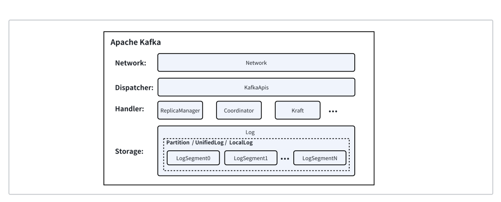
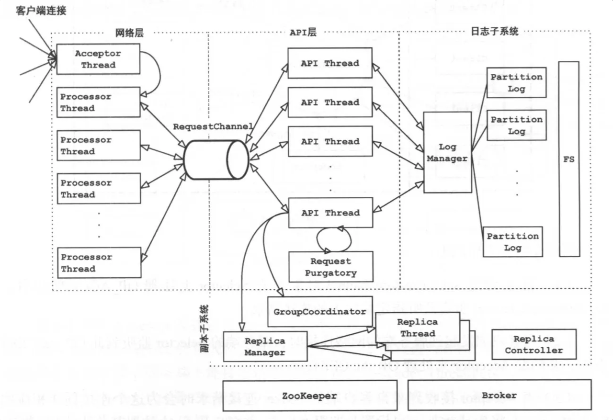

> 这篇文档是我在小红书实习的时候代码串讲用的文档，可能对于非Kafka研发人员来说没啥意义。
>
> Kafka的架构相对简单，理解哪里是为了高可用哪里是为了高并发，其实你就懂Kafka的架构了。
>
> 本文实际上是为想尝试Kafka内核Core模块研发的同学提供一定的方向指导和代码导读。
>
> 最好的老师永远是Google\~

Apache Kafka 从南北向流量的处理层依次为：

* 网络层：负责管理连接、从客户端接受网络包解码成请求和把响应编码成网络包发送给客户端；

* 分发层：接收到请求后，KafkaApis 根据请求的 ApiKey 将请求分发到具体的业务逻辑处理模块；

* 业务逻辑层：拆分成更细的子模块处理不同的业务逻辑。ReplicaManager 负责消息收发和分区管理；Coordinator 负责消费者管理和事务消息；Kraft 负责集群元数据；

* 存储层：负责数据的高可靠存储，对业务逻辑层提供 Partition 抽象。自顶向下划分多个层次：UnifiedLog 负责 Log 的 ISR 多副本复制保障数据的高可靠；LocalLog 负责本地数据存储，提供一个“无限”的流存储抽象；LogSegment 作为 Kafka 的最小存储单元，将 LocalLog 切分成数据段映射到对应的物理文件；



# Kafka 学习

***

## 整体架构



kafka 服务端核心是 KafkaServer，KafkaServer 没什么特别的，聚合和启动各个能力对象即可（kafka 称之为subsystem子系统）。各能力对象都用到了统一的线程池，各自干各自的活儿。

1. LogManager：负责日志文件的维护，负责加载创建以及删除Log对象，一台broker上只会启动一个LogManager对象，单纯的日志写入交给了Log 对象。

2. ReplicaManage：管理一个Broker 范围内的Partition 信息。代码上，Partition 对象为ReplicaManager 分担一部分职能。

3. KafkaController：在Kafka集群的多个Broker中， 有一个Broker会被推举为Controller Leader，负责管理整个集群中分区和副本的状态。

4. GroupCoordinator：主要用于对一个 group 名下的消费者进行协调。在服务运行过程中难免会出现消费者的上下线，以及分区数目的变更，GroupCoordinator 主要负责在必要时对 group 名下的消费者执行分区再分配操作，以保证消费者与 topic 分区之间分配关系的均衡性。

> 对于Kafka的学习，我认为可以从单机版开始学起，也就是从请求处理模块到存储模块。

***

## 网络层

> 对于 Kafka 这种超高并发系统来说，一个 Selector 多路复用器（监听这些连接、接收请求、处理响应结果都是同一个 Selector 在进行处理）是 Hold 不住的，为了减轻当前 Selector 的处理负担，引入另外一个Selector 处理队列，原来的 Selector 只负责监听连接。
>
> 面对高并发、低延迟的需求，kafka 服务端使用了单个Acceptor + 多个Processor的设计。这么做的好处我认为是：分层实现，网络io 部分负责读写数据，并将数据序列化/反序列化为协议请求。协议请求交给上层处理，API层就好比 tomcat 中的servlet。

请求在网络层可以简单理解为，所有request最后都会进入一个RequestQueue，等待API层对它进行对应的io操作。

### Acceptor

基本上，Acceptor 线程使用 Java NIO 的 Selector + SocketChannel 的方式循环地轮询准备就绪的 I/O 事件。这里的 I/O 事件，主要是指网络连接创建事件，即代码中的 SelectionKey.OP\_ACCEPT。一旦接收到外部连接请求，Acceptor 就会指定一个 Processor 线程，并将该请求交由它，让它创建真正的网络连接。总的来说，Acceptor 线程就做这么点事。

```plain&#x20;text
val keys = nioSelector.selectedKeys()
val iter = keys.iterator()
while (iter.hasNext && isRunning) {
  try {
  val key = iter.next
  iter.remove()
  // 有新的连接请求到达。
  if (key.isAcceptable) {
    // 调用accept()方法来处理新的连接请求，返回一个SocketChannel，
    // 表示与客户端建立的连接。然后对这个SocketChannel进行进一步处理。
    accept(key).foreach { socketChannel =>
    var retriesLeft = synchronized(processors.length)
    var processor: Processor = null
    do {
      retriesLeft -= 1
      processor = synchronized {
        currentProcessorIndex = currentProcessorIndex % processors.length
        processors(currentProcessorIndex)
      }
      currentProcessorIndex += 1
    } while (!assignNewConnection(socketChannel, processor, retriesLeft == 0))
      // 传递给processor，采用轮询（round-robin）方式分配。
}
```

### Processor

Processor这一层还有一次nio的并发处理，每个 Processor 线程都维护了一个 Selector 类实例。

在Acceptor中看到，其调用的`assignNewConnection(socketChannel, processor, retriesLeft == 0))`将socketChannel也传递了过来，说明真正处理这边请求和返回响应的操作，是在Processor中的，他有三个与此相关的属性：

```plain&#x20;text
private val newConnections = new ArrayBlockingQueue
[SocketChannel](connectionQueueSize)
private val inflightResponses = mutable.Map
String, RequestChannel.Response
private val responseQueue = new LinkedBlockingDequeRequestChannel.Response
```

### **newConnections:**

它保存的是要创建的新连接信息，具体来说，就是 SocketChannel 对象。这是一个默认上限是 20 的队列。

每当 Acceptor 线程接收新的连接请求时，都会将对应的 SocketChannel 放入这个队列（SocketServer.scala 1055行）。后面Processor在创建连接时（也就是调用 configureNewConnections 时），就从该队列中取出 SocketChannel，然后注册新的连接到自己的selector。

这个队列是所有Processors线程共享的。

### **inflightResponses**

这是一个临时 Response 队列。当 Processor 线程将 Response 返还给 Request 发送方之后，还要将 Response 放入这个临时队列。因为有些 Response 回调逻辑要在 Response 被发送回发送方之后，才能执行，因此需要暂存在一个临时队列里面。

### **responseQueue**

每个 Processor 线程都会维护自己的 Response 队列

### run()

因为Processor是作为一个线程存在的，他肯定也会有自己的run方法

```plain&#x20;text
override def run(): Unit = {
  startupComplete() // 先启动
  try {
    while (isRunning) { // 一直都在等待连接
      try {
        // setup any new connections that have been queued up
        configureNewConnections()
        // register any new responses for writing
        processNewResponses()
        poll()
        processCompletedReceives()
        processCompletedSends()
        processDisconnected()
        closeExcessConnections()
      } catch {
        case e: Throwable => processException(...)
      }
    }
  } finally {
    debug(s"Closing selector - processor $id")
    CoreUtils.swallow(closeAll(), this, Level.ERROR)
    shutdownComplete()
  }
}
```

这个方法并不是按一次请求的顺序来进行的，对于我第一次接触Reactor模式的新手来说，第一次看确实很奇怪，为什么在processNewResponses()处理了请求之后才去poll()，感觉想不明白，后面仔细看了代码实际做的事情，才能够理解。

这边实际上是写了一个Processor线程中一次循环里面的逻辑，首先去看看Acceptor那边有没有传东西到它的newConnections队列中，然后开始为这些新连接注册NIO需要的SocketChannel。之后看看有没有什么需要发送的请求在responseQueue队列中，看看需不需要放到inflight队列中做个回调什么的...

然后才是开始自己的一个poll()，和上层代码进行交互。

### poll()

**中间的实际读写操作，调用链路：**

（太复杂了，我就简单把核心方法理一下）

后续的操作都被Kafka解藕了，这边只需要发送到一个KafkaChannel中就行，会有别的Handler线程去take然后做对应的处理就行。

### processors之间的合作形式

**Request从同一个地方取，各自发自己做好的Response**

（1）Request 队列在被 IO 线程取走处理时不需要关心 Request 被哪个 IO 线程处理了。处理完放入到对应的 Response 队列就好。

（2）Response 队列是线程私有的，因为 Processor 管理着某一组 SocketChannel，SocketChannel 发出的某个 Request 处理完成后生成 Response 还需要在该 Processor Send 出去。

（3）如果 Response 设计成跟 Request 一样在共享队列中， Processor 需要主动去 take 出来，这时还需要判定对应的 SocketChannel 是否属于这个 Processor。那还不如 IO 线程处理完直接发给不同的 Response 队列划算，也没有锁的竞争。

### SocketServer分发请求

network包下其实就这两个scala文件，上面说过的Acceptor和Processor都在这个SocketServer里面，对于SocketServer他自己，它最主要的事情除了初始化各种其他线程和参数，还有一个就是对不同类型请求做不同的处理方式区分。

社区将 Kafka 请求类型划分为两大类：**数据类请求和控制类请求**。

Data plane 和 Control plane 的字面意思是数据面和控制面，各自对应数据类请求和控制类请求，也就是说 Data plane 负责处理数据类请求，Control plane 负责处理控制类请求。

在 Kafka 的配置中，每个 broker 可以配置多个 EndPoint，这样做的目的是为了支持不同的使用场景和网络环境，同时也可以区分内部网络和外部网络的请求。

```plain&#x20;text
private def createDataPlaneAcceptorsAndProcessors(dataProcessorsPerListener: Int,
                                                  endpoints: Seq[EndPoint]): Unit = {
  endpoints.foreach { endpoint =>
    connectionQuotas.addListener(config, endpoint.listenerName)
    val dataPlaneAcceptor = createAcceptor(endpoint, DataPlaneMetricPrefix)
    addDataPlaneProcessors(dataPlaneAcceptor, endpoint, dataProcessorsPerListener)
    dataPlaneAcceptors.put(endpoint, dataPlaneAcceptor)
    info(s"Created data-plane acceptor and processors for endpoint : ${endpoint.listenerName}")
  }
}
```

看样子是为每个Acceptor创建了对应的一个Processor线程池，然后将 < 监听器，Acceptor 线程 > 对加入到 Acceptor 线程池统一管理。这大概就是定义的不同类型的请求的入口dispatch吧。

***

## API层

Broker 端有两个参数与网络请求处理流程相关，分别是 num.network.threads 和 num.io.threads。

num.network.threads就是用来配置前面网络层中Processor线程池的大小。

num.io.threads 参数表征的就是 I/O 线程池的大小。所谓的 I/O 线程池，即 KafkaRequestHandlerPool，也称请求处理API线程池。KafkaRequestHandlerPool 是真正处理 Kafka 请求的地方。

### KafkaRequestHandler

```plain&#x20;text
// 关键字段说明
// id: I/O线程序号
// brokerId：所在Broker序号，即broker.id值
// totalHandlerThreads：I/O线程池大小
// requestChannel：请求处理通道
// apis：KafkaApis类，用于真正实现请求处理逻辑的类
class KafkaRequestHandler(
  id: Int,
  brokerId: Int,
  val aggregateIdleMeter: Meter,
  val totalHandlerThreads: AtomicInteger,
  val requestChannel: RequestChannel,
  apis: KafkaApis,
  time: Time) extends Runnable with Logging {
  ......
}
```

从定义可知，KafkaRequestHandler 是一个 Runnable 对象。

```plain&#x20;text
def run(): Unit = {
  while (!stopped) {
    val req = requestChannel.receiveRequest(300)
    ...
    req match {
      case RequestChannel.ShutdownRequest =>
        ...
      case request: RequestChannel.Request =>
        try {
          ...
          apis.handle(request)
        } catch {
          ...
        } finally {
          request.releaseBuffer()
        }
      case null => // continue
    }
  }
  shutdownComplete.countDown()
}
```

看起来也很简单，就是给一个300ms的超时时间，去requestChannel尝试拿一个Request，然后对它进行判断，看是要直接关闭还是交给KafkaApis进行处理。

### KafkaApis

KafkaApis 是 Kafka 最重要的源码入口。因为每次要查找 Kafka 某个功能的实现代码时，我们几乎总要从这个 KafkaApis.scala 文件开始找起，然后一层一层向下钻取，直到定位到实现功能的代码处为止。

比如，如果想知道创建 Topic 的流程，只需要查看 KafkaApis 的 handleCreateTopicsRequest 方法；如果想弄懂 Consumer 提交位移是怎么实现的，查询 handleOffsetCommitRequest 方法就行了。

比如想看最基础的**PRODUCE**的调用，可以在对应的方法中找到这一段：

```plain&#x20;text
replicaManager.appendRecords(
  timeout = produceRequest.timeout.toLong,
  requiredAcks = produceRequest.acks,
  internalTopicsAllowed = internalTopicsAllowed,
  origin = AppendOrigin.Client,
  entriesPerPartition = authorizedRequestInfo,
  responseCallback = sendResponseCallback,
  recordConversionStatsCallback = processingStatsCallback)
```

这个方法会调用

```plain&#x20;text
val localProduceResults = appendToLocalLog(internalTopicsAllowed = internalTopicsAllowed,
  origin, entriesPerPartition, requiredAcks)
debug("Produce to local log in %d ms".format(time.milliseconds - sTime))
```

一路点下去发现调用链是 `ReplicaManager --> Partition --> Log`，很自然的来到了存储层。

***

## 存储层

### 设计思想

> " This suggests a design which is very simple:
>
> rather than maintain as much as possible in-memory and flush it all out to the filesystem in a panic when we run out of space.
>
> **we invert that.**
>
> **All data is immediately written to a persistent log on the filesystem without necessarily flushing to disk.**
>
> **In effect this just means that it is transferred into the kernel's pagecache.**"

Kafka的存储是基于`日志文件`的，主要是想利用磁盘顺序IO的高效性。

听上去好像和LSM-tree有点相似？都是一个一个的日志段文件由旧到新、都是日志写的形式来做存储。

但其实还是有比较大的不同的，就像上面的Kafka官方文档里的一句话，kafka和以往的设计理念完全相反。以往的设计常常是维护一个在内存中的数据结构来达成比较高的读写效率，然后在某个时刻将其刷到盘里持久化。

LSM-Tree就是如此，它将写入操作首先记录到内存中的结构（如 Memtable），当 Memtable 满了之后，它会被转换成一个不可变的 SSTable 并持久化到磁盘上。这些 SSTables 会定期合并和重写以保持查询效率。

而Kafka则是直接写到磁盘中，并且尽可能的使用page cache，把后续的东西全部交给OS来实现。在读的时候再去考虑其他的优化。

这样的设计意味着即使发生系统故障，消息数据也大概率不会丢失。少了很多内存易失性方面的担忧。

### 存储部分逻辑结构

### 存储部分的代码结构

### LogManager

对于一个KafkaServer，会有一个全局唯一的LogManager，这边就是存储子系统的一个入口。它负责管理一个Broker上的所有Log。主要功能包括加载Log、创建Log、删除Log、查询Log以及周期性的后台任务等等。

LogManager中有一个成员属性currentLogs：

```plain&#x20;text
private val currentLogs = new PoolTopicPartition, Log
```

这个映射的目的是将 `TopicPartition` 对象（代表 Kafka 中特定的 topic 和 partition 的组合）关联到相应的 `Log` 对象。其实直接去扫描某个文件夹下的文件，也可以达成同样的功能，这样可以起到缓存的作用。但是不管怎么样，操作下一层Log对象的入口就是在这了。

### Log

Log是LogSegment的容器，也是用于管理LogSegment的对象，一般来说一个Log对象对应着一个分区副本目录。除了管理LogSegment以外，Log对象还负责高水位管理，关键位移管理，日志读写管理。

**日志读写管理**：Log负责了管理外界的读写请求，例如选择对应的LogSegment进行读写。其下层使用的还是LogSegment的append()、read()方法。

**高水位管理**：高水位是一个消费偏移量，消费者只能拉取到这个偏移量以前的消息，用于保证副本和leader之间的消息一致性。高水位以前是已经“备份”过的消息。Log负责管理这个偏移量。

**关键位移管理**：主要是LogStartOffset和LogEndOffset(日志末端位移LEO)的更新。Log Start Offset日志起始位移是Log对外可见的最小位移值；Log End Offset（LEO）指向最后一个位移值的下一个（永远是空的）。

**日志段管理**：一个Log下可能有多个LogSegment对象，Log负责这些LogSegment的创建、删除等。

### LogSegment

> 关于索引查找优化：《Kafka-二分查找优化》

LogSegment是和磁盘文件交互的入口，由日志和索引两部分共同构成，它的主要功能就是追加写入消息和读取指定offset的消息。

为了实现高性能读写，Kafka用到了mmap内存映射文件技术。使用内存映射文件的主要优势在于，它有很高的 I/O 性能，特别是对于索引这样的小文件来说，由于文件内存被直接映射到一段虚拟内存上，访问内存映射文件的速度要快于普通的读写文件速度。

不过，Kafka在读写log文件的时候，是没有使用mmap技术的，对于大文件进行内存映射，有可能会导致页表占用内存过多。内存比较宝贵，kafka日志又有可能非常大，映射过来会产生很大的页表。

对于**单次写入小量数据**的场景，性能瓶颈在于内核态和用户态之间的切换，而不在文件I/O上。FileChannel的read/write 底层相关联的系统调用，是需要切换内核态和用户态的，而mmap所关联的系统调用不涉及内核态切换。索引文件的读写刚好是这种场景。

对于**单次写入数据量**的场景，性能瓶颈不在内核态和用户态之间的切换，而在文件I/O上。FileChannel和mmap都需要经过PageCache，因此mmap的性能提升并不明显，不分伯仲。

### read/write - ByteBuffer

最普通的方式：标准的IO操作，调用read和write操作用户虚拟内存中的一个ByteBuffer用户空间缓冲区中，然后通过系统调用syscall把数据移动到内核缓冲区中。

不管是读还是写，都会syscall，进行两次状态切换，同时有一次数据拷贝。

### mmap - MappedByteBuffer

使用 mmap() 时，数据直接从文件映射到进程的虚拟内存空间，读取和写入操作可以直接访问内核中的 Page Cache。

也就意味着映射的是mmap和page cache两者之间，而不是虚拟内存和File之间！

### mmap的局限性

既然可以映射到虚拟内存空间，那么这个MappedByteBuffer是不是可以无限大？

另外map方法中size的类型是long，是long类型，但不能超过Integer.MAX\_VALUE，换算一下大概是2G。也就是说MappedByteBuffer的最大值是2G，一次最多只能map 2G的数据。

***

## Controller模块

上面的部分可以自己构成一个单机版的Broker，要想实现Kafka的分布式性质，必不可少的需要这个模块——Controller模块，它负责集群的管理和协调。它的作用包括以下几个方面：元数据管理、Broker集群管理、controller选举、主题管理等。

### 元数据管理

Controller维护了整个Kafka集群的元数据信息，包括主题（topics）、分区（partitions）、Broker的状态等。其他组件可以向Controller查询元数据，以了解集群的状态和拓扑结构。

源码主要在ControllerContext.scala中，它有许许多多管理数据结构的方法。

### Broker集群管理

Controller负责监控整个Kafka集群的健康状态。它检测Broker的加入和离开，并维护集群的元数据信息。如果有Broker故障或加入新的Broker，Controller会负责重新分配分区的副本，并确保集群的数据可用性和一致性。

Controller 会给集群中的所有 Broker（包括它自己所在的 Broker）机器发送网络请求。发送请求的目的，是让 Broker 执行相应的指令。

Controller会**为集群中的每个Broker都创建一个对应的RequestSendThread线程和请求队列**。Controller上的这个线程，持续地从阻塞队列中获取待发送的请求。

### controller选举

/controller 节点在ZK中是作为临时节点存在的，所有Broker都监听着这个临时节点，这里的“监听”有两个含义：

* **监听这个节点是否存在**。倘若发现这个节点不存在，Broker 会立即“抢注”该节点，即创建 /controller 节点。创建成功的那个 Broker，即当选为新一届的 Controller。

* **监听这个节点数据是否发生了变更**。同样，一旦发现该节点的内容发生了变化，Broker 也会立即启动新一轮的 Controller 选举。

三种触发选举的情况

前两种都好理解，第三种会比较独特一点

Broker 检测到 /controller 节点数据发生变化，通常表明，Controller“易主”了，这就分为两种情况：

* 如果 Broker 之前是 Controller，那么该 Broker 需要首先执行卸任操作，然后再尝试竞选；

* 如果 Broker 之前不是 Controller，那么该 Broker 直接去竞选新 Controller。

## 副本管理模块

Kafka中的每个Partiotion中有多个副本(Replica)用于实现高可用。

Kafka的数据复制是以Partition为单位的。而多个备份间的数据复制，通过Follower向Leader拉取数据完成。从一这点来讲，Kafka的数据复制方案接近于Master-Slave方案。不同的是，Kafka既不是完全的同步复制，也不是完全的异步复制，而是基于ISR的动态复制方案。

### ISR机制

ISR，也即In-sync Replica。每个Partition的Leader都会维护这样一个列表，该列表中，包含了所有与之同步的Replica（包含Leader自己）。每次数据写入时，只有ISR中的所有Replica都复制完，Leader才会将其置为Commit，它才能被Consumer所消费。

这种方案，与同步复制非常接近。但不同的是，这个ISR是由Leader动态维护的。如果Follower不能紧“跟上”Leader，它将被Leader从ISR中移除，待它又重新“跟上”Leader后，会被Leader再次加加ISR中。每次改变ISR后，Leader都会将最新的ISR持久化到Zookeeper中。

至于如何判断某个Follower是否“跟上”Leader，Leader不仅会判断Follower是否在`replica.lag.time.max.ms`时间内向其发送Fetch请求，同时还会考虑Follower是否在该时间内与之保持同步。

ISR可动态调整，极限情况下，可以只包含Leader，极大提高了可容忍的宕机的Follower的数量。与`Majority Quorum`方案相比，容忍相同个数的节点失败，所要求的总节点数少了近一半。

### Leader Epoch

**Kafka通过Leader Epoch来解决follower日志恢复过程中潜在的数据不一致问题。**

之前简单的用HW来截断自己的日志来追赶Leader日志的方式不好：在自己截断后Leader也挂了，这时候集群只有自己能够成为leader，那就真的完了，日志只剩下截断之前的部分了。

所以在恢复的时候，会向Leader询问一下当前的epoch和offset(LEO)，根据那个值来做截断。

这样做的好处？

如果这时候，Leader一样down了，起码leader的commit部分已经被follower用leader epoch保留住了，这样数据没有丢失，还有机会能够恢复回来。

***

## 分层存储

### RLMM

> RomoteLogMedataManager （RLMM）：主要负责维护 RemoteLog 的元数据， 并提供检索元数据相关的方法。

#### 内部Topic实现

每个Broker上都会有自己的RLMM，用来识别相关的元数据变更事件。比如当RLM把一个LocalCopyToRemote了，会把对应的事件发到这个Topic里面，利用消息队列的自己的性质来实现其他通过 ConsumerManager订阅这个Topic的Broker感知到事件变动。

\*\*全局可见：\*\*表达当前broker内topic-partition的remote相关状态，需要做成全局可见的。

RLMM 每消费一批事件， 都需要提交消费位点， 以避免在重启时重新消费事件， 同时为了保证元数据不丢失， 还需要将元数据持久化存储。

因此 RLMM 在消费完一批事件后，  需要：

1. 持久化元数据 （Create Snapshot）

2. 一种方案是为每个 RLMM 维护的 Topic-Partition MetadataCache 构建一个快照文件， 将该 MetadataCache 中的数据序列化到 SnapshotFile 中。

3. 持久化消费位点

4. Metadata Topic 有多个分区（默认 50 个，我认为是为了提高并发能力）， 因此对每个分区要维护当前分区的消费位点。我们可以直接存储在文件上， 文件名为 ‘\`**\_rlmm\_committed\_offsets**’， 格式为：

```plain&#x20;text
<PartitionId><Offset> Examples:
0 2000
1 1003
2 1030
```

1. 提交消费位点

***缺点：***

机制：社区的 Topic-Based RLMM 只订阅所在 Broker 含有 Replica 的 partitons。

但是Metadata-Topic里面会有各个topic-partition的变更事件元数据，在某个Broker上的RLMM获取到不认识的topic-partition时会跳过这个元数据，如果这时候那个topic-partition因为reassign来到这个Broker上了，RLMM消费的offset不会回退重做，跳过的元数据就这么丢失了。

这个主要的原因就是，每个RLMM只会维护一个文件SnapshotFile，保存从`Internal Topic`那边收到的自己有订阅的`t-p`相关的事件。

为什么不对于每个`t-p`都做一个单独的SnapshotFile？

* 因为不知道它会被reassign到哪里，所以最保险的情况就是把它的SnapshotFile复制到每个Broker上，那这样肯定开销太大，不现实。

为什么不每次reassign就重做整个File？

* 开销太大了，并且会对其他正常消费的`t-p`产生影响。

#### COS实现

如果可以对于每个Topic-partition做一个单独的SnapshotFile，就可以避免上面说的这种情况，不过在每个Broker都保存一份一样的SnapshotFile肯定不现实，所以可以用全局的可靠存储来实现，比如说COS。key = {Topic}-{Partition}-{MetadataPartition}-{MetadataOffset}.

这样，在reassign的时候，订阅了新的topic-partiton，就会开始尝试从COS上面Load这个t-p的最新的SnapshotFile，对比 SnapshotFile 的 S-MetadataPartition 与 RLMM 本地 L-MetadataPartition 的消费进度，来进行一系列稳固的操作。

为 Topic-Partition 在 RLMM 中新增以下状态：

* **LoadedAndVisible**：已经成功加载并且对外可见。

* **LoadedAndInvisible**：已经成功加载但对外不可见。

* **UnLoaded**：未成功加载

#### ZK Based实现

把原本放在Metadata-Topic里面的元数据转而放到ZK中，达成强一致性的要求(sync read?)，但是这样每次有新的数据都会是**全量发布**，不过看benchmark的表现，还是比较可以接受的。

我觉得如果metadata一直一直持续上涨，也不是一个好事，是否可以引入一些快照之类的机制来截断旧的metadata，保证其内存稳定，读写速度稳定？

### RCM

> RemoteCacheManager (RCM)：负责缓存远程数据到本地磁盘， 通过复用 Fetch Remote 的结果， 提高读性能。

主要包括：

#### RemoteIndexDiskCache （磁盘索引缓存）

Kafka 索引本身比较小， 可以直接采用本地磁盘来缓存， 也即每次需要通过 RemoteIndex 检索一个 RemoteSegment 的时候， 可以直接将这三个索引从 Remote Fetch 下来， 保存到本地的 SSD 磁盘上。

内部维护了一个 LRU List， 元素是 RemoteIndexEntry。

RemoteIndexEntry 由三个索引组成， 其是一个 Case class RemoteIndexEntry（OffsetIndex， TimestampIndex， TransactionIndex）。是以一个LRU队列存在的。

#### RemoteSegmentDiskCache （磁盘日志段缓存 （**待定**））

Segment 除了内存缓存， 同样可以用上磁盘缓存。

消息引擎读历史消息不像数据库一样可能会存在历史随机读， 更多的只是历史回溯读， 也即从头到尾读一遍。

所以当用户回溯消息的时候， 除了使用内存缓存 Segment Block， 另一种可行的方案是， 提前将 Remote Segment 接下去的数据的一部分（比如 128 MB）拷贝到本地磁盘， 这样这 128 MB 的数据就能直接在本地磁盘读， 节省大量的时间。

#### RemoteSegmentMemoryCache （内存日志段缓存）

Segment 同样可以用上本地缓存， 但不适合像 Index 一样一整个拉取下来放到本地磁盘。

因为Segment很大一个，一整个利用率不高，所以可以分成小个的Block拉到本地来，一样以一个LRU的形式来维护。

**堆外缓存**

因为RemoteCacheManager 要开启的内存缓存空间比较大（默认 20 GB）， 如果使用堆内缓存， 会对 JVM GC 带来很大影响。上文缓存的特点是创建一次， 复用多次， 且占用空间大， 因此适合用堆外缓存。

### RSM

> 作为对外storage的manager，对接外部系统比如说腾讯云的COS。

### RLM

> RLM 更多起到 承上启下 的作用，对上 ReplicaManager 可以通知 RLM 分区主从的状态变化，对下其可以对接 RLMM 和 RSM管理远程日志段。
>
> 1. 维护 Topic-Paritition List， 为不同角色的 Partition 调度一个对应的 Task
>
> 2. 为客户端提供读取远程日志段的方法

#### 定时任务

RLM 为每个 Topic-Partition 都维护了一个定时任务， 每隔 ‘SCHEDULE-REMOTE-TASK-MS’ 调度一次， 任务如下：

* **对于Leader**：检测是否有 Segment 满足被 Copy 到远端的条件， 并调用 RSM 和 RLMM 执行 Copy 和修改元数据的流程， 条件：`Inactive && SegmentEndOffset < LastStableOffset`，检测远端是否有 Segment 满足过期条件，并删除过期的 Segment。

* **对于Follower**：追踪 RLMM 中相关的元数据， 并管理本地的日志段（例如 Leader 复制了一个 Segment 到远端， 则 Follower 可以删除相应的日志段）。

如果 Partition-Task 调度失败， 此时应该进行 BackingOffset， 延长下一次调度该 Task 的时间。

#### 客户端请求remote

为了不让远端存储的间接性不稳定影响到 Kafka IO 线程， 也需要一个单独的线程池来运行相关工作 -- ---- ‘Remote-Storage-Fetcher-Pool’。

1. 从 RLMM 找到要读取日志段的 StartPosition 和 EndPosition， 如果日志段已经被删除， 则直接唤醒 RemoteFetchPurgatory。

2. 调用 RSM 从远端读取日志。

3. 如果读取失败， 则进行 **BackingOff 退避**并重试， 直到 RemoteFetchPurgatory 超时。

#### Follower Fetch Protocol

> 在分层存储的背景下， 当 Leader 将 Segemnt Copy 到远端之后， Follower 就无需再 Copy 这些 Segments， 但其仍然需要构建和 Leader 相同的辅助状态（例如 EpochEntry）， 以保证功能的正确性。

当follower尝试拉取leader本地存在的数据时，一切都照旧。当尝试拉取remote数据的时候，会发生这样的事情：

follower会收到‘**OFFSET\_MOVED\_TO\_TIERED\_STORAGE**’ 报错，获取这个segment是简单的事情，但是要构成辅助状态就会比较复杂了。

因为以往拉的是全量的leader日志，并且逐步构建leader-epoch-checkpoint文件，但是现在没有全量的给follower拉了，这个文件又不能缺少，否则成为leader后又会引起奇奇怪怪的错误。

follower收到leader的local-log-start-offset后，需要基于这个offset构建远端日志段的AuxiliaryState，这个AuxiliaryState其实就是leader的「leader eopch」及「producer-snapshot-ids」。可以通过两种方式来实现：

* 引入一个新的协议，专门从leader中拉取这个AuxiliaryState

* **从远端存储中获取这个AuxiliaryState**

然后正好，RLMM就可以获取到Remote Segment Info，所以就选第二种方式了。具体流程是：

1. Leader 拷贝 Segments 和辅助状态（Epoch等）到远端存储。

2. Leader 发布 Remote Segemnt Metadata 元数据变更事件到 RLMM。

3. Follower 尝试从 Leader 处复制日志， 收到 ‘**OFFSET\_MOVED\_TO\_TIERED\_STORAGE**’ 报错。

4. Follower 根据 Follower Fetch Protocal， 尝试从 RLMM 中的元数据重构辅助状态。

5. Follower 继续从 Leader 处复制最新的日志。

#### Follower Fetch Protocol

说实话，看文字，看表格，太抽象了，实在难以理解这个过程，所以画了点图来帮助理解，就举最简单的例子，”**“重启后的全新follower追赶leader进度，发现太落后，拉取的日志已经到remote里了”**

* 这个Follower重启了，开始重新拉取日志信息，这时候会向Leader开始从0开始拉取log segments。现在是处于一个Fetching的状态。

* 像橙色的箭头所示，不出意外的，收到了OMTS，这时候，Follower会向Leader再发一个API来获取它最早的消息的offset（ELO）和对应的epoch（ELO - LE）。接下来会截断自己的本地日志（通过ELO - LE），然后就是从Fetching状态切换为BuildingRemoteLogAux状态：

> 如上文说到的，我们选择方案2，从远端存储获得这个“AuxiliaryState”，方案如下：
>
> 1. RLMM（RemoteLogMetadataManager）等待远端的元数据，直到等到某个segment包含了ELO-LE
>
> 2. 抓取远端存储的leader epoch以及producer snapshot（使用远端fetcher线程：多层存储引入的工作线程）
>
> 3. 获取远端存储的leader epoch数据后，截取 \[LSO, ELO] 部分，然后构建follower自己的cache。*LSO：Log Start Offset 日志起始offset*

* 如绿色的过程所示，已经通过RLMM获取到了需要的Leader Epochs信息，现在就可以认为已经构建好自己的辅助状态AuxiliaryState了，接下来就是开始向Leader获取本地的日志localLogSegments了

至此，这个case就完成了，这是最简单的一种情况，有时候会有特殊情况，**比如说follower并不是重启的，而是本身自己本地就有一些过期数据了**，那么这时候**在上图橙色的步骤时，就会根据获取到的ELO和ELO-LE来把本地的过期日志给truncate掉**，接下来就和上面的case一样了。

* 有时候，Remote Seg Storage里面可能会出现一些奇怪的现象，比如说两个seg段中有相同的offset日志，这个时候**consumer需要根据epoch来判断在哪个segment去fetch消息**。

#### Follower to Leader 流程

controller会根据某个follower的相关配置信息来判断，follower是可以被转换为leader的。当一个follower成为leader后，它需要判断从哪个日志段开始将数据拷贝至远端存储，通过遍历leader epoch的历史信息，直至到**最近一次的leader epoch**，然后找到已经拷贝至远端存储的最大offset。

如果找不到对应的entry，那么就从前一个leader epoch中寻找，如果一直到最早的leader epoch仍然没有找到，那么就从最早的epoch开始拷贝。

* 一开始都是正常的，A是Leader，B是Follower，B正常的向A拉取消息

* 然后A宕机了，B会成为新的Leader，这时候它的epoch会是**3**，所以会去remote metadata那边寻找LE = 2的offset的最大值，这时候会发现不存在，最多只到了LE = 1，对应的seg-3-4代表这边能看到的“**已经拷贝至远端存储的最大offset**”，因此需要从offset 5开始拷贝（到remote）。

* 后面就可以继续正常的接受请求处理了。

#### Consumer Fetch Protocol

## 贡献者

<div class="contributors-list" style="display: flex; gap: 20px; flex-wrap: wrap; margin-top: 20px;">
  <!-- 贡献者 1 -->    
  <div style="text-align: center;">
    
    <p style="margin-top: 8px;"><a href="https://github.com/spaceluke" target="_blank">魏知乐</a></p>
  </div>

</div>