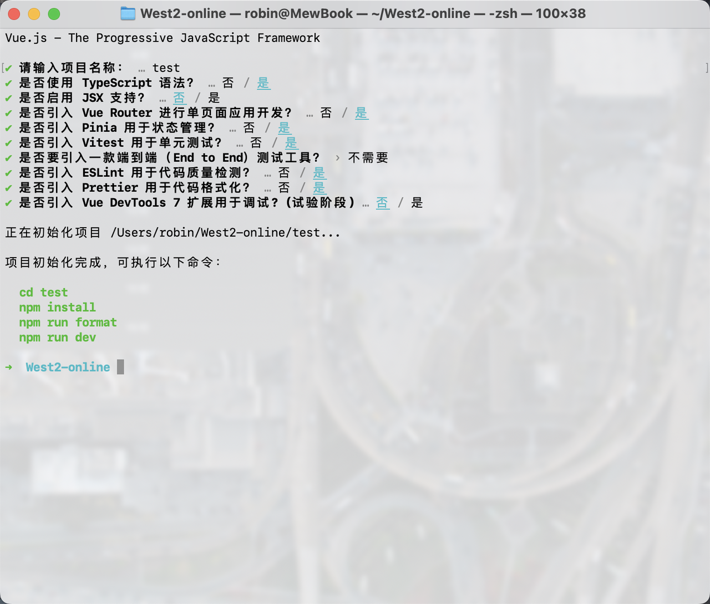
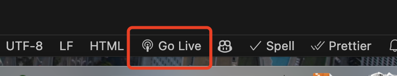
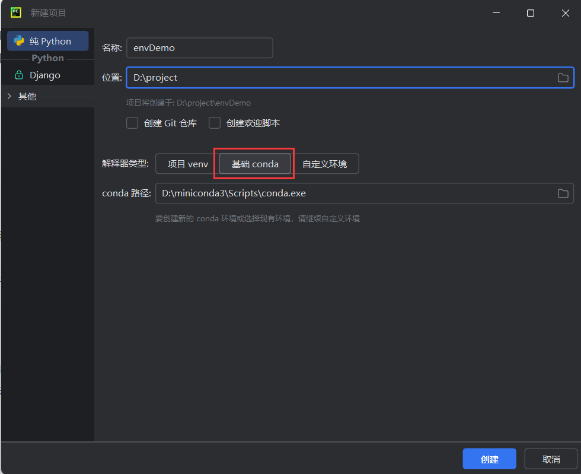

> 请尽可能在 Linux/Unix（如 macOS）环境下进行开发，我们建议你首先要做的事是给自己安排一个这样合适的环境，如[ 从格式化硬盘到支持生产力的Ubuntu双系统装机保姆级教程](https://west2-online.feishu.cn/wiki/AUKFw7MVLidXmzkm80ScYDx5nid)

对于所有第一次接触计算机的同学来说，配环境是一道坎。本文尽可能的以最通俗易懂的方式来告诉你如何配置一个最新的本地环境

# 目录

请按自己的方式来跳转对应内容

# Linux / macOS 下环境配置

## Go


> 请先确保你具有良好的网络环境，具体可以看安装 Ubuntu 的教程

### 1. 使用 g 来进行 golang 版本管理控制

go 的版本仍在不断更新，虽然版本和版本之间差异没那么大，但是为了便于平滑过渡版本，以及便于部分项目调试（事实上，我见过一些项目对刚出新版本的 go 是有编译问题的），我们这边直接从安装 g 开始入手

依据官网说明，安装 g 非常的简单

```bash
sudo curl -sSL https://raw.githubusercontent.com/voidint/g/master/install.sh | bash
# 如果你使用的是zsh，则~/.bashrc 要改为对应的~/.zshrc  
echo "unalias g" >> ~/.bashrc  # 取消 g 的 alias，git 会占用 g 的名字 
source "$HOME/.g/env" # 重载资源 
source "$HOME/.bashrc"
```

现在来进行配置，首先要安装一个 go 版本

```bash
❯ g ls-remote stable # 查看远程 go 版本
  1.21.11
  1.22.4
❯ g install 1.22.4 # 安装 1.22.4
Downloading 100% [===============] (69/69 MB, 1.1 MB/s)
Computing checksum with SHA256
Checksums matched
Now using go1.22.4


# 这里演示一下如何切换go版本
❯ g ls # 查看本地安装列表，我这里又安装了go 1.21.11版本
* 1.21.11
  1.22.4
❯ go env | grep GOVERSION # 可以看见目前就是 go 1.21.11
GOVERSION='go1.21.11'
❯ g use 1.22.4 # 现在切换到 1.22.4 版本
go version go1.22.4 linux/amd64
❯ go env | grep GOVERSION # 可以看见已经成功切换了
GOVERSION='go1.22.4'
```

### 2. 配置

接下来我们需要做一些环境的配置

```bash
mkdir -p ~/gopath # 在你用户的根目录下创建一个 gopath 文件夹负责存放module cache以及基于 go 的 bin 文件

# go 1.13版本后请使用go env来进行设置
go env -w GO111MODULE=on
go env -w GOPROXY=https://goproxy.cn,direct
go env -w GOROOT=/home/你的用户名/.g/go
go env -w GOPATH=/home/你的用户名/gopath # gopath需要设置到你用户的根目录下，否则会出现Permission Denied

# 查看是否设置成功
go env | grep -E 'GOPROXY|GO111MODULE|GOROOT|GOPATH'
```


### 3. 编写

我们在projects中新建一个test文件夹，里面创建一个main.go，写入一个简单的程序

```bash
mkdir -p ~/projects/test
cd ~/projects/test
touch main.go             # 创建main.go
vim main.go
# 填入下面示例代码

go run main.go # 运行go程序
```

```go
package main

import "fmt"

func main() {
    fmt.Println("Hello World!")
    return
}
```


## Python

> &#x20;我觉得应该要写点 Anaconda 安装教程。。。
>
> &#x20;

~~我没有Linux，没有mac，结束~~

linux和windows一样，安装pycharm，安装conda环境，遇到不懂得可以看看windows篇

### 1. 安装python

* 打开终端

* 试试python3，如果没not found说明装好了可以跳过

* 否则装一下

> `命令：sudo apt install python3`

* 同样方法试试pip，如果没有pip

> `命令：sudo apt install python3-pip`


### 2. 安装Python最好用的IDE：PyCharm

> [Download PyCharm: The Python IDE for data science and web development by JetBrains](https://www.jetbrains.com/pycharm/download/?section=linux)

下载


解压

```bash
tar -zxvf pycharm-community-2024.1.4.tar.gz
```

进入bin文件夹后运行sh脚本

```bash
cd pycharm-community-2024.1.4/bin/
./pycharm.sh
```


之后一步步安装


然后可以接windows篇

[1.2 安装中文插件](https://west2-online.feishu.cn/wiki/H2YSwNxumiOoHRktDi4cGCHwn3d?fromScene=spaceOverview#P4v2dkBMGogtQ9xKtJQcdWB2nZd)

### 3. 安装Anaconda

建议在清华镜像源下载

```bash
https://mirrors.tuna.tsinghua.edu.cn/anaconda/archive/
```

下载完后用sh命令直接安装

```bash
bash Anaconda3-2024.06-1-Linux-x86_64.sh
```

后续还可以自己尝试将安装源改清华源


### 4. Hello World!

[和windows篇一样](https://west2-online.feishu.cn/wiki/H2YSwNxumiOoHRktDi4cGCHwn3d?fromScene=spaceOverview#Rso6d326ooXA3ixMltycbMJLnpe)


### 5. AI框架Pytorch安装

安装nvidia-GPU版pytorch

> [pytorch官网get-started](https://pytorch.org/get-started/locally/)


选择自己的配置


复制指令安装

## Frontends

> &#x20;

其实Windows / Linux / macOS三个的安装差不多，这里一块讲掉。

### 1. 下载VSCode


按照自己的操作系统（Windows / Linux / macOS），架构类型（x86 / arm64）下载安装。针对于macOS的用户，VsCode提供了Universal版本的安装包，即通用安装包，会兼容x86和arm64两种架构类型。

> 但是最好还是直接看一下自己电脑是Intel芯片还是m系列芯片，直接下载对应的版本，uni版本的软件大小基本都会大一倍，无端占空间，个人觉得没必要。如下图所示⬇️


Windows用户的安装和常规软件安装步骤一致，安装目录方面建议选择非系统盘。

Linux用户这边以主流的deb安装为例，安装.deb的安装包后，在当前目录进入终端，输入以下命令即可。

```bash
sudo apt install xxxxx.deb -y
```

macOS用户下载好后，解压后把应用拖动到“应用程序”文件夹即可完成安装。

### 2. VsCode配置

VsCode对于前端开发来说是很强大且方便的一个软件（虽然你也可以选择JetBrains家的WebStorm）

**首先请下载以下插件，最好全部安装，我目前是这套配置**

| **插件名**                                                          | **功能**                                                  |
| ---------------------------------------------------------------- | ------------------------------------------------------- |
| Auto Close Tag                                                   | 自动闭合标签，方便html的编写，提高效率                                   |
| Auto Rename Tag                                                  | html修改标签名时开始标签和结束标签同时更改，提高效率                            |
| Chinese (Simplified) (简体中文) Language Pack for Visual Studio Code | 中文语言包                                                   |
| Code Spell Checker                                               | 拼写检测，帮助自己命名                                             |
| ESLint                                                           | 代码格式化工具，检测语法错误、代码风格问题、潜在的代码质量问题                         |
| GitHub Copilot                                                   | 很强大的AI，辅助改bug和帮你写代码                                     |
| GitLens — Git supercharged                                       | 相当于把整个GitHub搬到vscode了，可以实现整个开发只需要沉浸在vscode里，提高效率        |
| GitHub Repositories                                              | GitHub仓库插件                                              |
| GitHub Pull Requests                                             | GitHub的pr插件                                             |
| Git Graph                                                        | GitHub的commit记录图，很清晰地描述代码管理情况                           |
| HTML CSS Support                                                 | 对html的class和id的补全                                       |
| IntelliSense for CSS class names in HTML                         | 对css类名的自动补全，好像和上面那个差不多，可以一起安装互作补充                       |
| Live Server                                                      | 适用于传统三件套开发的快速服务器启动和热更新                                  |
| Prettier - Code formatter                                        | 代码格式化工具，和ESLint配合使用，自动格式化代码，使代码符合预定义的格式规则，如缩进、引号使用、行长度等 |
| TODO Highlight                                                   | 可以在代码里使用TODO注释，会有黄色荧光高亮                                 |
| Vue - Official                                                   | Vue的语言支持，非常完整，包括对ts的支持                                  |
| VS Color Picker                                                  | 取色器，提升还原页面时写css的效率                                      |
| vscode-icons                                                     | 可以在文件夹处显示小图标，比较直观也方便管理                                  |
| Vue 3 Snippets                                                   | vue3的一些补充的代码补全，可以更快速开发                                  |

### 3. 环境的搭建


同时考虑到现在前端（网页端）的主要框架依旧是vue，同时三件套开发因其低效且可维护性低，已经成为历史，所以接下来我们以Vue3为例构建项目。

#### 3.1.  Node.js

这里我们以v20.15.0(LTS)为例，20版本的足够用了，不必追求最新，防止有bug。

先安装nvm

```bash
# Linux
curl -o- https://raw.githubusercontent.com/nvm-sh/nvm/v0.39.7/install.sh | bash
```

```bash
# macOS
brew update 

brew install nvm
```

如果你是Linux用户，使用nvm安装：

```bash
nvm install 20

node -v # should print `v20.15.0`

npm -v # should print `10.7.0`
```

&#x20;或者，如果你是macOS用户，你应该有brew的包管理器，那么你的操作很简单，终端输入以下命令即可。

```bash
brew install node@20
# 对于 Linux 用户，通常是 debian 系的，通过 apt install 安装即可
```

如果你是windows用户，建议直接到官网下载预构建的应用程序，直接一直点下一步安装就行。

其他的npx/docker自行查阅官网

#### 3.2.  Vue

在你想要创建项目的文件夹下进入终端，然后输入

```bash
$ npm create vue@latest
```

你将会有以下的选项可选

```bash
✔ Project name: … <your-project-name>
✔ Add TypeScript? … No / Yes
✔ Add JSX Support? … No / Yes
✔ Add Vue Router for Single Page Application development? … No / Yes
✔ Add Pinia for state management? … No / Yes
✔ Add Vitest for Unit testing? … No / Yes
✔ Add an End-to-End Testing Solution? … No / Cypress / Nightwatch / Playwright
✔ Add ESLint for code quality? … No / Yes
✔ Add Prettier for code formatting? … No / Yes
✔ Add Vue DevTools 7 extension for debugging? (experimental) … No / Yes

Scaffolding project in ./<your-project-name>...
Done.
```

* 第一个是你的项目名字，最好不要取邪门名字（比如什么JQuery），也不要有中文，就正常的项目名就好，用短横线命名法。

* 第二个是是否使用TypeScript，选否的话就是JavaScript，想写ts的就选上。

* 第三个是是否使用JSX。Vue 3 支持两种模板语法：JSX 和 Template，JSX在React更常用，可选可不选。

* 是否使用VueRouter，一个很好用的路由管理，基本都选上。

* 是否使用Pinia，非常好用的全局状态管理，选上。

* 是否使用Vitest做单元测试，选上。

* 是否使用一个端到端的测试工具，看项目需求选。

* 是否用ESLint，选选选！

* 是否用Prettier，选！

* 是否用DevTools 7，看个人意愿选择，鉴于还在experiment所以可不选。


安装完成后，你就可以cd进去你的文件夹了。然后运行如下命令：

```bash
cd <your-project-name>
npm install
npm run dev
```



然后你运行`npm run dev`之后，就可见如下所示的提示，在浏览器打开即可。


运行后你就会看到如下界面，说明项目构建成功了，vue3默认采用vite作为脚手架。


然后原本的终端就可以关了，在vscode里打开这个项目的文件夹。然后新建终端运行刚才的命令，就可以了。


按这样子的构建方法是最保险的，也最没啥问题的。

### 4. html+css+js三件套的项目启动方法

直接点击这个就可以启动了，并且自动跳转到浏览器。



> **注意！这个能且仅能用作三件套的启动方法，vue项目无法以这种方式启动，而是采用脚手架的方式启动，详见 §3.2. Vue**

### 5. 补充插件

**然后接下来是几个常用的插件安装，按需取用。**

* 如果你需要和后端对接，也就是有网络请求的需求，这里推荐使用axios。

```bash
npm install axios
```

* 如果你用到了pinia，请安装这个插件，他可以实现数据持久化，也就是刷新数据不会丢失。

* 如果你用到了组件库，比如**ElementPlus、Vant、TDesign**，请到官网查看安装步骤，过程层都很详细简单，无外乎包的安装，以及main.ts/main.js的引入。

## Android

请参考后文Windows下的配置步骤。Android Studio的安装、升级也可以使用Jetbrains Toolbox管理。

# Windows 下环境配置

## Go

> &#x20;

### 1. 下载go安装包

[All releases - The Go Programming Language](https://golang.google.cn/dl/)

选择windows版本


打开下载好安装包跟着安装即可

现在windows版本的安装包非常人性化，不仅能帮你配好环境变量，甚至还能帮你卸载旧版本（如果你有装）


### 2. 验证安装

使用win+R 打开CMD终端


输入go env 验证安装，注意一下红箭头所指的**GOPATH**和**GOROOT**的路径，然后确认**GO111MODULE**和**GOPROXY**的值是否与图中一致


然后我们需要在终端输入以下命令

```bash
go env -w GO111MODULE=on # 启用go module
go env -w GOPROXY=https://goproxy.cn,direct # 设置go代理，这样国内可以方便拉包
```

为了保险，我们再检查一下环境变量


win11可以直接搜索 “编辑系统环境变量”


你需要检查的：

1. 是否有GOPATH这个变量，路径是否与go env获取的一致

2. 点击PATH->编辑，图中红箭头的路径应该比之前的GOROOT路径多了一个/bin


> 环境变量的简单理解：
>
> GOROOT：Go 编译器和标准库所在的安装目录。目录下的bin文件夹内有一个go.exe文件，当我们在终端输入go命令时，终端会去**系统环境变量的PATH内**寻找这个go.exe文件，所有的go命令的执行依赖这个exe文件
>
> GOPATH：主要用于存放你的第三方依赖包(在GOPATH/pkg/mod下)。网上搜到的已经过时的教程可能会告诉你你需要在GOPATH里创建你的GO项目，现在这么做会**导致各种各样奇怪的问题**
>
> GOPROXY：下载go依赖包的代理服务器地址，**确保**它的值为`https://goproxy.cn,direct`，否则你的go依赖包可能拉不下来
>
> GO111MODULE：这是一个历史遗留的环境变量，用于启动go module，现在的GO项目没有不用到go module的

### 3. IDE安装

golang目前推荐两个IDE，[vscode](https://code.visualstudio.com/) 和 [Goland](https://www.jetbrains.com/go/)&#x20;

从我个人的角度，我会更推荐新手选择vscode，可以帮助你更好的理解运行go项目的**过程**

#### VSCode

vscode的优点是轻量和泛用

官网地址：[Visual Studio Code - Code Editing. Redefined](https://code.visualstudio.com/)

安装vscode就和安装一个普通的软件一样，没什么好说的


你只需要安装一个go插件就可以了


第二个 Go Nightly 是预览版，先不要用预览版


#### Goland

Goland提供了更直观的交互界面，并且会帮你完成新建项目的一些固定操作（例如创建go mod），因为Goland的索引建的比较好，更适合大的项目

官网地址：[JetBrains GoLand：不只是 Go IDE](https://www.jetbrains.com/zh-cn/go/)

下载后打开安装包进行安装

这些选项可以按你的喜好进行选择（感觉选不选都没什么软用），不过环境变量我们设过了，没有必要选择更新


有一个坏消息和一个好消息，坏消息是：goland**是收费的，**&#x597D;消息是：goland**对学生是免费的**，你只需要用你的fzu邮箱去申请一个资格就可以

申请页面 [免费教育许可证 - 社区支持](https://www.jetbrains.com/zh-cn/community/education/#students)

### 4. HelloWorld与项目管理

通常我们会在一个喜欢的位置创建一个Projects文件夹，然后文件夹内一个文件夹对应一个项目。

现在，我们来创建一个HelloWorld项目

1. 创建一个名叫HeeloWorld的文件夹

2. 在终端中初始化go.mod,命令为`go mod init {go module name}`，**中括号里的是要替换掉的，请看下面**

注意：go mod 的名字一般遵循github.com/\[github\_name]/\[project\_name]

我的Github ID叫jiuxia211，创建的项目叫HelloWorld,我就会这样初始化go mod：&#x20;

```bash
go mod init "github.com/jiuxia211/HelloWorld"
```


* 创建main.go文件，在目录下右键->新建文件，名字是`main.go`

```go
package main  // main包是项目的入口

import "fmt" // fmt 是golang 自带的包，主要用于标准输入输出

func main() {
    fmt.Println("hello world")
}

```

打开终端，输入`go run main.go` 结果如下


## Python

> &#x20;

### 1. 下载Python最好用的IDE：PyCharm

> PyCharm官网：[PyCharm：适用于数据科学和 Web 开发的 Python IDE](https://www.jetbrains.com/zh-cn/pycharm/)

#### 1.1 安装PyCharm


#### 1.2 安装中文插件

现在打开 PyCharm


#### 1.3 新建项目

现在你可以建一个Python项目，但建议你先看环境搭建部分


### 2. 环境搭建

#### 2.1 什么是环境，为什么要配环境

对于Python，一个环境里包括了你写这个Python代码需要用到的所有第三方库，比如深度学习的Pytorch，PyG。第三方库没有内置在python本体中，需要你额外下载(接下来会说明如何快速下载)。

那么，比如Pytorch一个库就接近2GB，后期最好不要把所有第三方库都放在一个环境里，否则环境太大太大特别难用，所以后期需要对每一个项目单独配环境。

.

.

.

但初学者不管，对于初学者，最简单的做法是一个环境应对所有问题，抛开环境针对项目的烦恼

所以接下来第一节讲的是，怎么**通过conda建一个虚拟环境并且以后一直用下去**

#### 2.2 下载Miniconda

> Miniconda官网：[Miniconda #](https://docs.anaconda.com/free/miniconda/)


官网下载完exe后打开


#### 2.3 以conda基础环境创建项目




这样你就成功完成了Windows下Python配环境，下面讲解怎么通过conda安装第三方库

#### 2.4 conda安装第三方库

下面以用conda安装numpy为例


```powershell
conda install numpy
```

conda - 表示conda命令

install - 安装

numpy - 安装的第三方库是numpy


### 3. AI框架Pytorch安装

安装nvidia-GPU版pytorch

> [pytorch官网get-started](https://pytorch.org/get-started/locally/)


选择自己的配置


复制指令安装

### 4. 结束语

这就是最基本的Python环境搭建啦，祝大家身体健康！

## Java

> &#x20;&#x20;

### 1. JDK

> 本文以 JDK21 为例，其他版本的配置流程基本相似

#### 1.1 下载

[官网下载](https://www.oracle.com/java/technologies/downloads/#jdk21-windows)

[安装包直达下载](https://download.oracle.com/java/21/latest/jdk-21_windows-x64_bin.exe)


#### 1.2 安装

下载完成后，双击exe文件进行安装


自定义安装路径

> 推荐专门建一个Environment文件夹存放相关环境配置的文件


#### 1.3 环境变量配置

查找设置


新建`JDK-21`变量，变量值选择刚才安装的JDK21目录


接着新建变量`JAVA_HOME`，变量值引用上面配置的JDK-21

变量值为`%JDK-21%`    (即为上面bin目录变量的变量名 头尾加上%)


继续新建变量`CLASSPATH`，变量值为 `.;%JAVA_HOME%\lib\dt.jar;%JAVA_HOME%\lib\tools.jar;%JAVA_HOME%\lib;`


最后双击Path变量，进行编辑


新建输入`%JAVA_HOME%`，最后点击确认，配置完成


#### 1.4 验证

键盘按住 win+r 接着输入`cmd`打开终端


输入`java -version`查看JDK版本信息


成功得到如下JDK21的版本信息，即表示安装成功


#### 1.5 Hello, World!

##### 命令行运行单文件

这里用到了JDK21的新特性：

编写 HellWorld.java 文件，用于测试运行

```java
class HelloWorld { 
  void main() { 
      System.out.println("Hello, World!");
  }
}
```

打开java文件所在目录的终端

在路径栏中输入`cmd`，回车打开终端


使用javac命令编译HelloWorld.java文件，将其编译成HelloWorld.class字节码文件

> javac --release 21 --enable-preview HelloWorld.java


查看目录，可得到一个新的.class文件


使用java命令运行.class文件

> java --enable-preview HelloWorld


终端输出 Hello, World! 表示运行成功！

##### IDEA运行项目

> 强烈建议Java项目使用[IntelliJ IDEA](https://www.jetbrains.com/zh-cn/idea/)进行编程

新建一个项目hellojava，Nmae填写新项目的根文件夹名，Build system选择IntelliJ默认构建工具，JDK选择先前安装过的JDK21

> 推荐专门建一个如JavaTotal文件夹来专门存放Java项目


创建成功后，显示如下：


点击绿色三角形图标即可运行Main.java文件


得到如下输出


终端输出 Hello, World! 表示运行成功！

**最后来介绍IDEA为我们生成的文件结构**


1. .idea文件夹

   存放项目的配置信息，如历史记录，版本控制等信息。非必要不需要我们操作。

2. out文件夹

   存放的是编译后的.class字节码文件，当我们运行Main.java文件后，会自动生成。

3. src文件夹

   这是我们存放项目源代码的文件夹。是我们主要操作的文件夹。

4. .gitignore文件

   是IDEA的git忽略文件，git会自动忽略在该文件内的文件名的文件

5. hellojava.iml文件

   .iml是IDEA的工程配置文件，里面是当前project的一些配置信息。非必要不需要我们操作。

### 2. Maven

#### 2.1 什么是Maven


从上图可以看到，我们可以通过Maven作为Build system来构建一个项目，可以认为它是一个项目管理工具，可以通过pom.xml文件的配置来自动获取jar包，拿到你想要的依赖。日后我们的Java项目最见的就是使用Maven来构建的。

#### 2.2 下载

这里我们选择最新的3.9.8版本下载，下面是下载官网：


这是maven-3.9.8版本的zip包直达下载：[apache-maven-3.9.8-bin.zip](https://dlcdn.apache.org/maven/maven-3/3.9.8/binaries/apache-maven-3.9.8-bin.zip)

也可以根据自习需要选择其他版本，入口如下：


然后将下载后的zip包解压到我们的Environment目录下：


压缩得到：


#### 2.3 环境变量配置


新建`MAVEN_HOME`变量，变量值为刚才解压的maven目录：


在Path变量中添加`%MAVEN_HOME%\bin`


#### 2.4 验证

键盘按住 win+r 接着输入`cmd`打开终端


输入 `mvn -v` 后回车 查看maven的版本信息

输出如下信息，即配置成功


#### 2.5 配置镜像仓库

打开 Environment\apache-maven-3.9.8\conf 下的 settings.xml 配置文件


找到 mirrors 配置的位置


由于默认的远程仓库地址是国外的，所以我们可以加入国内阿里云的镜像仓库地址，提高下载速度

```xml
    <mirror>  
      <id>alimaven</id>  
      <name>aliyun maven</name>  
      <url>https://maven.aliyun.com/repository/public/</url>  
      <mirrorOf>central</mirrorOf>          
    </mirror>

```

将其加入到\<mirrors>\</mirrors>中，默认的仓库地址的上面，如下：


#### 2.6 配置本地仓库

在apache-maven-3.9.8目录下创建一个名为`maven-repo`的文件夹


打开 Environment\apache-maven-3.9.8\conf 下的 settings.xml 配置文件


找到\<settings>，可以找到下面有\<localRepository>


我们在\<localRepository>的注解下面配置我们本地仓库，仓库地址是刚才我们在apache-maven-3.9.8目录下创建一个名为`maven-repo`的文件夹路径，如下：

```xml
<localRepository>F:\Environment\apache-maven-3.9.8\maven-repo</localRepository>
```


保存后关闭文件

#### 2.7 IDEA配置Maven

打开IDEA的Settings


设置Maven配置


1. 将 Maven home path 修改为解压的Maven目录

2. 勾选 User settings file 右边的Override，然后修改为Maven目录下conf目录里的 **settings.xml&#x20;**&#x6587;件

3. Local repository 是步骤 2.6 配置的本地仓库，一般会自动识别更新

配置完成后，点击ok，保存设置


#### 2.8 测试

我们来创建一个Maven项目，来测试Maven，顺便介绍一下Maven项目的结构

先new project，Build system选择 Maven&#x20;


创建项目后，我们可以得到如下项目结构


下面来介绍一下各个包及其用途

1. `pom.xml`

   * 项目的核心配置文件，定义了项目的依赖、插件、构建配置等信息。

2. `src/main/java`

   * 放置项目的主要源代码。按包结构组织代码，以反映应用的层次和功能。

3. `src/main/resources`

   * 该目录包含项目的非Java资源文件，如配置文件、静态资源等。

4. `src/test/java`

   * 放置测试代码，按与main主代码类似的包结构组织。


创建项目后，打开pom.xml文件，准备加入依赖


加入如下junit依赖，这是用于单元测试的依赖：

```xml
<dependencies>
    <dependency>
        <groupId>junit</groupId>
        <artifactId>junit</artifactId>
        <version>4.13.2</version>
        <scope>test</scope>
    </dependency>
</dependencies>
```


> 注意：每个依赖以\<dependency>\</dependency>为单位，全部要求放在\<dependencies>\</dependencies>中

随后，加载Maven配置，点击下面标出的任意一个即可


如果加载错误，请共享先前解压的apache-maven-3.9.8目录的权限给当前电脑的用户：


随后重新加载即可，加载成功后爆红消失


开始测试，创建如下MvnTest.java文件


编写测试代码

```java
package com.poldroc;

import org.junit.Test;

public class MvnTest {

    @Test
    public void test() {
        System.out.println("Hello world!");
    }
}
```


> 当我们能够成功引入*org.junit.Test ，*&#x8BF4;明我们的Maven已经确认配置成功

随后，点击第8行的绿色三角标，即可运行单元测试


可以看到，我们成功输出了Hello world!


### 3. Gradle

某些项目可能使用的是gradle用来进行依赖管理，所以在此也介绍一下gradle的安装用法（基本用不上，但是有，小白可略过，也可以装着反正没什么坏处）

在安装之前建议大家先行创建一个总的gradle文件夹，里面可以放不同版本的gradle，如下图


#### 3.1 下载

[官网下载](https://gradle.org/releases/)


图上是8.8版本，我们可以根据需要下载，下载后进行解压（记一下这个时候解压的路径）

#### 3.2 环境变量配置

与1.3同步骤，新建GRADLE\_HOME环境变量指向你的解压路径


然后将%GRADLE\_HOME%\bin添加到Path环境变量中，点击确定


点击Path系统变量进行编辑


添加%GRADLE\_HOME%\bin到Path，点击确定

然后验证Gradle是否安装成功

cmd输入gradle -v


至此Gradle环境变量配置完成

#### 3.3 配置镜像仓库

找到刚刚解压的路径，找到init.d文件夹下的init.gradle用编辑器打开（这里用的是vscode，记事本也可以）


添加如下配置，这里使用阿里云镜像

```plain&#x20;text
allprojects {
    repositories {
        mavenLocal()
        maven { name "Alibaba" ; url "https://maven.aliyun.com/repository/public" }
        maven { name "Bstek" ; url "http://nexus.bsdn.org/content/groups/public/" ;allowInsecureProtocol = true}
        mavenCentral()
    }
 
    buildscript { 
        repositories { 
            maven { name "Alibaba" ; url 'https://maven.aliyun.com/repository/public' }
            maven { name "Bstek" ; url 'http://nexus.bsdn.org/content/groups/public/' ;allowInsecureProtocol = true}
            maven { name "M2" ; url 'https://plugins.gradle.org/m2/' }
        }
    }
}

```

#### 3.4 配置本地仓库

新建一个repository文件夹，我的习惯是与gradle版解压文件夹放在同一目录，如下


回到刚刚创建环境变量的位置，添加环境变量GRADLE\_USER\_HOME

设置值为你repository文件夹的位置，确定


然后你就装好了一个gradle版本

#### 3.5 IDEA配置Gradle

打开idea,打开setting面板，如图找到Gradle设置


点击apply,ok

开始构建，如果使用此方式构建除了错误

Execution failed for task ‘:compileJava’.，Could not resolve all dependencies for configuration ‘:compileClasspath’.或者no tasks available

有可能是idea和gradle版本不兼容导致的，需要修改


此时在你idea的右侧有gradle的标志


点击如图可以进行构建

## Android

> &#x20;

### 1. 下载并安装 Android Studio

谷歌官网（注意网络代理先配置好，以正常访问，可参看其他教程）：https://developer.android.com/studio?hl=zh-cn

下载后启动安装。


红框中是虚拟机，推荐安装，虽然后续开发可能以真机调试为主。


选择路径，**推荐安装到比较大的非系统盘**。

其他一路Next即可，等待安装完成。


统计信息，个人倾向于不发送。


拉取组件，由于网络原因，可能会失败，弹出如下报错。此时点击Setup Proxy


进入代理配置页面，如图配置代理，注意端口号填写要和代理软件配置的端口号一致。

> 代理设置后续还可以在主界面-File-Settings-Apperance & Behavior-System Settings-HTTP Proxy修改。


OK确认配置后，关闭所有Android Studio的窗口，注意保持上面弹窗中选项勾选，重新打开Android Studio，等待拉取组件列表完成。**（如果前面没有拉取失败的错误，则不需要这一步，直接Next即可）**


选择自定义安装，并在下一界面修改Android Sdk存储路径，**推荐改到比较大的非系统盘**，点击Next。

> Android Sdk存储路径后续还可以在主界面-File-Settings-Languages & Frameworks-Android SDK修改。


同意协议，点Finish开始下载，等待下载解压完成。


出现此界面，代表Android Studio及Sdk初步配置完成。

### 2. 工程建立

点击New Project，出现如下界面


我们一般比较常用的是Empty Views Activity 和Empty Activity两种，前者是传统的View体系界面开发，后者是使用Compose进行界面开发。以Empty Views Activity为例，新建一个项目。


Name就是App名字，通常安装后显示在桌面图标下方；Package Name包名是区分不同App的唯一标识，[介绍](https://dev.mi.com/docs/appsmarket/operation_docs/package_name/)。其他设定可以暂时保持默认。点击完成。


新项目加载过程中可能再次弹出代理弹窗，勾选不再提示即可。


等待底部提示条加载完，就可以开始coding了。这个过程耗时比较长，主要是下载依赖耗费的时间。

### 3. 虚拟机调试


红框处是想要运行的目标机器，默认是虚拟机；点击绿框处按钮即可编译运行。


工具栏-Tools-Device Manager可以管理虚拟机和真机。

### 4. 真机调试

由于虚拟机性能一般，而且往往不能完全反映真实场景，我们经常使用真机进行开发调试。关于真机连接，可以参考[这个教程](https://blog.csdn.net/qq_35251502/article/details/80770448)。需要注意的几点问题是，打开USB调试并连接电脑后，手机上可能会弹出授权弹窗，需要及时允许；部分系统在USB调试开关的附近提供了USB安装的开关，往往默认处于关闭状态，调试时安装App需要提前打开这个选项。

## 前端

参考 Linux/macOS 安装教程

# 善用 docker-compose

## 为什么建议用 docker-compose

当你学的东西越来越多，你的项目需要用到的中间件也会越来越多。这时，启动项目可能非常麻烦：每次启动项目都需要逐个启动各种所需的中间件。即使你指定了安装目录，大部分中间件也会将某些数据存到默认的系统盘，导致系统盘被污染。

并且，由于每个人的系统环境不同，在你电脑上运行的项目难以被别人尝试运行。需要自己启动重新数据库，各种中间件的账号密码、配置文件也需要修改

Docker Compose 是一个强大的工具，用于定义和管理多个 Docker 容器的应用程序。它简化了容器化应用程序的部署和管理过程，提供了一种简单而高效的方式来定义多个容器之间的关系和依赖。通过 Docker Compose，你可以轻一键启动和停止所有服务。

## 安装 Docker 和 docker-compose

Docker compose 现在已经被集成到 Docker中，无需额外安装，我们只需要安装 Docker 即可

这里给出官方文档（需要科学上网）

[Get Docker Desktop](https://docs.docker.com/guides/getting-started/get-docker-desktop/)

需要注意的是，现在Docker官方镜像仓库已经被墙了，**可以考虑为你的 Docker 配置代理**

## 使用 docker-compose 在本地部署 MySQL 和 Redis

> 这里我给出一个简单的模板 yaml，需要为重要的 env 配置做注释，以及让新生知道每个重要的参数都做了什么事，之后提供 go 和 java 的连接 demo，知道怎么正确的用就可以了

```yaml
networks:
    west2online:
        driver: bridge

services:

    mysql:
        container_name: mysql
        image: mysql:latest
        restart: always
        environment:
            - MYSQL_ROOT_PASSWORD=west2online
            - MYSQL_DATABASE=west2online
            - MYSQL_USER=west2online
            - MYSQL_PASSWORD=west2online
            - TZ=Asia/Shanghai
        volumes:
            - ./config/sql:/docker-entrypoint-initdb.d/
            - ./data/mysql:/var/lib/mysql
        ports:
            - "3306:3306"
        networks:
            - west2online

    redis:
        container_name: redis
        image: redis:latest
        restart: always
        command: redis-server --requirepass west2online
        volumes:
            - ./data/redis:/data
        ports:
            - "6379:6379"
        networks:
            - west2online
```

