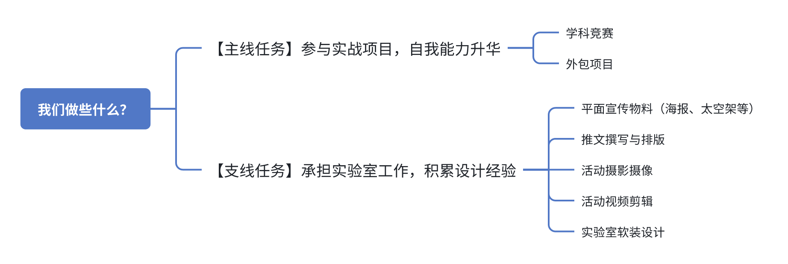
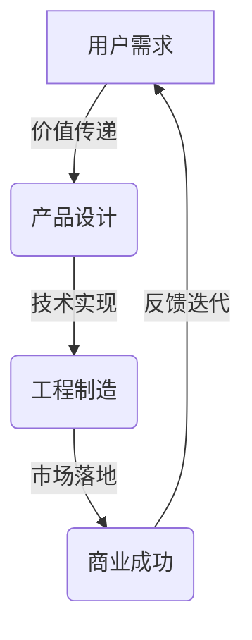
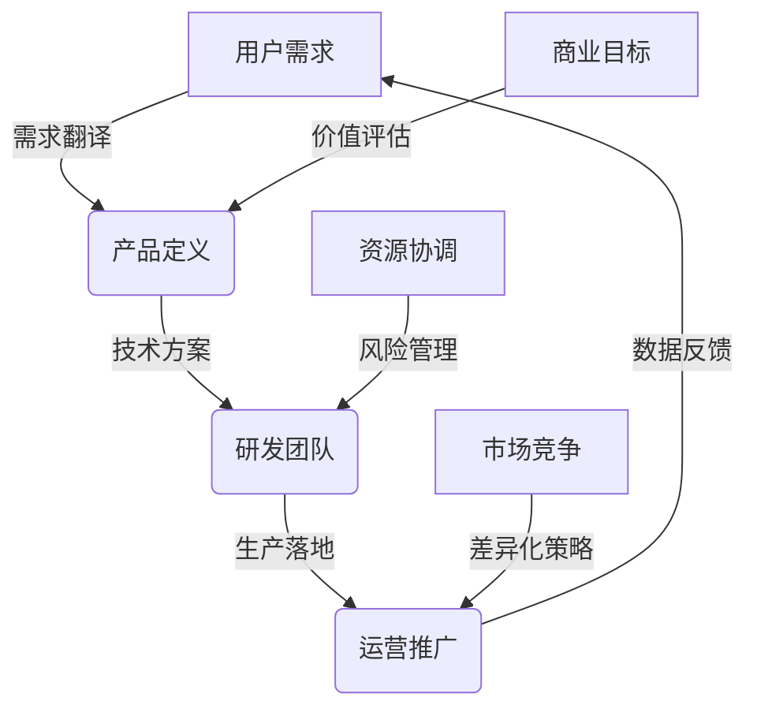
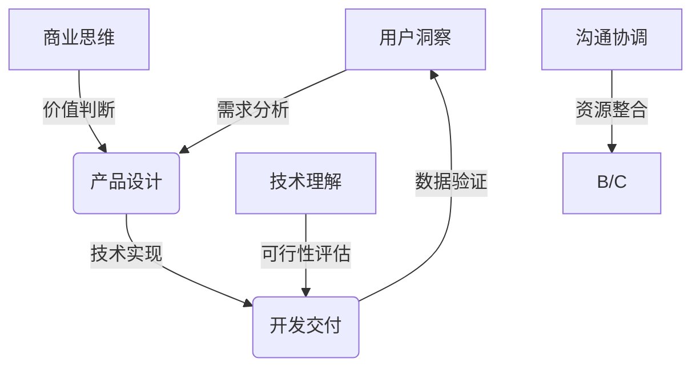

我们是SOSD-Design，顾名思义，就是做一些设计相关的事情。

# 我们的日常工作

设计组的**日常工作**围绕一些**学科竞赛**、**外包项目**展开以及**实验室的宣传工作**

## 主线任务

### 参与的竞赛

除了项目开发，我们还鼓励大家积极参与各类竞赛。以下是我们通常会参与的几项赛事：

1. [**中国大学生服务外包创新创业大赛**](http://www.fwwb.org.cn/)

2. [**“中国软件杯”大学生软件设计大赛**](https://www.cnsoftbei.com/)

3. [**中国高校计算机大赛**](http://www.c4best.cn/)——**[移动应用创新赛](https://www.appcontest.net/)、[人工智能创意赛](http://aicontest.baidu.com/)、[网络技术挑战赛](http://net.c4best.cn/)、[AIGC创新赛](https://aigc.vivo.com.cn/)、[智能交互创新赛](https://hci.oppo.com/)**

4. [**海峡两岸暨港澳地区大学生计算机创新作品赛**](https://fzs.newoe.cn/)

5. [**海峡两岸信息服务创新大赛暨福建省计算机软件设计大赛**](https://ds.fjsoft.org.cn/)

6. [**中国大学生计算机设计大赛**](https://jsjds.blcu.edu.cn/index.htm)

7. [**国际用户体验创新大赛（UXDA）**](https://2025uxda.awardclub.cn/#/)

我们会组织各个组的同学组队参与这些竞赛项目，同时也会有学长学姐和老师来进行指导。1-6是与其他组的小伙伴一起组队，7是设计组组内的小伙伴一起组队

### 外包项目

一般是配合web组一起完成外包项目。参与外包项目，你能在这些项目中得到全面锻炼，一个真正上线的项目，在求职的时候，作用是要远高于那些视频课里面的自嗨项目的，即使你只参与到了其中的一个模块。

## 支线任务——实验室宣传工作

* 平面宣传物料（海报、太空架等）

* 推文撰写与排版

* 活动摄影摄像

* 活动视频剪辑

* 实验室软装设计

* ······

# What is Design？

设计是**人类将灵感、技术与需求转化为实用解决方案的系统性创造过程**，其本质是通过「形式」与「功能」的平衡，解决真实存在的问题。以下是多维度的拆解：

## **一、设计的哲学内核**

* **以人为本**：聚焦用户痛点

* **美学重构**：打破常规的视觉表达

* **可持续性**：平衡商业价值与生态责任

* **社会赋能**：通过设计推动平等（数字包容性）

## **二、核心构成要素**

| 要素       | 作用             | 典型案例                         |
| ---------- | ---------------- | -------------------------------- |
| 功能逻辑   | 解决实际问题     | 特斯拉鸥翼门设计优化空间利用率   |
| 视觉语言   | 传递品牌基因     | Apple极简主义设计统一产品矩阵    |
| 交互体验   | 建立人机/人际连接 | 道路交通标志的全球标准化设计     |
| 技术创新   | 实现设计可行性   | 3D打印技术助力定制化假肢生产     |
| 文化语境   | 融入地域特征     | 原研哉无印良品「空」的东方美学   |

## **三、设计思维模型**

1. **共情阶段**：用户旅程地图绘制（如医院App设计前访谈500名患者）

2. **定义问题**：建立设计挑战（如「如何让老年人独立完成在线挂号？」）

3. **构思方案**：脑暴会议产出100+草图（如为残障人士设计智能餐具）

4. **原型制作**：Figma快速迭代交互原型（如电商网站结账流程优化）

5. **测试验证**：A/B测试验证设计方案（如按钮颜色改变提升30%点击率）

## **四、设计的价值维度**

* **商业价值**：设计驱动增长（如Airbnb通过改进房源照片提升60%预订率）

* **社会价值**：促进公平（如Refugee Design为难民设计身份证明解决方案）

* **技术价值**：推动创新（如柔性显示屏技术催生可穿戴设备设计革命）

* **文化价值**：传承文明（如故宫文创将传统文化符号现代化转译）

## 五、需要学习什么

### 工具篇

* **基础版**

  UI设计：[Figma](https://www.figma.com/)，[即时设计](https://js.design/)，Adobe XD，[Sketch](https://www.sketch.com/)（仅mac）等（选其一即可）（UI设计和海报制作）

  视觉设计：Adobe Photoshop（PS)，Adobe illustrator（AI)（制作海报、套素材模版、抠图批图）

  动画特效：Adobe AfterEffects（AE)（软件介绍视频剪辑）

  影像后期：Adobe Lightroom Classic（LR)

  演示PPT：Microsoft Powerpoint，WPS PPT，Keynote（看个人喜好和设备）（演示PPT制作、项目演示文档制作）

  文档撰写：Microsoft Word，WPS Word（相信大家都会的哈哈哈哈，但是有一个排版优秀的文档真的非常重要）（各种赛方要求的文档撰写）

* **进阶版**

  UI动效：[ProtoPie](https://www.protopie.cn/)

  3D建模：[Spline](https://spline.design/)（强推！！！），C4D，Blender

  AI工具：[莫高设计](https://mastergo.com/)，Mijourney，Stable Diffusion

（欢迎补充）

> 了解AI工具强推这几篇文档🤩
>
> [ 通往AGI之路](https://waytoagi.feishu.cn/wiki/QPe5w5g7UisbEkkow8XcDmOpn8e?from=from_copylink)
>
> [ 奔赴AGI](https://aigcreative.feishu.cn/wiki/DQGiwCAwji9ZoAkwZ7Tcvqhvngf?from=from_copylink)
>
> [ AI 产品榜  aicpb.com](https://dnipkggqxh.feishu.cn/wiki/YTIUwM6Vmij4IQkSm9PctPWunIb?from=from_copylink)

### 规范篇

不同手机厂商的设计规范文档，方便做出符合标准的组件

如：[apple developer design](https://developer.apple.com/cn/design/)

***

## 六、推荐参考&素材网站

[Dribbble](https://dribbble.com/)：平面设计和UI设计参考网站

[阿里巴巴矢量图标库](https://www.iconfont.cn/)

[figma社区](https://www.figma.com/community)

[envato](https://elements.envato.com/)：视频模版站（有点小贵，可以找到想要的模版素材去淘宝看一下有没有帮忙下载的）

# What is Product Design？

产品设计是**将用户需求、技术可行性与商业目标系统化转化为实体或数字产品的过程**，其本质是构建「问题-方案-价值」的闭环。以下是多维度的深度解析：

## **一、核心定义与哲学**

* **本质**：通过设计语言解决真实问题

* **设计三角**：

* **核心原则**：

  * **用户中心**​（Don Norman的《设计心理学》）

  * **系统思维**​（考虑产品生命周期全链路）

  * **可持续性**​（从材料选择到回收闭环）

提到产品设计就不得提到这个职业了——产品经理

## 二、产品经理的核心定位与价值

## **三、产品经理核心能力钻石模型**

## **四、产品经理关键技能矩阵**
| 技能维度   | 具体能力                          | 工具/方法论                | 评估标准               |
| ---------- | --------------------------------- | -------------------------- | ---------------------- |
| 商业分析   | LTV/CAC计算、ROI分析、定价策略    | Excel建模、财务模型模板    | 商业价值量化能力       |
| 技术理解   | API对接、数据库设计、基础开发知识 | 技术白皮书阅读、GitHub开源项目 | 能否与工程师高效沟通   |
| 用户研究   | 定量分析（Python/Pandas）、定性分析 | 用户访谈提纲、NPS问卷设计  | 需求优先级判断准确率   |
| 产品设计   | 原型设计（Figma）、交互逻辑       | 用户故事地图、设计系统搭建 | 原型可用性评分         |
| 数据分析   | A/B测试设计、漏斗分析、归因模型   | Google Analytics、Mixpanel | 数据结论驱动决策的能力 |
| 项目管理   | 甘特图制定、风险管理、资源协调    | Jira看板、RACI矩阵         | 项目按时交付率         |
| 沟通表达   | PRD撰写、设计评审话术、跨部门汇报 | TED式演讲训练、金字塔原理  | 方案说服力与执行力     |

## **五、产品经理与设计师的协作关系**

| 角色       | 侧重点                 | 协作场景                     | 冲突点与解决方式                     |
| ---------- | ---------------------- | ---------------------------- | ------------------------------------ |
| 产品经理   | 商业价值、功能优先级   | 需求评审会（讨论砍掉次要功能） | 用数据证明需求价值（如留存率提升预测） |
| UI设计师   | 视觉美感、用户体验一致性 | 原型设计评审（布局合理性）   | 采用用户测试验证设计方案             |
| UX设计师   | 交互流程、用户认知负荷 | 交互逻辑评审（点击路径优化） | 制作用户旅程地图达成共识             |

产品经理的本质是**商业价值的建筑师**，需要用技术实现可能性，用设计创造体验，用数据验证假设。在这个VUCA时代，建议构建「T型+π型」能力：纵向深耕某个垂直领域（如AI硬件），横向拓展跨部门协作（如供应链管理），同时培养商业领导力（如融资路演能力）。记住：最好的产品不是最完美的方案，而是**最能解决真实痛点的最小可行产品**​（MVP）。

## 六、**关键结论**

产品设计是**商业、技术与人文的交响曲**，优秀的产品不仅是功能的堆砌，更是生活方式的提案。在这个体验经济时代，产品设计师需要像导演一样掌控全局——既要深谙用户心理（如马斯洛需求层次），又要精通工程实现（如注塑工艺），还要具备商业嗅觉（如定价策略）。记住：​**最好的产品设计不是最完美的，而是最能创造可持续价值的**。正如乔布斯所言：「设计是人性化的科技。」

## 贡献者

    <!-- 贡献者 2 -->    
  

    
    
<a href="https://github.com/Rebeccaxy" target="_blank">雷茜媛</a>

  

