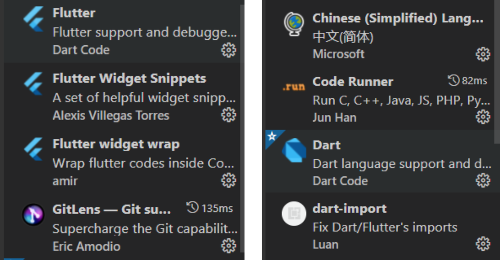

## Flutter→Dart

&#x20;[依赖库](https://pub-web.flutter-io.cn/)、  [王叔不秃](https://space.bilibili.com/589533168?spm_id_from=333.337.0.0)、  《Flutter组件详解与实战》

##### 1）你应该了解的

flutter作为目前较为主流的跨平台解决方案，可以自由的适配网页端、Android端、IOS端，做到一份代码，多端适用，大大降低了开发的成本，国内知名的闲鱼，就是采用了flutter跨平台技术。Google作为flutter框架的开发公司，致力于打造出一款多端开发的利器，技术在近几年逐渐成熟，值得学习。

##### 2）学习路线

* 语言学习：flutter框架所选择使用的语言是dart语言，是一款类似于java的语言，所以如果你有java的学习经验，就可以轻松上手dart语言的学习了！但即使没有任何语言经验，仍可以快速上手使用。

  * [B站视频教程，前15讲Dart](https://www.bilibili.com/video/BV1S4411E7LY?from=search\&seid=15503597704627681760)

* flutter框架的安装：这个安装有些坑的，建议慢慢来，按照视频一步一步来

  * [B站视频教程](https://www.bilibili.com/video/BV1S4411E7LY?from=search\&seid=15503597704627681760)

  * [flutter官方文档](https://flutterchina.club/setup-windows/)

* flutter框架的学习：快速学习flutter，通过视频快速解决flutter的多种内置组件

  * [B站视频教程](https://www.bilibili.com/video/BV1S4411E7LY?from=search\&seid=15503597704627681760)

  * [flutter官方文档](https://flutterchina.club/setup-windows/)

  * 各种博客和掘金上的文档

  * [中文文档](https://flutter.cn/docs)

* **cxq 学长超喜欢的 flutter up主**  [王叔不秃](https://space.bilibili.com/589533168?spm_id_from=333.337.0.0)（**小亮表示同意，确实非常有意思**）

* 推荐使用vscode进行开发flutter的开发：可以通过多种插件简化开发   （cxq 学长建议 Android Studio 个人喜欢）

记得在 vscode 中安装 flutter 和 dart 插件

* 提高审美

  * [dribbble](https://dribbble.com/)

  * [zcool](https://www.zcool.com.cn/)

* 一些素材库，包括图片素材，icon素材

  * [iconfont矢量图标库](https://www.iconfont.cn/)

  * [免费插画网站](https://iradesign.io/)

* Flutter常用基础组件的学习（下列内容需要自己找找资料学习，当然也可以直接配合最后的项目一起学习，一边看项目，一边学组件，更能学会他的使用方式）

  * Flutter官方推荐状态共享方案：provider

  * 状态管理框架： getx （用起来更顺手）

  * 路由组件：fluro

  * 网络请求框架：dio

  * 轮播图：flutter\_swiper

  * 多合一工具组件：flustars

  * 屏幕适配方案：flutter\_screenutil

  * ......

* Flutter基础项目的学习（经过一段时间的学习，相信你已经领会了一些基本组件的使用，但是，单纯只会使用这些组件却无法将他们组合起来，成为一个应用，这样的学习只能说是打个基础，在这个阶段，我们需要的就是一个项目，通过这个项目来进行学习，达到事半功倍的效果。）

  * [flutter基础框架构成的学习，这个框架的flutter版本是1.x的，记得降级](https://github.com/haolizi/electricity_flutter)

***

PS：感谢小亮学长的整理&#x20;

## 贡献者

  <!-- 贡献者 1 -->    
  

    
    
<a href="https://github.com/LucaAnd2024?tab=repositories" target="_blank">李佳亮</a>

  

