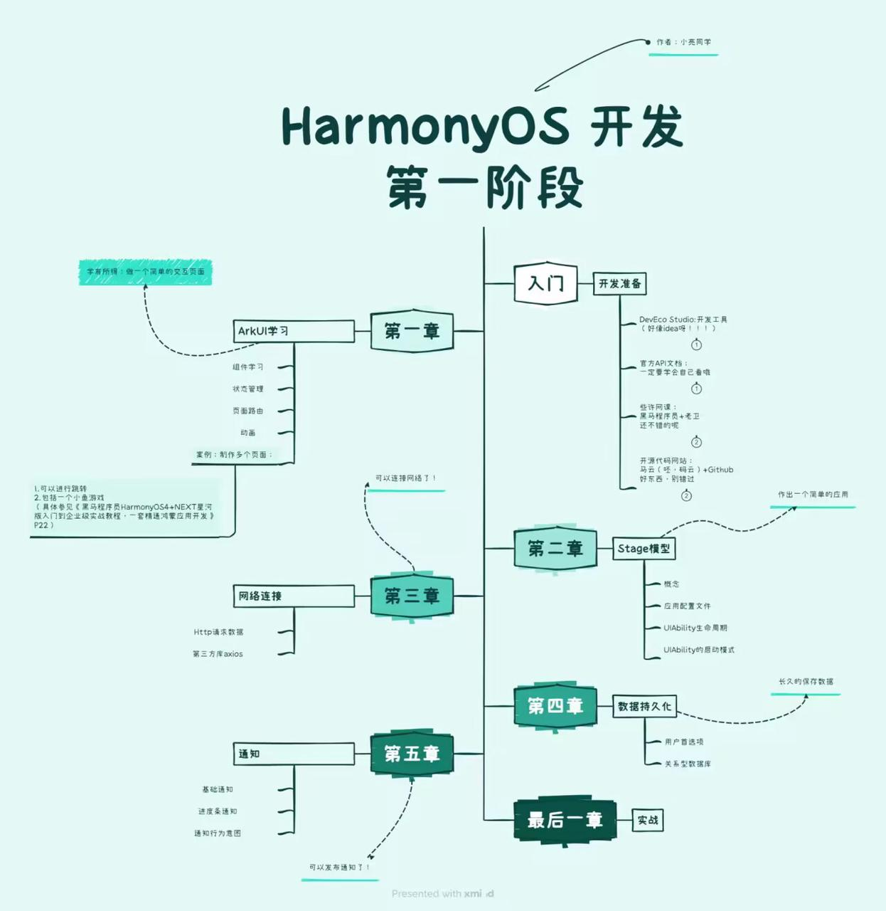

### 鸿蒙→ArkTS

#### 1）总路线

目前而言，学完下面的基础知识，再学会前后端对接，就可以打比赛了。

#### 2）开发前的准备

准备一个华为的账号，[点击这里](https://id1.cloud.huawei.com/CAS/portal/userRegister/regbyemail.html?reqClientType=89\&loginChannel=89000700\&lang=zh_CN\&countryCode=CN\&service=https%3A%2F%2Foauth-login.cloud.huawei.com%2Foauth2%2Fv2%2Fauthorize%3Faccess_type%3Doffline%26response_type%3Dcode%26client_id%3D106899921%26redirect_uri%3Dhttps%253A%252F%252Fdeveloper.huawei.com%252Fhome%252Fhdhome-handle-register.html%253FurlBeforeLogin%253Dhttps%25253A%25252F%25252Fdeveloper.huawei.com%25252F%26login_channel%3D89000700%26scope%3Dhttps%253A%252F%252Fwww.huawei.com%252Fauth%252Faccount%252Floginid%2Bhttps%253A%252F%252Fwww.huawei.com%252Fauth%252Faccount%252Fbase.profile%2Bhttps%253A%252F%252Fwww.huawei.com%252Fauth%252Faccount%252Fmobile.number%2Bemail)一键传送（免费的，有手机号和邮箱号就行）。

准备开发所需的IDE（你不知道IDE是什么？[看这里](https://blog.csdn.net/m0_74028782/article/details/135180131)）：[DevEco-Studio](https://developer.huawei.com/consumer/cn/deveco-studio/)

#### 3) 课程资料

首推华为[官网课程](https://developer.huawei.com/consumer/cn/teaching-video/)，现阶段，鸿蒙语言的更新迭代速度极快，有些东西能用，但是他们早已不进行维护更新，而市面上很多课程其实并没有实时更新，所以建议查看官网来进行学习。

好了，我要说但是了，但是呢他们的官方课程其实讲解非常难懂，也非常的快，所以在看官方课程无果的情况下，可以尝试[黑马的课程](https://www.bilibili.com/video/BV14t421W7pA/?p=1\&spm_id_from=pageDriver\&vd_source=357ae64d39472f5339b85d801197a2d5)或者是[老卫的系列课程](https://github.com/waylau/harmonyos-tutorial)，虽然没有做到与时俱进，有些东西已经淘汰，但是作为入门还算ok。

还有[华为推送的开发者礼包](https://docs.qq.com/sheet/DQ0JyZlFPVVJIR3RK?tab=w70n0s)、[别的开发者的资料参考](https://hm.codefe.cn/docs/tutorial/intro/)、一些[实例代码](https://developer.huawei.com/consumer/cn/samples/)

#### 4) 遇到问题时

遇到问题的解决途径

[官方的文档](https://developer.huawei.com/consumer/cn/doc/harmonyos-guides-V5/application-dev-guide-V5)，需要什么直接搜索

[开发者论坛](https://developer.huawei.com/consumer/cn/forum/)，这里面可以找到很多和你有相同问题的人。

***

PS：感谢小亮学长的整理&#x20;

## 贡献者

  <!-- 贡献者 1 -->    
  

    
    
<a href="https://github.com/LucaAnd2024?tab=repositories" target="_blank">李佳亮</a>

  

