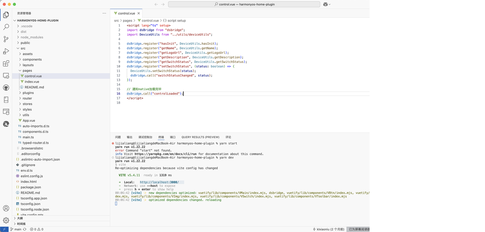

ps：本文档作者小亮学长&#x20;

小亮随便写点什么吧，3、4 月份应该会持续更新（[ RN 迁移鸿蒙文档](https://ccnml9qi8pl2.feishu.cn/wiki/PWpywm7Fji7Av3kB52DcFHbunAg?from=from_copylink)）


&#x20;RN 适配鸿蒙文档：[docs/zh-cn/架构介绍.md · OpenHarmony-SIG/ohos\_react\_native - Gitee.com](https://gitee.com/openharmony-sig/ohos_react_native/blob/0.72.5-ohos-5.0-release/docs/zh-cn/%E6%9E%B6%E6%9E%84%E4%BB%8B%E7%BB%8D.md#%E6%9E%B6%E6%9E%84%E4%BB%8B%E7%BB%8D)

## Before

### RN 框架

React Native（RN）是 Facebook 于 2015 年推出的跨平台移动开发框架，允许开发者使用 JavaScript 和 React 语法编写代码，通过桥接（Bridge）技术将代码转换为原生系统（iOS/Android）的 UI 组件和功能调用。

### **文档中都讲了什么**：

简单说一下文档中涉及的知识点，具体的知识点详情请看上方文档。

1. **RNOH架构** ，讲了一下不同框架下各部分的作用

2. 详细的讲了一下**RN库代码**，简单的讲了一下封装和配置

3. &#x20;**Fabric**（React Native 的组件渲染系统，RN->F->原生 OS），这其中提到了C-API（[ContentSlot](https://gitee.com/openharmony-sig/ohos_react_native/blob/0.72.5-ohos-5.0-release/docs/zh-cn/%E6%9E%B6%E6%9E%84%E4%BB%8B%E7%BB%8D.md#contentslot%E6%8E%A5%E5%85%A5)对接到 ArkUI 的后端接口进行渲染）的具体优势。

4. 之后讲了一下**TurboModule**，是React Native 中用于 JavaScript 和原生代码进行交互的模块（我是小白，区分一下，Fabric是组件渲染，而TurboModule对接 JS 代码），分为 cxxTurboModule 和 ArkTSTurboModule

5. **React Native线程模型**讲了RNOH线程模型的四个线程（MAIN，JS，BACKGROUND，WORKER）、RNOH线程的长期演进和典型线程Trace图

   1. MAIN/UI（组件管理、TurboModule业务功能、交互和消息）

   2. JS 线程（通过 React 代码与 RN Common 的核心代码交互完成 React Native 的 Render 阶段任务）

   3. BACKGROUND（会将 JS 线程的部分布局、ShadowTree 比较的任务迁移到该线程执行，从而降低 JS 线程的负荷）

   4. WORKER（新特性，将 TurboModule 运行在 worker 线程）

   5. 线程扩展：增加唯一 TM 线程（将 TurboModule 的业务代码放到 TM 线程来执行，从而降低 MAIN 线程负荷），增加单独的 TIMER 线程，确保时间基准稳定执行

6. **命令式组件**

   1. ContentSlot接入，推荐使用[ContentSlot](https://gitee.com/link?target=https%3A%2F%2Fdeveloper.huawei.com%2Fconsumer%2Fcn%2Fdoc%2Fharmonyos-guides-V5%2Farkts-rendering-control-contentslot-V5)占位组件管理Native API创建的组件（ContentSlot在内存和性能方面都优于NODE类型的XComponent。此外XComponent的libraryname参数不支持跨module使用，即无法找到其它模块中的同名so，RNOH的日志会提示找不到对应的so），分为createSurface、startSurface两个步骤

   2. CAPI组件向上对接RN指令，`SchedulerDelegate.cpp` 负责处理 RN Common 传递下来的指令 MountingManagerCAPI.cpp 的didMount中对各个指令进行处理（先根据预先配置的arkTsComponentNames 获取 ArkTS 组件和 CAPI 组件的指令，分别进行处理，API 组件的指令会在 `handleMutation` 方法中逐个遍历每个指令，根据指令的类型（Create 、Delete、Insert、Remove、Update）进行不同的处理）

   3. 适配层事件分发逻辑（React Native for OpenHarmony（RNOH）架构中，处理和传递各种事件（如触摸事件、点击事件等）的一套机制），注册（SurfaceTouchEventHandler）->接收（回调传递处理）->处理（OH\_ArkUI\_NodeEvent\_GetEventType，touch和非touch）->touch->非touch

7. **RHOH启动流程**:RN 容器创建、Worker 线程启动、NAPI 方法初始化、RN 实例创建四个阶段，接下来加载 bundle 和界面渲染

## 1.  RN鸿蒙适配方案

> 这里是笔记整理思路，用来补充下面的文字：ok，我们来说一下他是怎么实现第三方适配的吧，首先是架构层面，在**RN库代码**中设计有**Fabric**和**TurboModule**完成组件渲染和 JS 业务对接，**FabricFabric**通过 **C-API&#x20;**&#x76F4;连 arkui后端渲染，跳过传统的桥接层，**TurboModule&#x20;**&#x5206;为**ArkTSTurboModule（**&#x901A;过NAPI调用 ArkTS 原生 AP&#x49;**）**&#x548C;**cxxTurboModule（**&#x7EAF; C++ 实现，无需系统 API，通过 JSI 直接与 JS 交&#x4E92;**），**&#x5728;线程模型调整方面，华为分有四个线程并进行了拓展。

#### 1. 适配层设计

* **TurboModule&#x20;**：华为将 TurboModule 分为 ArkTSTurboModule 和 cxxTurboModule。ArkTSTurboModule 通过 NAPI 调用 ArkTS 原生 API，支持同步/异步操作，依赖 ArkTSMessageHub 进行线程间通信；cxxTurboModule 纯 C++ 实现，通过 JSI 直接与 JS 交互，减少跨语言开销。

* **Fabric 渲染优化**：

  采用 C - API 直连 ArkUI，跳过传统 React Native 的桥接层，使用 ContentSlot 替代 XComponent 解决跨模块 SO 依赖问题。这种方式无数据类型转换，支持属性 Diff，避免重复渲染。

#### 2. 线程模型调整

华为设计了 4 线程分工模型，包括 MAIN 线程处理 ArkUI 组件生命周期和 TurboModule 业务逻辑；JS 线程执行 JS 代码，生成 ShadowTree 并计算布局；WORKER 线程运行 TurboModule 任务；BACKGROUND 线程（实验性）分担 JS 线程的布局计算。


## 2. Platform 判断

> 在现有的跨平台架构项目中，往往会有一个 Platform，比如 import { Platform } from 'react-native'，目前 RN 的 Platform 里没有 openharmony，那么华为是如何实现插入其中并做 Platform 判断的呢？文档中有提到“在现行的 React Native 中，有很多属性是在 React 侧完成的封装，也有很多属性是平台独有的。**为了达成这个效果，React Native 在 JS 侧根据 `Platform` 增加了很多判断。**&#x6240;以，React Native 的鸿蒙化适配也需要增加 `OpenHarmony` 相关的平台判断，与相应的组件属性的封装。为此，**鸿蒙化团队提供了 `react-native-harmony` 的 tgz 包，并通过更改 `metro.config.js` 配置，将该 tgz 包应用到 Metro Bundler 中**。”但是没有说到具体怎么实现插入判断的....我回头自己搜一下

鸿蒙化团队提供了 `react-native-harmony` 的 tgz 包，并通过更改 `metro.config.js` 配置，将该 tgz 包应用到 Metro Bundler 中。

## 3. 第三方库适配

### 第三方库迁移策略：

#### 文档依据：

[zh-cn/third-party.md · react-native-oh-library/docs - Gitee.com](https://gitee.com/react-native-oh-library/docs/blob/master/zh-cn/third-party.md#%E4%B8%89%E6%96%B9%E5%BA%93%E7%BB%84%E6%88%90)

#### 分类：

这里面讲了具体的分类和大致的实现方法，根据 RN 三方库的实现方式可分为：原生库，JS 库，纯 JS 库，根据不同的分类会有不同的移植策略。简单来说，原生模块提供了与底层平台直接交互的能力，可以实现对底层功能的更深度的控制。JS 库这专门为 React Native 开发，但不涉及原生实现，利用 React Native 提供的桥接机制和 API 来实现其功能，或者通过其他三方库实现二次封装的功能，所以涉及较少的开发工作。纯 JS 库是纯粹的 JavaScript 模块，不依赖 React Native 平台的特定功能，可以在多种 JavaScript 环境中运行。

#### 迁移点：

简单了解完原理，我们了解一下每个框架的迁移点。

**原生库：**

这类库需要参考原库逻辑来移植，有着如下移植点：

* RN JS 侧适配新架构

* RN JS 侧适配 HarmonyOS 平台

* 利用 codegen 搭建 Bridge 的通信通道（开发相对固定）

* 使用 arkts 复刻原库逻辑实现原库效果

**JS 库：**

由于是基于 RN 接口的封装，所以涉及较少的开发工作，移植点包含：

* RN JS 侧适配 HarmonyOS 平台

* 大量测试对比

**纯 JS 库：**

由于是基于 RN 接口的封装，所以没有开发工作，主要是测试对应各个平台效果是否一致，不一致则需要反馈给框架层。因为使用的 RN 引擎是一致的，所以通常来说接口都是正常可用的。

### 迁移方法

迁移到新框架分为两步：JS 代码迁移和原生代码迁移。

#### JS 代码迁移方法：

##### 文档依据：

 [ https://gitee.com/react-native-oh-library/docs/blob/master/zh-cn/migration.md#https://gitee.com/link?target=https%3A%2F%2Freactnative.cn%2Fdocs%2Fnew-architecture-intro](https://gitee.com/react-native-oh-library/docs/blob/master/zh-cn/migration.md#https://gitee.com/link?target=https%3A%2F%2Freactnative.cn%2Fdocs%2Fnew-architecture-intro)

##### 具体方法：

###### 判断三方库是否支持新框架：

有三个方法来判断：

一般用第一个方法就能快速识别。

###### 预备工作：


#### 原生平台代码迁移方法：

[https://reactnative.cn/docs/new-architecture-library-ios](https://reactnative.cn/docs/new-architecture-library-ios)

### RNOH 和 JS 第三方库：

[https://gitee.com/react-native-oh-library/usage-docs#%E7%AE%80%E4%BB%8B](https://gitee.com/react-native-oh-library/usage-docs#%E7%AE%80%E4%BB%8B)

这里面是已经有的第三方库，挺全的

### taro 框架？

[https://docs.taro.zone/docs/react-native-harmony](https://docs.taro.zone/docs/react-native-harmony)


## 4. 编写原生鸿蒙 RN 项目

[https://gitee.com/openharmony-sig/ohos\_react\_native/blob/master/docs/zh-cn/%E7%8E%AF%E5%A2%83%E6%90%AD%E5%BB%BA.md#%E5%9C%A8%E5%8E%9F%E7%94%9F%E5%B7%A5%E7%A8%8B%E4%B8%AD%E9%9B%86%E6%88%90rnoh](https://gitee.com/openharmony-sig/ohos\_react\_native/blob/master/docs/zh-cn/%E7%8E%AF%E5%A2%83%E6%90%AD%E5%BB%BA.md#%E5%9C%A8%E5%8E%9F%E7%94%9F%E5%B7%A5%E7%A8%8B%E4%B8%AD%E9%9B%86%E6%88%90rnoh)


## 5. 目前的问题

### 1.expo库

目前我们用的最多的就是expo库，需要了解一下RN 是否有适配 expo 库的方法

#### 1. 了解 expo库（[Expo 介绍](https://jigang-duan.github.io/2018/02/08/expo-introduce/)）&#xA;[Expo](http://expo.io/)是一套工具、库和服务，让你可以通过编写JavaScript来构建本地的iOS和Android应用程序。


#### 2. 查看文档

搜查了官网（[https://docs.expo.dev/](https://docs.expo.dev/)），论坛（[https://forums.expo.dev/](https://forums.expo.dev/)），官方在 12 月份表示会适配鸿蒙，但不是重点项目，想来应该是不会适配了，看一下有没有高人在做这件事。

...并没有高手在做这件事，我还是看一下 Expo 库是否有平替吧


#### 3. 我们用了哪些 expo库以及是否有平替

```java
    "expo": "^52.0.28",
    "expo-blur": "^14.0.3",
    "expo-build-properties": "~0.13.2",
    "expo-calendar": "~14.0.6",
    "expo-camera": "~16.0.17",
    "expo-constants": "~17.0.5",
    "expo-crypto": "~14.0.2",
    "expo-image": "~2.0.4",
    "expo-intent-launcher": "~12.0.2",
    "expo-linear-gradient": "^14.0.2",
    "expo-linking": "~7.0.5",
    "expo-localization": "~16.0.1",
    "expo-navigation-bar": "^4.0.7",
    "expo-router": "~4.0.17",
    "expo-sharing": "~13.0.1",
    "expo-splash-screen": "~0.29.21",
    "expo-status-bar": "~2.0.1",
    "expo-system-ui": "~4.0.7",
    "expo-tracking-transparency": "~5.1.1",
    "expo-web-browser": "~14.0.2",
```


1. &#x20;`expo-blur`

"expo-blur": "^14.0.3"

**用途**：该库用于在应用中创建模糊效果。可以为视图添加模糊背景，增强用户界面的视觉效果。

**平替**：鸿蒙的 `BlurEffect` 类

* `expo-build-properties`

"expo-build-properties": "\~0.13.2"

**用途**：用于配置Expo项目的构建属性。可以帮助开发者自定义项目的构建配置，如Android的Gradle属性、iOS的Xcode配置等。

**平替**：无，额，这个好像也不需要吧

* `expo-calendar`（[Calendar](https://docs.expo.dev/versions/latest/sdk/calendar/)）

"expo-calendar": "\~14.0.6"

**用途**：
`expo-calendar` 提供了一个 API，用于与设备的系统日历、事件、提醒和关联记录进行交互。此外，它还提供了启动[系统提供的日历 UI](https://docs.expo.dev/versions/latest/sdk/calendar#launching-system-provided-calendar-dialogs) 的方法，以允许用户查看或编辑活动。在 Android 上，这些方法使用 Intent 启动系统日历应用。在 iOS 上，它们将 [`EKEventViewController`](https://developer.apple.com/documentation/eventkitui/ekeventviewcontroller) 或 [`EKEventEditViewController`](https://developer.apple.com/documentation/eventkitui/ekeventeditviewcontroller) 显示为模式。

**平替：**&#x43;alendar Kit（日历服务）（https://developer.huawei.com/consumer/cn/doc/harmonyos-references-V5/calendar-api-V5）

* `expo-camera`[Camera](https://docs.expo.dev/versions/latest/sdk/camera/)

"expo-camera": "\~16.0.17"

**用途**：用于在应用中实现相机功能。可以拍照、录制视频，还支持设置相机的各种参数，如闪光灯模式、对焦模式等。

**平替：**[Camera Kit简介-Camera Kit（相机服务）-媒体](https://developer.huawei.com/consumer/cn/doc/harmonyos-guides-V5/camera-overview-V5)

* `expo-constants`[Constants](https://docs.expo.dev/versions/latest/sdk/constants/#installation)

"expo-constants": "\~17.0.5"

**用途**：

* 设备型号、系统版本、屏幕状态栏高度等硬件 / 系统属性。

* 应用的构建配置（如版本号、打包信息）、执行环境（Expo Go、独立应用或裸工程）。

**平替：无**

* `expo-crypto`[Crypto](https://docs.expo.dev/versions/latest/sdk/crypto/)

"expo-crypto": "\~14.0.2"

**用途**：提供了加密和解密相关的功能。可以进行哈希计算、加密算法等操作，用于保护应用中的敏感数据。`~` 表示安装版本大于等于 `14.0.2` 且小于 `14.1.0` 的库。

**平替：**[Crypto Architecture Kit（加解密算法框架服务）-安全-系统](https://developer.huawei.com/consumer/cn/doc/harmonyos-guides-V5/crypto-architecture-kit-V5?ha_source=sousuo\&ha_sourceId=89000251)

* `expo-image`

"expo-image": "\~2.0.4"

**用途**：用于在应用中加载和显示图像。支持多种图像格式，并且可以进行图像的缓存、缩放等处理。

**平替：**[图片开发指导(ArkTS)-Image Kit（图片处理服务）-媒体](https://developer.huawei.com/consumer/cn/doc/harmonyos-guides-V5/image-arkts-dev-V5)

* `expo-intent-launcher`

"expo-intent-launcher": "\~12.0.2"

**用途**：主要用于Android平台，允许应用启动其他应用的特定功能或活动。通过发送意图（Intent）来调用其他应用的服务。`~` 表示安装版本大于等于 `12.0.2` 且小于 `12.1.0` 的库。

**平替：无，不用管**

* `expo-linear-gradient`https://docs.expo.dev/versions/latest/sdk/linear-gradient/

"expo-linear-gradient": "^14.0.2"

**用途**：用于在应用中创建线性渐变效果。可以为视图添加渐变背景，增强界面的视觉效果。

**平替：&#x20;**&#x9E3F;蒙自带的，也许可以完成[颜色渐变-通用属性-组件通用信息-ArkTS组件-ArkUI（方舟UI框架）-应用框架](https://developer.huawei.com/consumer/cn/doc/harmonyos-references-V13/ts-universal-attributes-gradient-color-V13#lineargradient)

* `expo-linking`https://docs.expo.dev/versions/latest/sdk/linking/

"expo-linking": "\~7.0.5"

**用途**：提供了处理应用链接的功能。可以实现应用内的深层链接，即通过URL链接打开应用内的特定页面。

**平替：**[使用App Linking实现应用间跳转-拉起指定应用-应用间跳转-Stage模型开发指导-Ability Kit（程序框架服务）-应用框架](https://developer.huawei.com/consumer/cn/doc/harmonyos-guides-V5/app-linking-startup-V5#section6903241628)

* `expo-localization`

"expo-localization": "\~16.0.1"

**用途**：

* 语言与地区：获取用户设备的语言标签（如 `en-US`）、地区代码（如 `US`）、文本方向（LTR/RTL）。

* 格式与单位：支持货币符号（如 `$`）、十进制分隔符（`.` 或 `,`）、测量系统（公制 / 英制）、时区等。

* 日历与时间：获取用户首选的日历类型（如公历、农历）、24 小时制开关、每周起始日等。

**平替：**[@ohos.resourceManager (资源管理)-ArkTS API-Localization Kit（本地化开发服务）-应用框架](https://developer.huawei.com/consumer/cn/doc/harmonyos-references-V13/js-apis-resource-manager-V13)

* `expo-navigation-bar`[NavigationBar](https://docs.expo.dev/versions/latest/sdk/navigation-bar/)

"expo-navigation-bar": "^4.0.7"

**用途**：用于控制Android设备的导航栏。可以设置导航栏的颜色、透明度等属性，以实现与应用界面的风格统一。

**平替：**[Navigation-导航与切换-ArkTS组件-ArkUI（方舟UI框架）-应用框架](https://developer.huawei.com/consumer/cn/doc/harmonyos-references-V13/ts-basic-components-navigation-V13)

* `expo-router`https://docs.expo.dev/versions/latest/sdk/router/

"expo-router": "\~4.0.17"

**用途**：是Expo的路由库，用于管理应用的页面导航。可以定义路由规则，实现页面之间的跳转和参数传递。`~` 表示安装版本大于等于 `4.0.17` 且小于 `4.1.0` 的库。

**平替：**[github.com](https://github.com/react-native-oh-library/react-navigation/tree/sig/packages/native-stack)**也许可以吧**


* `expo-sharing`https://docs.expo.dev/versions/latest/sdk/sharing/

"expo-sharing": "\~13.0.1"

**用途**：提供了分享功能，允许用户将应用内的内容分享到其他应用或平台。可以分享文本、图片、文件等。`~` 表示安装版本大于等于 `13.0.1` 且小于 `13.1.0` 的库。

**平替：**[Share Kit(分享服务) | 华为开发者联盟](https://developer.huawei.com/consumer/cn/sdk/share-kit/?ha_source=sousuo\&ha_sourceId=89000251)

.png)

* `expo-splash-screen`https://docs.expo.dev/versions/latest/sdk/splash-screen/

"expo-splash-screen": "\~0.29.21"

**用途**：用于管理应用的启动屏。可以自定义启动屏的显示内容和显示时间，提升用户体验。

**平替：**[【代码案例】HarmonyOS NEXT 启动页实现案例-华为开发者问答 | 华为开发者联盟](https://developer.huawei.com/consumer/cn/forum/topic/0201163460999436146?fid=0109140870620153026)

* `expo-status-bar`https://docs.expo.dev/versions/latest/sdk/status-bar/

"expo-status-bar": "\~2.0.1"

**用途**：用于控制应用的状态栏。可以设置状态栏的颜色、透明度、文本样式等属性。

**平替：**[应用接入状态栏-Status Bar Extension Kit（状态栏开放服务）-基础功能-系统](https://developer.huawei.com/consumer/cn/doc/harmonyos-guides-V5/statusbar-extension-guide-V5)

[statusBarManager（状态栏管理服务）-ArkTS API-Status Bar Extension Kit（状态栏开放服务）-基础功能-系统](https://developer.huawei.com/consumer/cn/doc/harmonyos-references-V13/statusbar-extension-manager-V13)

[404](https://developer.huawei.com/consumer/cn/doc/harmonyos-faqs-V5/faqs-arkui-214-V5)

* `expo-system-ui`https://docs.expo.dev/versions/latest/sdk/system-ui/

"expo-system-ui": "\~4.0.7"

**用途**：用于控制设备的系统UI，如状态栏、导航栏等。可以实现沉浸式体验，让应用界面与系统UI更好地融合。

**平替：**&#x4E0D;太懂干什么的，也许`window`可以吧

* `expo-tracking-transparency`https://docs.expo.dev/versions/latest/sdk/tracking-transparency/

"expo-tracking-transparency": "\~5.1.1"https://docs.expo.dev/versions/latest/sdk/tracking-transparency/

**用途**：主要用于iOS平台，用于请求用户授权应用进行数据跟踪。符合苹果的隐私政策要求。

**平替：**[应用权限管理 · 鸿蒙OS开发文档](https://harmonyos.litebook.cn/docs/ying-yong-quan-xian-guan-li.html)

[裴云飞/桃夭](https://gitee.com/zhongte/TaoYao)

* `expo-web-browser`https://docs.expo.dev/versions/latest/sdk/webbrowser/

"expo-web-browser": "\~14.0.2"

**用途**：用于在应用内打开网页。可以使用系统的浏览器打开网页，也可以使用自定义的WebView组件。

**平替：https://developer.huawei.com/consumer/cn/doc/harmonyos-guides-V5/arkweb-V5**

### 2.Platform判断

https://gitee.com/react-native-oh-library/docs/blob/master/zh-cn/deprecated/strategy.md


每个库可能在自身代码添加许多平台判断，因此我们需要根据我们的对标策略，适当的添加平台判断代码：

1. Platform 接口中 HarmoyOS 判断

```plain&#x20;text
  if (Platform.OS === 'ios') {
    headerHeight = 32;
  } else if (Platform.OS === 'android') {
    headerHeight = 56;
  } else if (Platform.OS === 'harmony') {
    headerHeight = 32;
  } else {
    headerHeight = 64;
  }
   headerTitleAlign = Platform.select({
      ios: 'center',
      harmony: 'center',
      default: 'left',
    })
```

1. 添加 HarmonyOS 平台后缀的文件

2. 如 [react-native-tab-view](https://gitee.com/link?target=https%3A%2F%2Fgithub.com%2Freact-navigation%2Freact-navigation%2Ftree%2Fmain%2Fpackages%2Freact-native-tab-view%2Fsrc) 中包含，Pager.android.tsx、Pager.ios.tsx、Pager.tsx 代码文件，我们则需要对标 iOS 添加Pager.harmoy.tsx文件，代码实现则复制至 Pager.ios.tsx。若在该库中缺少这部分添加则该库会走到 window 侧实现，虽然可以运行但性能效果缺相差甚远。类似的需要注意的代码文件还有 xx.native.tsx。

以上列举了常见的平台判断，在移植时排除以上内容后必须在 js 代码中全量搜索以下关键词，以确保平台判断无疏漏：

* ios

* android

* Platform

q\&a：

1.4 bob-build 或使用 babel 时 Platform.OS 报错：'"android" | "windows" | "macos" | "web"' and '"harmony"' have no overlap.

将 node\_modules 的 `react-native/Libraries/Utilities/c`（node\_modules/expo/types/react-native-web.d.ts） 替换成 react-native-harmony 包里 `react-native-harmony/Libraries/Utilities/Platform.d.ts`。

```ts
<!-- @include: @src/.vuepress/public/mobile/Platform.d_副本.ts -->
```
[Platform.d\_副本.ts](/mobile/Platform.d_副本.ts)


### 3.做一个小demo

现做一个小demo，试试水

[docs/zh-cn/环境搭建.md · OpenHarmony-SIG/ohos\_react\_native - Gitee.com](https://gitee.com/openharmony-sig/ohos_react_native/blob/0.72.5-ohos-5.0-release/docs/zh-cn/%E7%8E%AF%E5%A2%83%E6%90%AD%E5%BB%BA.md)


### &#x20;4.去 IDE 化

之前是 iOS 开发，必须用 xcode，其实xcode只是一个图形化工具，完全可以用命令行打开

1. 了解Xcode是怎么去IDE的

```json
"scripts": {
    "start": "expo start",
    "android": "expo run:android",
    "ios": "expo run:ios",
    "prebuild:android": "expo prebuild --platform android",
    "prebuild:ios": "expo prebuild --platform ios",
    "test": "jest --watchAll",
    "lint": "expo lint",
    "openapi": "openapi-ts"
  },
```

https://developer.huawei.com/consumer/cn/doc/harmonyos-guides-V5/ide-hvigor-commandline-V5#section16300629103


### 未整理区域

1. github文件actions

写一份类似的文档，然后在 github 上可以进行编译，这也就是为什么之前要做去 IDE 化

[https://github.com/west2-online/fzuhelper-app/blob/master/.github/workflows/build.yml](https://github.com/west2-online/fzuhelper-app/blob/master/.github/workflows/build.yml)

.png)

* expo-router

适配这个库，简单的试一下

fork 下来这个代码（[https://github.com/expo/expo/blob/main/packages/expo-router/package.json](https://github.com/expo/expo/blob/main/packages/expo-router/package.json)），然后把其中的名字改为华为提供的，试一下

.png)

* 服创：

Webview组件，点击后显示[http://localhost:3000/](http://localhost:3000/)



* 服创：

搞一个不可见的 webview，然后做一下 getname（如上图）

## 贡献者

<div class="contributors-list" style="display: flex; gap: 20px; flex-wrap: wrap; margin-top: 20px;">
  <!-- 贡献者 1 -->    
  <div style="text-align: center;">
    
    <p style="margin-top: 8px;"><a href="https://github.com/LucaAnd2024?tab=repositories" target="_blank">李佳亮</a></p>
  </div>

</div>