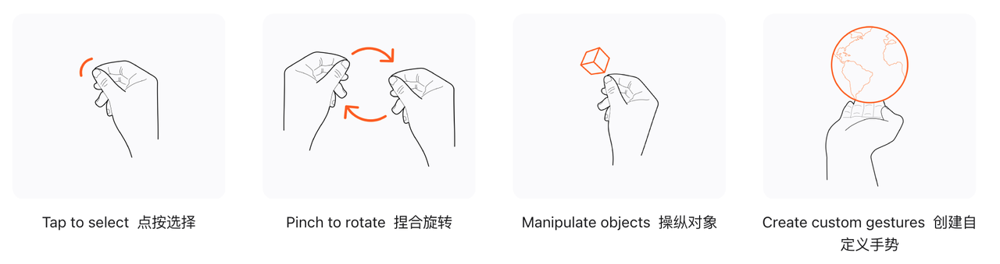
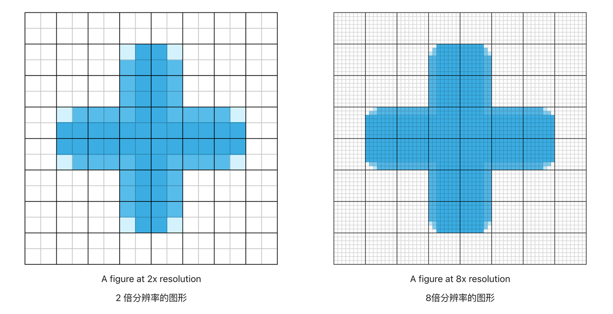

写在前面，本文档为 25 年打移动应用时苦恼于苹果官方文档一直跳转嵌套自己整理的，如后续有更新请以官网为准，更新截止至 2025.9.30。（ps：markdown 粘贴过来的，有点格式很奇怪，懒得改了，给大家开一个复制权限自己贴到 obsidian里去看吧）

***

## 了解VisionPro

[针对 visionOS 设计](https://developer.apple.com/cn/design/human-interface-guidelines/designing-for-visionos)

当你着手为 visionOS 设计 App 或游戏时，首先要了解该平台特有的基本设备特征和模式。利用这些特征和模式来指导你的设计决策，帮助你打造出富有吸引力的沉浸式体验。

* **空间。** Apple Vision Pro 提供了无限的画布，用户可在其中查看[窗口](https://developer.apple.com/cn/design/human-interface-guidelines/windows)、[视体](https://developer.apple.com/cn/design/human-interface-guidelines/windows#visionOS-volumes)和 3D 对象等虚拟内容，还可选择进入仿佛置身于不同地点的深度沉浸式体验。


* **沉浸。** 在 visionOS App 中，用户可在不同的[沉浸](https://developer.apple.com/cn/design/human-interface-guidelines/immersive-experiences)程度之间流畅转换。App 默认在\_共享空间\_中启动，在此空间中多个 App 可并排运行，用户可打开、关闭窗口以及调整窗口的位置。用户还可选择将 App 转换到\_全空间\_，在此空间中只会运行这一个 App。 在全空间 App 中，用户可查看与四周融合的 3D 内容，打开传送门以查看其他地点，或者进入另一个世界。


* **透视。** [透视](https://developer.apple.com/cn/design/human-interface-guidelines/immersive-experiences#Immersion-and-passthrough)提供了来自设备外部相机的实时视频，帮助用户在与虚拟内容交互的同时还可看到其实际四周。用户想看到更多或更少的四周时，可使用[数码旋钮](https://developer.apple.com/cn/design/human-interface-guidelines/digital-crown)控制透视量。


* **空间音频。** Apple Vision Pro 结合听觉和视觉感知技术来为用户四周的声波特征建模，可自动使音频在其空间中听起来自然。App 从用户处获得访问其四周信息的许可后，可微调[空间音频](https://developer.apple.com/cn/design/human-interface-guidelines/playing-audio#visionOS)以使自定义体验更加身临其境。


* **眼睛和手。** 一般而言，用户通过用[眼睛](https://developer.apple.com/cn/design/human-interface-guidelines/eyes)注视虚拟对象并使用轻点等\_非直接\_[手势](https://developer.apple.com/cn/design/human-interface-guidelines/gestures#visionOS)将其激活来执行大部分操作。用户还可以使用单指轻触等\_直接\_手势来与虚拟对象交互。


* **人体工程学。** 佩戴 Apple Vision Pro 时，用户完全依赖设备相机来看到真实和虚拟的一切事物，因此保持视觉舒适性至关重要。为帮助保持舒适，系统会自动相对于佩戴者的头部放置内容，无论用户的身高如何或者是坐着、站着还是躺着。visionOS 会将内容带到用户眼前（而非让用户移动来触及内容），因此用户可在保持静止不动的状态下与 App 和游戏交互。


* **辅助功能。** Apple Vision Pro 支持“旁白”、“切换控制”、“停留控制”、“引导式访问”、“头控指针”等许多[辅助功能](https://developer.apple.com/cn/design/human-interface-guidelines/accessibility)技术，因此用户可使用适合自己的交互方式。与所有平台一样，在 visionOS 中，系统提供的用户界面组件默认内建辅助功能支持，系统框架也为你提供了增强 App 或游戏中辅助功能的方式。

### 交互方式

#### 直接交互

#### 间接交互

人们可以通过注视元素并用手指轻敲来选择它。他们还可以使用特定的手势来捏合、拖动、缩放和旋转对象。SwiftUI 内置了对这些标准手势的支持，因此您的应用的大部分输入都可以依靠它们。如果您想超越标准手势，可以[使用 ARKit](https://developer.apple.com/documentation/ARKit) [创建](https://developer.apple.com/documentation/SwiftUI)自定义手势



#### 键盘交互

### 开发会用到哪些框架

VisionPro 使用 [SwiftUI](https://developer.apple.com/documentation/SwiftUI) 做为框架

使用 [RealityKit](https://developer.apple.com/documentation/RealityKit) 和 Reality Composer Pro 构建应用的 3D 内容，并通过 [`Reality View`](https://developer.apple.com/documentation/RealityKit/RealityView) 显示它。在沉浸式体验中，使用 [ARKit](https://developer.apple.com/documentation/ARKit) 将您的内容与用户的周围环境融为一体


## 开始第一个项目

[创建您的第一个 visionOS 应用程序](https://developer.apple.com/documentation/visionOS/creating-your-first-visionos-app)

如果您想创建 3D 资源或场景以在应用中显示，请添加 Reality Composer Pro 项目文件。使用此项目文件可以从原始形状和现有的 USDZ 资源构建内容。您还可以使用它为您的内容构建和测试自定义 RealityKit 动画和行为


### 修改窗口

使用标准 SwiftUI 视图构建您的初始界面。视图为您的界面提供基本内容，您可以使用 SwiftUI 修饰符自定义它们的外观和行为。例如， `.background` 修饰符会在内容背后添加部分透明的色调：


```swift
@main
struct MyApp: App {
    var body: some Scene {
        WindowGroup {
            ContentView()
               .background(.black.opacity(0.8))
        }


        ImmersiveSpace(id: "Immersive") {
            ImmersiveView()
        }
    }
}
```


**选择初始窗口大小，以最大程度减少窗口内的空白区域。** 默认情况下，窗口尺寸为 ==1280x720 pt==。窗口首次打开时，系统会将其放置在佩戴者前方约两米处，使其视宽约为三米。窗口内空白区域过多会使窗口看起来过大，同时也会遮挡用户视野内的其他内容。


#### 指定窗口位置

\>您可以通过应用 [`default Window Placement(_:)`](https://developer.apple.com/documentation/SwiftUI/Scene/defaultWindowPlacement\(_:\)) 场景修饰符来覆盖窗口的默认位置，以指示窗口的放置位置。例如，您可以请求系统将新窗口放置在现有窗口的后边缘。

\>使用 [`Window Placement .Position`](https://developer.apple.com/documentation/SwiftUI/WindowPlacement/Position) 枚举之一来选择窗口的位置。

```swift
@main struct MyApp: App {
        var body: some Scene { 
                WindowGroup(id: "content") { 
                        ContentView() 
                }
                 
                WindowGroup(id: "trailingWindow") { 
                        TrailingWindowView() 
                } 
                .defaultWindowPlacement { content, context in 
                        guard let contentWindow = context.windows.first(where: { $0.id == "content" }) else { return WindowPlacement(nil) 
                        } 
                        return WindowPlacement(.trailing(contentWindow)) 
                } 
        } 
}
```


#### 指定窗口大小

\>您可以通过应用某个默认大小场景修饰符（例如 [`default Size(width: height:)`](https://developer.apple.com/documentation/SwiftUI/Scene/defaultSize\(width:height:\)) ）来指定系统根据 [`Scene`](https://developer.apple.com/documentation/SwiftUI/Scene) 声明创建的新窗口的默认初始大小。例如，您可以要求 [`Window Group`](https://developer.apple.com/documentation/SwiftUI/WindowGroup) 生成的新窗口在 x 维度上占据 600 个点，在 y 维度上占据 400 个点。

```swift
@main 
struct MyApp: App { 
        var body: some Scene { 
                WindowGroup { 
                        ContentView() 
                } 
                .defaultSize(CGSize(width: 600, height: 400)) 
        } 
}
```


#### 指定窗口可调整代码

您可以指定系统如何限制窗口的可调整大小。所有场景的默认可调整大小均为 [`automatic`](https://developer.apple.com/documentation/SwiftUI/WindowResizability/automatic) 。在该策略下， [`Settings`](https://developer.apple.com/documentation/SwiftUI/Settings) 窗口将使用 [`content Size`](https://developer.apple.com/documentation/SwiftUI/WindowResizability/contentSize) 策略，其中窗口的最小大小和最大大小分别与窗口所包含内容的最小大小和最大大小匹配。其他场景类型默认使用 [`content Min Size`](https://developer.apple.com/documentation/SwiftUI/WindowResizability/contentMinSize) ，即保留最小大小限制，但不限制最大大小


\>您可以通过向场景添加 [`window Resizability(_:)`](https://developer.apple.com/documentation/SwiftUI/Scene/windowResizability\(_:\)) 场景修饰符来显式指定其中一种可调整大小策略。例如，用户可以将以下窗口组中的窗口大小在两个维度上调整到 100 到 400 点之间，因为 frame 修饰符将这些边界强加在内容视图上：

```swift
@main 
struct MyApp: App { 
        var body: some Scene { 
                WindowGroup { 
                        ContentView() 
                                .frame( minWidth: 100, maxWidth: 400, minHeight: 100, maxHeight: 400) 
                        } 
                        .windowResizability(.contentSize) 
        } 
}
```


#### 指定 volume 大小

\>当你创建一个体积（一个具有 [`volumetric`](https://developer.apple.com/documentation/SwiftUI/WindowStyle/volumetric) 样式的窗口）时，你可以使用三维默认尺寸修饰符之一（例如 [`defaultSize(width:height:depth:in:)` ）](https://developer.apple.com/documentation/SwiftUI/Scene/defaultSize\(width:height:depth:in:\)) 来指定体积的大小。以下代码创建了一个边长为一米的体积：

```swift
WindowGroup(id: "globe") { 
        Globe() 
} 
.windowStyle(.volumetric) 
.defaultSize(width: 1, height: 1, depth: 1, in: .meters)
```

### 创建应用程序的入口点

\>Hello World 使用 [`Window Group`](https://developer.apple.com/documentation/SwiftUI/WindowGroup) 构建启动时显示的场景（ `World App` 结构中出现的第一个场景）：

```swift
WindowGroup("Hello World", id: "modules") { 
        Modules() .environment(model) 
}
.windowStyle(.plain)
```


### 使用 NavigationStack 呈现不用的模块

\>观看一段简短的介绍动画（其中显示了正在输入的文本“Hello World”）后，定义主场景内容的 `Modules` 视图会显示用于探索世界不同方面的选项。此视图包含位于 [`NavigationStack`](https://developer.apple.com/documentation/SwiftUI/NavigationStack) 根目录下的目录：

```swift
NavigationStack(path: $model.navigationPath) { 
        TableOfContents() 
                .navigationDestination(for: Module.self) { module in 
                        ModuleDetail(module: module) 
                                .navigationTitle(module.eyebrow) 
                } 
}
```


当有人根据来自相应链接的初始化程序的 `module` 输入激活链接时，上述代码中 [`navigationDestination(for:destination:)`](https://developer.apple.com/documentation/SwiftUI/View/navigationDestination\(for:destination:\)) 视图修饰符的尾部闭包会显示一个视图：

```swift
NavigationLink(value: module) { /* The link's label. */ }
```


可能的 `module` 值来自自定义 `Module` 枚举：

```swift
enum Module: String, Identifiable, CaseIterable, Equatable { 
        case globe, orbit, solar 
        // ... 
}
```


### 多场景交互

\>为了能够打开多种场景类型，Hello World 在其 [`InformationPropertyList`](https://developer.apple.com/documentation/BundleResources/Information-Property-List) 文件中添加了 [`UIApplicationSceneManifest`](https://developer.apple.com/documentation/BundleResources/Information-Property-List/UIApplicationSceneManifest) 键。该键的值是一个字典，其中包含值为 `true` 的 [`UIApplicationSupportsMultipleScenes`](https://developer.apple.com/documentation/BundleResources/Information-Property-List/UIApplicationSceneManifest/UIApplicationSupportsMultipleScenes) 键：

```swift
<key>UIApplicationSceneManifest</key>
<dict>
        <key>UIApplicationSupportsMultipleScenes</key>
        <true/> 
        <key>UISceneConfigurations</key> 
        <dict/>
</dict>
```


### 创建 Volume

\>使用这个键后，应用程序在其 [`App`](https://developer.apple.com/documentation/SwiftUI/App) 声明中使用了第二个 [`Window Group`](https://developer.apple.com/documentation/SwiftUI/WindowGroup) 。这个新的窗口组使用 `Globe` 视图作为其内容

```swift
WindowGroup(id: Module.globe.name) { 
        Globe() 
                .environment(model) 
        } 
        .windowStyle(.volumetric) 
        .defaultSize(width: 0.6, height: 0.6, depth: 0.6, in: .meters)
```


#### 打开与关闭 Volume

\>地球模块提供了一个“查看地球”按钮，用户可以点击该按钮来显示或关闭音量，具体取决于当前状态。Hello World 通过创建一个具有按钮样式的 [`Toggle`](https://developer.apple.com/documentation/SwiftUI/Toggle) 并将其嵌入到自定义的 `Globe Toggle` 视图中来实现此行为。

```swift
struct GlobeToggle: View { 

        @Environment(ViewModel.self) private var model 
        @Environment(\.openWindow) private var openWindow 
        @Environment(\.dismissWindow) private var dismissWindow 
        
        var body: some View { 
                @Bindable var model = model 
                
                Toggle(Module.globe.callToAction, isOn: $model.isShowingGlobe) 
                        .onChange(of: model.isShowingGlobe) { _, isShowing in 
                                if isShowing { 
                                        openWindow(id: Module.globe.name) 
                                } else { 
                                        dismissWindow(id: Module.globe.name) 
                                } 
                        } 
                        .toggleStyle(.button) 
        } 
}
```


### plain 上具有深度

在 visionOS 中使用窗口的方式与在其他平台中相同。但即使是 2D 窗口，visionOS 也提供了少量的深度，可用于创建 3D 效果，例如元素显示在其他元素的前面。Hello World 利用这种深度来呈现与 2D 内容一致的小模型

\>Hello World 使用自定义 `Item View` 中的 [`Model3D`](https://developer.apple.com/documentation/RealityKit/Model3D) 结构从 Asset Bundle 加载这些模型。该视图会缩放和定位模型以适应可用空间，并应用可选的方向调整：

```swift
private struct ItemView: View { 
        var item: Item 
        var orientation: SIMD3<Double> = .zero 
        
        var body: some View { 
                Model3D(named: item.name, bundle: worldAssetsBundle) { model in 
                        model.resizable() 
                                .scaledToFit() 
                                .rotation3DEffect( 
                                        Rotation3D( 
                                                eulerAngles: .init(angles: orientation, order: .xyz) 
                                        ) 
                                ) 
                                .frame(depth: modelDepth) 
                                .offset(z: -modelDepth / 2) 
                } placeholder: { 
                        ProgressView() 
                                .offset(z: -modelDepth * 0.75) 
                } 
        } 
}
```

\>应用程序会为每个模型使用一次此 `Item View` ，并将每个模型放置在一个叠加层中，该叠加层仅根据当前选择才会显示。例如，以下叠加层显示的卫星模型在 x 轴和 z 轴上略有倾斜：

```swift
.overlay { 
        ItemView(item: .satellite, orientation: [0.15, 0, 0.15]) 
                .opacity(selection == .satellite ? 1 : 0) 
}
```

\>包含模型的 [`VStack`](https://developer.apple.com/documentation/SwiftUI/VStack) 还包含一个 [`Picker`](https://developer.apple.com/documentation/SwiftUI/Picker) ，人们可以使用它来选择要查看的模型：

```swift
Picker("Satellite", selection: $selection) { 
        ForEach(Item.allCases) { item in 
                Text(item.name) 
        } 
} 
.pickerStyle(.segmented)
```

向 2D 窗口添加 3D 效果时，请记住以下指导：


* **Don’t overdo it.** These kinds of effects add interest, but can unintentionally obscure important controls or information as people view the window from different directions.  \*\*不要过度使用。\*\* 这类效果虽然能增添趣味，但当人们从不同方向查看窗口时，可能会无意中遮挡重要的控件或信息。


* **Ensure that elements don’t exceed the available depth.** Excess depth causes elements to clip. Account for any position or orientation changes that might occur after initial placement.  \*\*确保元素不超过可用深度。\*\* 深度过大会导致元素被裁剪。请考虑初始放置后可能发生的任何位置或方向变化。


* **Avoid models intersecting with the backing glass.** Again, account for potential movement after initial placement.  \*\*避免模型与背板玻璃相交。\*\* 再次强调，初始放置后，需考虑潜在的移动。

### ImmersiveSpace mix 形式

```swift
ImmersiveSpace(id: Module.orbit.name) { 
        Orbit() 
                .environment(model) 
} 
.immersionStyle(selection: $orbitImmersionStyle, in: .mixed)
```

\>与 visionOS 应用中的任何次要场景一样，此场景依赖于 [`Information Property List`](https://developer.apple.com/documentation/BundleResources/Information-Property-List) 文件中的 [`UIApplicationSupportsMultipleScenes`](https://developer.apple.com/documentation/BundleResources/Information-Property-List/UIApplicationSceneManifest/UIApplicationSupportsMultipleScenes) 键。该应用还使用类似于地球仪的切换视图来打开和关闭空间：

```swift
struct OrbitToggle: View { 
        @Environment(ViewModel.self) private var model 
        @Environment(\.openImmersiveSpace) private var openImmersiveSpace 
        @Environment(\.dismissImmersiveSpace) private var dismissImmersiveSpace 
        
        var body: some View { 
                @Bindable var model = model 
                
                Toggle(Module.orbit.callToAction, isOn: $model.isShowingOrbit) 
                        .onChange(of: model.isShowingOrbit) { _, isShowing in 
                                Task { 
                                        if isShowing { 
                                                await openImmersiveSpace(id: Module.orbit.name) 
                                        } else { 
                                                await dismissImmersiveSpace() 
                                        } 
                                } 
                        } 
                        .toggleStyle(.button) 
        } 
}
```


### ImmersiveSpace full 形式

```swift
ImmersiveSpace(id: Module.solar.name) { 
        SolarSystem() 
                .environment(model) 
} .immersionStyle(selection: $solarImmersionStyle, in: .full)
```

\>此场景依赖于与其他辅助场景相同的 [`UIApplicationSupportsMultipleScenes`](https://developer.apple.com/documentation/BundleResources/Information-Property-List/UIApplicationSceneManifest/UIApplicationSupportsMultipleScenes) 键，并由与应用程序用于其他场景的类似 `Solar System Toggle` 激活：

```swift
struct SolarSystemToggle: View { 
        @Environment(ViewModel.self) private var model 
        @Environment(\.openImmersiveSpace) private var openImmersiveSpace 
        @Environment(\.dismissImmersiveSpace) private var dismissImmersiveSpace 
        
        var body: some View { 
                Button { 
                        Task { 
                                if model.isShowingSolar { 
                                        await dismissImmersiveSpace() 
                                } else { 
                                        await openImmersiveSpace(id: Module.solar.name) 
                                } 
                        } 
                } label: { 
                        if model.isShowingSolar { 
                                Label( 
                                        "Exit the Solar System", 
                                        systemImage: "arrow.down.right.and.arrow.up.left") 
                                } else { 
                                Text(Module.solar.callToAction) 
                        } 
                } 
        } 
}
```

\>为了重新使用主窗口来控制太阳系，Hello World 将导航堆栈和控件都放在 [`ZStack`](https://developer.apple.com/documentation/SwiftUI/ZStack) 中，然后设置每个控件的不透明度，以确保一次只出现一个：

```swift
ZStack { 
        SolarSystemControls() 
                .opacity(model.isShowingSolar ? 1 : 0) 
                
        NavigationStack(path: $model.navigationPath) { 
                // ... 
        } 
        .opacity(model.isShowingSolar ? 0 : 1) 
} 
.animation(.default, value: model.isShowingSolar)
```

### 向应用添加3D内容

[Adding 3D content to your app](https://developer.apple.com/documentation/visionos/adding-3d-content-to-your-app/)

在为 visionOS 构建应用时，请思考如何为应用界面增添深度。系统提供了多种显示 3D 内容的方式，包括在现有窗口中、在体积中以及在沉浸式空间中。请选择最适合您的应用和您提供的内容的选项


#### Window

根据需要将深度效果合并到您的自定义视图中，并使用 3D 布局选项在窗口中排列视图

* Apply a [`shadow(color:radius:x:y:)`](https://developer.apple.com/documentation/SwiftUI/View/shadow\(color:radius:x:y:\)) or [`visualEffect(_:)`](https://developer.apple.com/documentation/SwiftUI/View/visualEffect\(_:\)) modifier to the view.

* Lift or highlight the view when someone looks at it using a [`hoverEffect(_:in:isEnabled:)`](https://developer.apple.com/documentation/SwiftUI/View/hoverEffect\(_:in:isEnabled:\)) modifier.

* Lay out views using a [`ZStack`](https://developer.apple.com/documentation/SwiftUI/ZStack).

* Animate view-related changes with [`transform3DEffect(_:)`](https://developer.apple.com/documentation/SwiftUI/View/transform3DEffect\(_:\)).

* Rotate the view using a [`rotation3DEffect(_:axis:anchor:anchorZ:perspective:)`](https://developer.apple.com/documentation/SwiftUI/View/rotation3DEffect\(_:axis:anchor:anchorZ:perspective:\)) modifier.


除了增强 2D 视图的深度之外，您还可以在 2D 窗口中添加静态 3D 模型。Model3D 会加载 USDZ 文件或其他资源类型，并以其固有大小在窗口中显示。如果您的应用中已有模型数据，或者可以从网络下载，则可以使用此视图。例如，购物应用可能会使用此类视图来显示产品的 3D 版本


#### 使用RealityKit显示动态3D场景

RealityKit 是 Apple 推出的一项技术，用于构建可在屏幕上动态更新的 3D 模型和场景。在 visionOS 中，RealityKit 和 SwiftUI 可无缝集成 app 的 2D 和 3D 内容。您可以加载现有的 USDZ 资源，或在 Reality Composer Pro 中创建场景，为您的内容添加动画、物理效果、灯光、音效和自定义行为。要在您的 app 中使用 Reality Composer Pro 项目，请将 Swift 软件包添加到您的 Xcode 项目中，并在 Swift 文件中导入其模块。有关更多信息，请参阅[管理 Xcode 项目中的文件和文件夹](https://developer.apple.com/documentation/Xcode/managing-files-and-folders-in-your-xcode-project)


当您准备在界面中显示 3D 内容时，请使用 [`RealityView`](https://developer.apple.com/documentation/RealityKit/RealityView) 。此 SwiftUI 视图可作为 RealityKit 内容的容器，并允许您使用熟悉的 SwiftUI 技术更新该内容


\>以下示例展示了一个使用 [`RealityView`](https://developer.apple.com/documentation/RealityKit/RealityView) 显示 3D 球体的视图。视图闭包中的代码会为该球体创建一个 RealityKit 实体，将纹理应用于球体表面，并将该球体添加到视图的内容中。

```swift
struct SphereView: View {
    var body: some View {
            RealityView { content in 
                        let model = ModelEntity( 
                        mesh: .generateSphere(radius: 0.1), 
                        materials: [SimpleMaterial(color: .white, isMetallic: true)]) 
                content.add(model) 
                } 
        } 
}
```


当 SwiftUI 显示你的 [`RealityView`](https://developer.apple.com/documentation/RealityKit/RealityView) 时，它会执行一次你的代码来创建实体和其他内容。由于创建实体相对昂贵，因此视图只运行一次创建代码。当你想要更新实体的状态时，请更改视图的状态并使用 update 闭包将这些更改应用于你的内容。以下示例使用 update 闭包在 `scale` 属性中的值发生变化时更改球体的大小：

```swift
struct SphereView: View { 
        var scale = false 
        var body: some View { 
                RealityView { content in 
                        let model = ModelEntity( 
                                mesh: .generateSphere(radius: 0.1), 
                                materials: [SimpleMaterial(color: .white, isMetallic: true)]
                                ) 
                        content.add(model) 
                } update: { content in 
                        if let model = content.entities.first { 
                        model.transform.scale = scale ? [1.2, 1.2, 1.2] : [1.0, 1.0, 1.0] 
                        } 
                } 
        } 
}
```


#### 响应与 RealityKit 内容的互动

* Attach a gesture recognizer to your [`RealityView`](https://developer.apple.com/documentation/RealityKit/RealityView) and add the [`targetedToAnyEntity()`](https://developer.apple.com/documentation/SwiftUI/Gesture/targetedToAnyEntity\(\)) modifier to it.  将手势识别器附加到您的 [`Reality View`](https://developer.apple.com/documentation/RealityKit/RealityView) ，并向其添加 [`targeted To Any Entity()`](https://developer.apple.com/documentation/SwiftUI/Gesture/targetedToAnyEntity\(\)) 修改器。


* Attach an [`InputTargetComponent`](https://developer.apple.com/documentation/RealityKit/InputTargetComponent) to the entity or one of its parent entities.  将 [`Input Target Component`](https://developer.apple.com/documentation/RealityKit/InputTargetComponent) 附加到实体或其父实体之一。


* Add collision shapes to the RealityKit entities that support interactions.  向支持交互的 RealityKit 实体添加碰撞形状。


The [`targetedToAnyEntity()`](https://developer.apple.com/documentation/SwiftUI/Gesture/targetedToAnyEntity\(\)) modifier provides a bridge between the gesture recognizer and your RealityKit content. For example, to recognize when someone drags an entity, specify a [`DragGesture`](https://developer.apple.com/documentation/SwiftUI/DragGesture) and add the modifier to it. When the specified gesture occurs on an entity, SwiftUI executes the provided closure.        [`targeted To Any Entity()`](https://developer.apple.com/documentation/SwiftUI/Gesture/targetedToAnyEntity\(\)) 修饰符在手势识别器和 RealityKit 内容之间架起了一座桥梁。例如，要识别拖动实体的操作，请指定一个 [`Drag Gesture`](https://developer.apple.com/documentation/SwiftUI/DragGesture) 并为其添加修饰符。当指定的手势发生在实体上时，SwiftUI 会执行提供的闭包。


\>以下示例将一个点击手势识别器添加到上一个示例中的球体视图。该代码还将 [`Input Target Component`](https://developer.apple.com/documentation/RealityKit/InputTargetComponent) 和 [`Collision Component`](https://developer.apple.com/documentation/RealityKit/CollisionComponent) 组件添加到形状中，以允许进行交互。如果省略这些组件，视图将无法检测到与实体的交互。

```swift
struct SphereView: View { 
        @State private var scale = false 
        
        var body: some View { 
                RealityView { content in 
                let model = ModelEntity( 
                        mesh: .generateSphere(radius: 0.1), 
                        materials: [SimpleMaterial(color: .white, isMetallic: true)])
                         
                         // Enable interactions on the entity. 
                         model.components.set(InputTargetComponent()) 
                         model.components.set(CollisionComponent(shapes:[.generateSphere(radius: 0.1)])) 
                         content.add(model) 
                         } update: { content in 
                         if let model = content.entities.first { 
                         model.transform.scale = scale ? [1.2, 1.2, 1.2] : [1.0, 1.0, 1.0] 
                         } 
                } .gesture(TapGesture().targetedToAnyEntity().onEnded { _ in
                 scale.toggle() 
                 })
        }
}
```


#### Volume

体积是一种在三维空间中扩展以匹配其所包含内容大小的窗口。窗口和体积均可容纳 2D 和 3D 内容，并且在许多方面相似。但是，窗口会裁剪超出窗口表面太远的 3D 内容，因此对于主要为 3D 的内容而言，体积是更好的选择


要创建体积，请将 [`WindowGroup`](https://developer.apple.com/documentation/SwiftUI/WindowGroup) 场景添加到您的应用，并将其样式设置为 [`volumetric`](https://developer.apple.com/documentation/SwiftUI/WindowStyle/volumetric) 。此样式会指示 SwiftUI 为 3D 内容创建一个窗口。您可以将所需的任何 2D 或 3D 视图添加到体积中。您还可以添加 [`RealityView`](https://developer.apple.com/documentation/RealityKit/RealityView) 来使用 RealityKit 构建内容。以下示例创建了一个体积，其中包含一些气球的静态 3D 模型，这些模型存储在应用的 bundle 中：

```swift
struct MyApp: App { 
        var body: some Scene { 
                WindowGroup { 
                        Model3D("balloons") 
                }.windowStyle(style: .volumetric) 
        } 
}
```

窗口和体积是显示有边界的 2D 和 3D 内容的便捷方式，但您的应用无法控制这些内容在用户周围环境中的位置。系统会在显示时设置每个窗口和体积的初始位置。系统还会添加一个窗口栏，方便用户重新定位窗口或调整其大小


#### Immersive Space

如果您需要更好地控制应用内容的布局，可以将内容添加到 [`ImmersiveSpace`](https://developer.apple.com/documentation/SwiftUI/ImmersiveSpace) 。沉浸式空间为您的内容提供了一个不受限制的区域，您可以控制内容在空间内的大小和布局。在获得用户许可后，您还可以将 ARKit 与沉浸式空间结合使用，将内容融入其周围环境。例如，您可以使用 ARKit 场景重建来获取家具和附近物体的网格，并让您的内容与该网格进行交互。


> [`ImmersiveSpace`](https://developer.apple.com/documentation/SwiftUI/ImmersiveSpace) 是与应用的其他场景一起创建的一种场景类型。以下示例展示了一个包含沉浸式空间和窗口的应用：

```swift
@main 
struct MyImmersiveApp: App { 
        var body: some Scene { 
                WindowGroup() { 
                        ContentView() 
                } 
                
                ImmersiveSpace(id: "solarSystem") {
                         SolarSystemView() 
                } 
        } 
}
```

如果您未在 [`ImmersiveSpace`](https://developer.apple.com/documentation/SwiftUI/ImmersiveSpace) 声明中添加样式修饰符，系统将使用 [`mixed`](https://developer.apple.com/documentation/SwiftUI/ImmersionStyle/mixed) 样式创建该空间。此样式会将您的内容与显示用户周围环境的透视内容一起显示。其他样式可让您以不同程度隐藏透视效果。使用 [`immersionStyle(selection: in:)`](https://developer.apple.com/documentation/SwiftUI/Scene/immersionStyle\(selection:in:\)) 修饰符来指定您的空间支持的样式。如果您指定了多种样式，则可以使用该修饰符的 `selection` 参数在各种样式之间切换。


请务必设置您在 [`ImmersiveSpace`](https://developer.apple.com/documentation/SwiftUI/ImmersiveSpace) 中放置的物品的位置。使用修饰符 (Modifier) 定位 SwiftUI 视图，并使用其变换组件 (Transform) 定位 RealityKit 实体。SwiftUI 最初将空间的原点置于人的脚部，但可以根据其他事件更改此原点。例如，系统可能会移动原点以适应使用空间角色 (Spatial Persona) 显示内容的 SharePlay 活动。如果您需要将 SwiftUI 视图和 RealityKit 实体相对于彼此定位，请使用 [`RealityView`](https://developer.apple.com/documentation/RealityKit/RealityView) 的 `content` 参数中的方法执行任何必要的坐标转换。


##### 打开 ImmersiveSpace 场景

\>此操作异步运行，并使用提供的信息来查找和初始化您的场景。以下示例显示了一个按钮，用于打开带有 `solarSystem` 标识符的空间：

```swift
Button("Show Solar System") { 
        Task { 
                let result = await openImmersiveSpace(id: "solarSystem") 
                if case .error = result {
                        print("An error occurred") 
                } 
        } 
}
```

当应用呈现 [`ImmersiveSpace`](https://developer.apple.com/documentation/SwiftUI/ImmersiveSpace) 时，系统会隐藏其他应用的内容，以防止视觉冲突。当该空间可见时，其他应用将保持隐藏状态，但当您关闭该空间时，其他应用将恢复显示。如果您的应用定义了多个空间，则必须先关闭当前可见的空间，然后才能显示其他空间。如果您不关闭可见的空间，则当您尝试打开其他空间时，系统会发出运行时警告。


##### 构建full immersive space

要打造完全沉浸式的体验，请打开 [`ImmersiveSpace`](https://developer.apple.com/documentation/SwiftUI/ImmersiveSpace) 并将其样式设置为 [`full`](https://developer.apple.com/documentation/SwiftUI/ImmersionStyle/full) 。沉浸式空间是一种 SwiftUI 场景，可让您将内容放置在用户周围的任何位置。将 [`full`](https://developer.apple.com/documentation/SwiftUI/ImmersionStyle/full) 样式应用于场景会指示系统隐藏透传视频并仅显示应用的内容


\>在应用对象的 [`body`](https://developer.apple.com/documentation/SwiftUI/App/body-swift.property) 属性中，或管理 SwiftUI 场景的任何位置声明空间。以下示例展示了一个包含主窗口和完全沉浸式空间的应用。应用启动时会显示该窗口

```swift
@main 
struct MyImmersiveApp: App { 
        @State private var currentStyle: ImmersionStyle = .full 
        
        var body: some Scene { 
                WindowGroup() { 
                        ContentView() 
                } 
                
                // Display a fully immersive space. 
                ImmersiveSpace(id: "solarSystem") { 
                        SolarSystemView() 
                }.immersionStyle(selection: $currentStyle, in: .full) 
        } 
}
```


##### 使用 RealityKit 构建内容

当您的内容包含原始形状或 USD 文件中的现有内容时，RealityKit 效果极佳。您可以使用 RealityKit 实体组织场景内容，并使用组件和系统为内容添加动画效果。使用 Reality Composer Pro 以可视化方式组合您的内容，并将动态着色器、动画、音频和其他行为附加到内容中。在场景中的 [`RealityView`](https://developer.apple.com/documentation/RealityKit/RealityView) 中显示 RealityKit 场景的内容


要在运行时加载 Reality Composer Pro 场景，请获取 Reality Composer Pro 软件包文件的 URL，并加载场景的根实体。以下示例展示了如何为应用软件包中的软件包创建实体：

```swift
import MyRealityBundle 

let url = MyRealityBundle.bundle.url(forResource: "MyRealityBundle", withExtension: "reality") 

let scene = try await Entity(contentsOf: url)
```

##### 使用 Metal 构建内容

另一种创建完全沉浸式场景的方法是使用 Metal 自行绘制所有内容。使用 Metal 绘制内容时，请使用 Compositor Services 框架将内容放置到屏幕上。Compositor Services 提供了设置 Metal 渲染引擎和开始绘制所需的代码


有关如何使用 Metal 和 Compositor Services 渲染内容以及如何管理与内容的交互的详细信息，请参阅[使用 Metal 绘制完全沉浸式内容](https://developer.apple.com/documentation/CompositorServices/drawing-fully-immersive-content-using-metal)


### 采用持久UI的最佳实践

[Adopting best practices for persistent UI](https://developer.apple.com/documentation/visionos/adopting-best-practices-for-scene-restoration)


在 visionOS 的共享和混合沉浸式空间中，用户可以将应用内容直接捕捉并锁定到物理环境中。这种持久性功能使应用即使在用户离开、返回或重启设备后也能保持原位。您可以利用此功能打造深度集成的空间体验，让人们自然而然地回归其中


人们可以通过几种不同的方式将应用程序锚定到他们的空间：

* **Snapping** — When a person moves a window near a vertical surface, like a wall, or a volume near a horizontal surface, like a table or floor, your app can automatically align with or snap to that surface.  \*\*捕捉\*\* - 当一个人将窗口移到垂直表面（如墙壁）附近，或将体积移到水平表面（如桌子或地板）附近时，您的应用可以自动与该表面对齐或捕捉到该表面。


* **Locking** — When an app snaps to a surface, the system places a lock icon in the window bar to indicate it’s locked in place if the application supports restoration of that window.  \*\*锁定\*\* - 当应用程序捕捉到某个表面时，如果应用程序支持恢复该窗口，系统会在窗口栏中放置一个锁定图标，以指示它已被锁定到位。


* **Persistence** — After locking the app in place, your content remains fixed to its physical location. It persists even if the person moves to a different room, takes the device off or on, or recenters their view. When moving between rooms, locked content from the previous room fades out, and locked content in the new room appears. Content that isn’t locked in place always launches relative to the person’s position.  \*\*持久性\*\* ——将应用锁定到位后，您的内容将固定在其物理位置。即使用户移动到其他房间、关闭或打开设备，或重新调整视图，内容仍会保留。在房间之间移动时，上一个房间的锁定内容会淡出，新房间的锁定内容会显示。未锁定到位的内容始终根据用户的位置进行启动。

\>您可以通过将 `.restorationBehavior(.disabled)` 应用于任何 `Window` 或 `Window Group` 来选择退出每个场景的场景恢复。默认行为是 `automatic` ，即恢复您的内容

```swift
WindowGroup(id: "to-do") { 
        // The main body of a to-do list app. 
        ToDoList() 
} 

Window("Onboarding", id: "onboarding") { 
        // The flow that takes the person through how the app works. 
        OnboardingView() 
} 
.restorationBehavior(.disabled)
```

\>为避免冗余和混乱，只启动必要的窗口至关重要。您可以使用 `.default Launch Behavior` 来微调用户重新启动应用时显示的窗口。默认情况下，应用会显示 `Scene` 中声明的第一个窗口，该窗口与 `Info .plist` 中的“Preferred Default Scene Session Role”键匹配

>
>
> 要在启动时优先显示特定窗口，请使用 `.presented` ：

```swift
@AppStorage("needsOnboarding") private var needsOnboarding = true 

var body: some Scene { 
        Window("Onboarding", id: "onboarding") { 
                // The flow that takes the person through how the app works.
                 OnboardingView() 
        } 
        // Prevent state restoration for this window. 
        .restorationBehavior(.disabled) 
        
        WindowGroup(id: "to-do") { 
                // The main body of a to-do list app. 
                ToDoList() 
        } // Presents the main body if the person doesn't need the onboarding experience. 
        .defaultLaunchBehavior(needsOnboarding ? .automatic : .presented) 
}
```

\>对于辅助窗口，请使用 `.suppressed` 确保其在应用重新启动时不会打开。这对于临时窗口（例如入门屏幕、工具栏或其他不应在用户每次打开应用时重新出现的 UI 元素）非常理想

```swift
@AppStorage("hasOnboarded") private var needsOnboarding = true 

var body: some Scene { 
        Window("Onboarding", id: "onboarding") { 
                // The flow that takes the person through how the app works. 
                OnboardingView() 
        } 
        // Prevent state restoration for this window.
        .restorationBehavior(.disabled) 
        
        WindowGroup(id: "to-do") { 
        // The main body of a to-do list app. 
                ToDoList() 
        } 
        // Presents the main body if the person doesn't need the onboarding experience. 
        .defaultLaunchBehavior(needsOnboarding ? .automatic : .presented) 
        
        WindowGroup(id: "settings") { 
                SettingsView() 
        } 
        // Suppresses launch of this window when the app is re-opened. 
        .defaultLaunchBehavior(.suppressed) 
}
```

#### 使用表面捕捉动态呈现内容

为了确保您的应用可以访问物理位置：


* **Request ARKit data access** — Follow the steps outlined in [Setting up access to ARKit data](https://developer.apple.com/documentation/visionOS/setting-up-access-to-arkit-data).

&#x20; \*\*请求 ARKit 数据访问权限\*\* — 按照[设置对 ARKit 数据的访问权限](https://developer.apple.com/documentation/visionOS/setting-up-access-to-arkit-data)中概述的步骤进行操作。

* **Enable detailed surface info** — Add the `UIWantsDetailedSurfaceInfo` key to your app’s `Info.plist` file and set its value to `YES`.  \*\*启用详细的表面信息\*\* - 将 `UIWants Detailed Surface Info` 键添加到应用程序的 `Info .plist` 文件中，并将其值设置为 `YES` 。


**要检查和使用捕捉状态：**

* **Access snapping information** — Use the `@Environment(\.surfaceSnappingInfo)` property wrapper within your SwiftUI view to observe the scene’s snapping state.  \*\*访问捕捉信息

  * 使用 SwiftUI 视图中的 `@Environment(\.surfaceSnappingInfo)` 属性包装器来观察场景的捕捉状态。


* **Check snapped state** — Read the `isSnapped` Boolean property from the environment value (`snappingInfo.isSnapped`) to determine if the system has currently snapped the scene to a physical surface.  **检查捕捉状态** ——从环境值（ `snapping Info .is Snapped` ）中读取 `is Snapped` 布尔属性，以确定系统当前是否已将场景捕捉到物理表面。


* **Verify authorization** — Confirm the person has granted permission by checking that the `authorizationStatus` property (`snappingInfo.authorizationStatus`) equals `.authorized`.  \*\*验证授权\*\* ——通过检查 `authorization Status` 属性 ( `snappingInfo.authorizationStatus` ) 是否等于 `.authorized` 来确认该人已授予权限。


* **Retrieve the surface type** — If the scene is snapped and authorization is granted, access the `classification` property (`snappingInfo.classification`). This returns an `ARKitSurfaceClassification` value, such as `.wall`, `.floor`, or `.table`.  \*\*检索表面类型\*\* — 如果场景已捕捉且已获得授权，则访问 `classification` 属性 ( `snapping Info .classification` )。这将返回 `ARKit Surface Classification` 值，例如 `.wall` 、 `.floor` 或 `.table` 。


* **Conditionally show content** — Use the retrieved surface classification to dynamically show content based on the detected surface type.  \*\*有条件地显示内容\*\* ——使用检索到的表面分类根据检测到的表面类型动态显示内容。

```swift
import SwiftUI 
import ARKit 

struct ContentView: View { 
        @Environment(\.surfaceSnappingInfo) private var snappedStatus 
        @State private var showWhiteboard = false 
        
        var body: some View { 
                Group { 
                        // If it's snapped to the wall, show a whiteboard to-do list. 
                        if showWhiteboard { 
                                WhiteboardView() 
                        } else { 
                                // Otherwise, show a paper to-do list. 
                                PaperView() 
                        } 
                } .onChange(of: snappedStatus) { 
                        if snappedStatus.isSnapped { 
                                switch SurfaceSnappingInfo.authorizationStatus { 
                                case .authorized: 
                                        switch snappedStatus.classification { 
                                        case .some(.table): 
                                                showWhiteboard = true 
                                        default: 
                                                showWhiteboard = false 
                                        } 
                                case .denied: 
                                        // The authorization prompt was denied. 
                                        print("Authorization denied.") 
                                case .notDetermined: 
                                        // The authorization prompt has not been answered.
                                         print("Please accept the authorization prompt.") 
                                case .restricted: 
                                        print("Access to surface snapping is restricted.") 
                                @unknown default: 
                                        print("Please accept the authorization prompt.") 
                                } 
                        } else { 
                                showWhiteboard = false 
                        } 
                } 
        } 
}
```

## 在visionOS中绘制清晰的基于图层的内容

[Drawing sharp layer-based content in visionOS](https://developer.apple.com/documentation/visionos/drawing-sharp-layer-based-content)


如果您的应用直接使用 Core Animation 图层，请更新图层代码，以便在适当的情况下绘制内容的高分辨率版本。SwiftUI 和 UIKit 视图使用 Core Animation 图层来高效管理界面内容。当视图绘制其内容时，底层图层会捕获该内容并进行缓存，以改进后续的渲染操作


大多数 Apple 平台上的 Core Animation 会以与屏幕相同的分辨率栅格化图层，但 visionOS 上的 Core Animation 可以以不同的分辨率栅格化，从而最大限度地提高内容清晰度和性能。系统会跟踪用户的视线，并以尽可能高的分辨率渲染用户眼前的内容。在此焦点区域之外，系统会以逐渐降低的分辨率渲染内容，以减少 GPU 工作负载。由于内容位于用户的周边视觉范围内，因此这些较低的分辨率不会影响内容的清晰度。随着用户视线的移动，系统会以不同的分辨率重新绘制内容，以匹配焦点的变化




如果您使用自定义 [`CALayer`](https://developer.apple.com/documentation/QuartzCore/CALayer) 对象交付内容，则可以配置自定义图层以支持以不同的分辨率进行绘制。如果您不执行此额外的配置步骤，则每个图层都会以 @2x 的比例因子栅格化其内容，这对于大多数内容来说已经足够好了，并且与图层在 Retina 显示屏上提供的内容相匹配。但是，如果您选择以不同的分辨率进行绘制，则在 visionOS 中，图层会以最高 @8x 的比例因子栅格化其内容，这会为文本和基于矢量的内容添加大量细节


### 请求自定义层的动态缩放


所有 Core Animation 图层的动态内容缩放功能默认处于关闭状态，框架或应用必须明确启用此支持。如果您的界面仅使用 SwiftUI 或 UIKit 视图，则无需执行任何操作即可支持此功能。SwiftUI 和 UIKit 会自动为受益于新增细节的视图启用此功能，例如文本视图和带有 SF 符号或其他矢量艺术作品的图像视图。但是，框架不会为所有视图（包括 [`UIView`](https://developer.apple.com/documentation/UIKit/UIView) 和 [`View`](https://developer.apple.com/documentation/SwiftUI/View) 启用此功能


如果您的 visionOS 界面包含自定义 Core Animation 图层，您可以启用任何包含矢量内容的 [`CALayer`](https://developer.apple.com/documentation/QuartzCore/CALayer) 对象的 [`wantsDynamicContentScaling`](https://developer.apple.com/documentation/QuartzCore/CALayer/wantsDynamicContentScaling) 属性。将此属性设置为 `true` 表示系统支持以不同的分辨率渲染图层内容。但是，此设置并不能保证系统会对您的内容应用动态内容缩放。如果您的图层使用不兼容的函数或技术进行绘制，系统可能会禁用该功能


> 以下示例展示了如何为 [`CAText Layer`](https://developer.apple.com/documentation/QuartzCore/CATextLayer) 对象启用此功能。配置图层后，将 [`wants Dynamic Content Scaling`](https://developer.apple.com/documentation/QuartzCore/CALayer/wantsDynamicContentScaling) 属性设置为 `true` ，并将该图层添加到图层层次结构中。

```swift
let layer = CATextLayer() 

layer.string = "Hello, World!" 
layer.foregroundColor = UIColor.black.cgColor 
layer.frame = parentLayer.bounds 

// Setting this property to true enables content scaling 
// and calls setNeedsDisplay to redraw the layer's content. 

layer.wantsDynamicContentScaling = true 

parentLayer.addSublayer(layer)
```

**如果您在图层中执行以下任一操作，请勿启用该功能：**

* You set the layer’s content using the [`contents`](https://developer.apple.com/documentation/QuartzCore/CALayer/contents) property.  您可以使用 [`contents`](https://developer.apple.com/documentation/QuartzCore/CALayer/contents) 属性设置图层的内容。


* You draw primarily bitmap-based content.  您主要绘制基于位图的内容。


* You redraw your layer’s contents repeatedly over a short time period.  您在短时间内反复重新绘制图层的内容。

[`CAShapeLayer`](https://developer.apple.com/documentation/QuartzCore/CAShapeLayer) 类会忽略 [`wantsDynamicContentScaling`](https://developer.apple.com/documentation/QuartzCore/CALayer/wantsDynamicContentScaling) 属性的值，并始终启用动态内容缩放。对于其他 Core Animation 图层，必须显式启用该功能才能使用。


### 动态绘制图层的内容


动态内容缩放要求您使用指定方法之一绘制图层内容。如果您定义了 [`CALayer`](https://developer.apple.com/documentation/QuartzCore/CALayer) 的自定义子类，请在 [`draw(in:)`](https://developer.apple.com/documentation/QuartzCore/CALayer/draw\(in:\)) 方法中绘制图层内容。如果您使用 [`CALayerDelegate`](https://developer.apple.com/documentation/QuartzCore/CALayerDelegate) 对象绘制图层内容，请改用委托对象的 [`draw(_: in:)`](https://developer.apple.com/documentation/QuartzCore/CALayerDelegate/draw\(_:in:\)) 方法


随着用户视线的移动，当有人直视图层时，系统会以更高的分辨率绘制图层，否则则以较低的分辨率绘制图层


某些 Core Graphics 例程与动态内容缩放不兼容。即使你为图层启用了动态内容缩放，如果图层使用以下任何一种功能，系统也会自动禁用该功能：


* Core Graphics shaders.  核心图形着色器。


* APIs that set intent, quality, or other bitmap-related properties. For example, don’t call [`CGContextSetInterpolationQuality`](https://developer.apple.com/documentation/coregraphics/1455656-cgcontextsetinterpolationquality).  设置意图、质量或其他位图相关属性的 API。例如，请勿调用 [`CGContextSetInterpolationQuality`](https://developer.apple.com/documentation/coregraphics/1455656-cgcontextsetinterpolationquality) 。


* A doc://com.apple.documentation/documentation/coregraphics/cgbitmapcontext to draw content.  doc://com.apple.documentation/documentation/coregraphics/cgbitmapcontext 用于绘制内容。


### 修改层级结构以提高性能

与低分辨率相比，图层的后备存储在高分辨率下会消耗更多内存。请在启用动态内容缩放前后测量应用的内存使用情况，以确保增加的内存成本值得其带来的收益。如果应用的内存使用量增加过多，请限制哪些图层采用动态内容缩放。您还可以通过以下方式减少每个图层使用的内存量：


* Make your layer the smallest size possible. Larger layers require significantly more memory, especially at higher resolutions. Make the size of the layer match the size of your content by eliminating padding or extra space.  尽可能缩小图层尺寸。较大的图层会占用更多内存，尤其是在高分辨率下。请通过消除填充或额外空间，使图层尺寸与内容尺寸匹配。


* Separate complex content into different layers. Instead of drawing everything in a single layer, build your content from multiple layers and arrange them hierarchically to achieve the same result. Enable dynamic content scaling only in the layers that actually need it.  将复杂的内容分成不同的图层。与其将所有内容绘制在一个图层中，不如从多个图层构建内容，并按层次排列它们，以达到相同的效果。仅在实际需要的图层中启用动态内容缩放。


* Apply special effects using layer properties whenever possible. Applying effects during drawing might require you to increase the layer’s size. For example, apply scale and rotation effects to the layer’s [`transform`](https://developer.apple.com/documentation/QuartzCore/CALayer/transform) property, instead of during drawing.  尽可能使用图层属性应用特殊效果。在绘制过程中应用效果可能需要增加图层的大小。例如，将缩放和旋转效果应用到图层的 [`transform`](https://developer.apple.com/documentation/QuartzCore/CALayer/transform) 属性，而不是在绘制过程中应用。


* Don’t draw your layer’s content at different resolutions in advance and cache the images. Maintaining multiple images requires more memory. If you do cache images, draw them only at @2x scale factor.  不要预先以不同的分辨率绘制图层内容并缓存图像。维护多幅图像需要更多内存。如果确实需要缓存图像，请仅以 @2x 比例因子绘制。


* Don’t use your drawing code to draw a single image. If your layer’s content consists of an image, assign that image to the layer’s [`contents`](https://developer.apple.com/documentation/QuartzCore/CALayer/contents) property directly.  不要使用绘图代码来绘制单张图片。如果图层的内容由一张图片组成，请直接将该图片赋值给图层的 [`contents`](https://developer.apple.com/documentation/QuartzCore/CALayer/contents) 属性。

## 贡献者

<div class="contributors-list" style="display: flex; gap: 20px; flex-wrap: wrap; margin-top: 20px;">
  <!-- 贡献者 1 -->    
  <div style="text-align: center;">
    
    <p style="margin-top: 8px;"><a href="https://github.com/muxia23" target="_blank">孙金哲</a></p>
  </div>

</div>