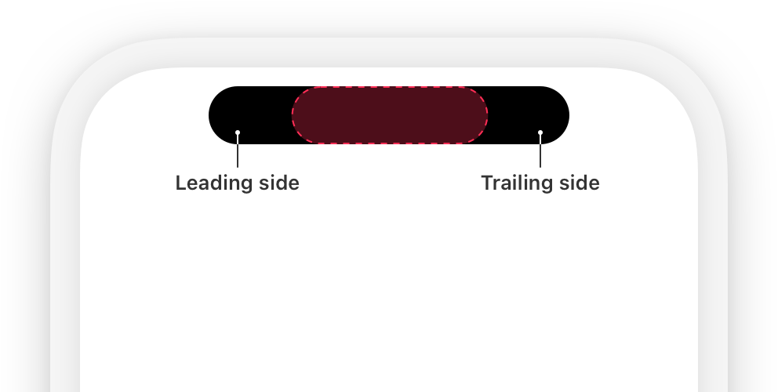
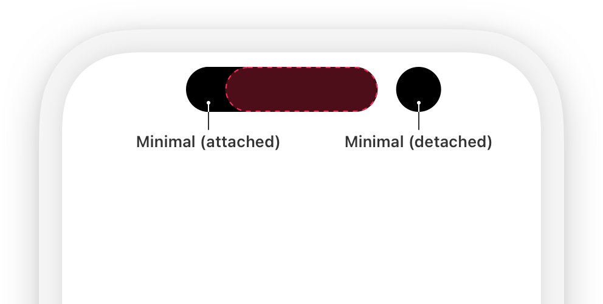
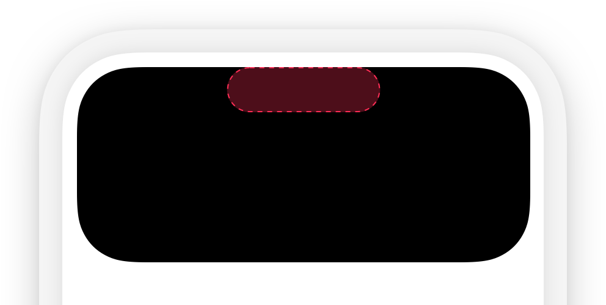
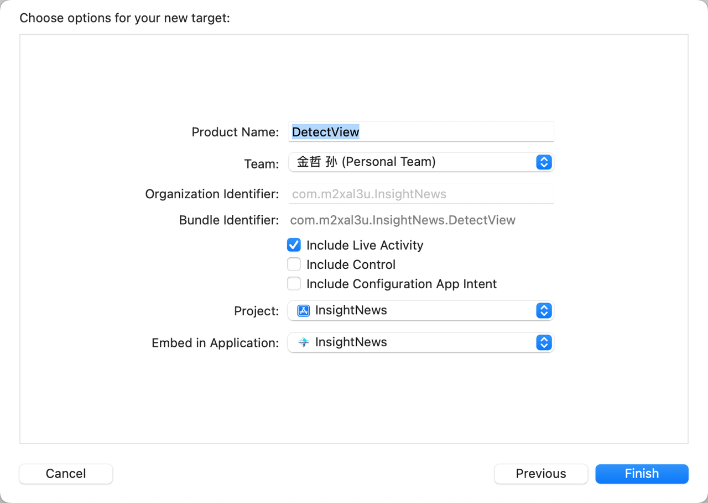

咕咕咕，有空就写

本文档更新日期为 2025.9.30

***

## 简单开发

### 灵动岛布局

**首先**我们应该先了解苹果官方对灵动岛的布局限定，对于移动端的大家其实不太需要看官方的设计文档，但是灵动岛这东西不太一样，他有官方给出指定的布局空间不能那么随心所欲。（而且多看看设计规范可以拷打你们的UI）

我们先了解灵动岛的三种形态：

#### Compact Presentation

#### Minimal Presentation

#### Expanded Presentation

了解完灵动岛的三种形态后也了解下对应的\*\*约束\*\*（设计规范）【英文比较差怕翻译有问题大家看英文吧】

* **Avoid Overcrowding:** Don’t overcrowd the Live Activity with too much information. Keep it concise and focus on the most relevant data to ensure clarity and a good user experience.

* **Content Alignment**: When designing Live Activities, make sure content is properly aligned and visually balanced around the camera area (in the compact and expanded presentations) to avoid misalignment.

* **Image Asset Size**: The image used in a Live Activity must fit within the size limits of the presentation for the device. If the image is too large, the system may not start the Live Activity. For example, an image for the minimal presentation should not exceed \*\*45x36.67 points\*\*.

* **Duration of Live Activity**: A Live Activity can be active for up to \*\*8 hours\*\*. After this, the system automatically ends it and removes it from the Dynamic Island. However, it will stay on the Lock Screen for up to \*\*4 more hours\*\*, or until manually removed, whichever happens first. This means a Live Activity can remain on the Lock Screen for a maximum of 12 hours.

* **Live Activity Sandbox:** Each Live Activity runs in its own sandbox. Unlike widgets, \*\*it can't access the network or receive location updates\*\*. If you need to update the data, use ActivityKit in your app or allow the Live Activity to receive push notifications through ActivityKit\*\*.\*\*

* **Minimal Distractions:** Since Live Activities are meant to provide quick, glanceable information, avoid cluttering them with non-essential details. Stick to only the most important and up-to-date data that users need to see at a glance.

* **Data size limit**: The combined size of static and dynamic data for a Live Activity, including data for ActivityKit updates and ActivityKit push notifications, cannot exceed \*\*4 KB\*\*. Keep the data within this limit to ensure proper functionality and smooth performance of your Live Activity.

##### SOSD WARNING

需要说明的一点是我在 iPhone15PM 的机型上运行的灵动岛填充图片超过了\*\*45x36.67 points\*\*的限定为\*\*42x42 points\*\* 仍可正常运行，不知小屏幕型号能不能正常运行。

### 准备工作

在项目打开后，左上角的 File -> New -> Target -> Widget Extension

这时候你项目的列表中会出现 DetectView 文件夹，你需要知道的是Target 和你之前 SwiftUI 并不属于一个框架内的东西，所以所有的数据都不可以直接共享，如果要做数据共享的话最好是把需要共享的数据迁移为Share Extension，然后在各个文件中引入，否则会报错。

在DetectViewLiveActivity 中记得把你的项目添加上

并且记得把你的 Info 文件中添加Supports Live Activities 变量改为 YES

在接下来的正式开始之前，我们应该了解一下灵动岛的实现逻辑。在 iOS16 的时候新增的ActivityKit允许用户可以在锁屏界面上看到实时的信息而不需要打开软件，但是当时是刘海屏所以灵动岛并没有出现，在 2022年9月发布的  iPhone14Pro 和 14PM 上才出现了灵动岛，所以灵动岛实际上是实时活动的扩展，目的是为了方便用户不用打开 App 也能看到数据。

### 开始搭建

咕咕咕～

***

## 课程参考

[官方设计规范](https://developer.apple.com/documentation/activitykit/displaying-live-data-with-live-activities)

[搭建教程](https://canopas.com/integrating-live-activity-and-dynamic-island-in-i-os-a-complete-guide?issue=057\&utm_source=fatbobman+weekly+issue+57\&utm_medium=email\&utm_campaign=fatbobman+weekly)

[上岛！SwiftUI开发，让APP成功登陆灵动岛](https://www.bilibili.com/video/BV1fM4m197ji/?share_source=copy_web\&vd_source=c6a723508cc0ef4681ea70fa6a67b1d2)

## 贡献者

  <!-- 贡献者 1 -->    
  

    
    
<a href="https://github.com/muxia23" target="_blank">孙金哲</a>

  

