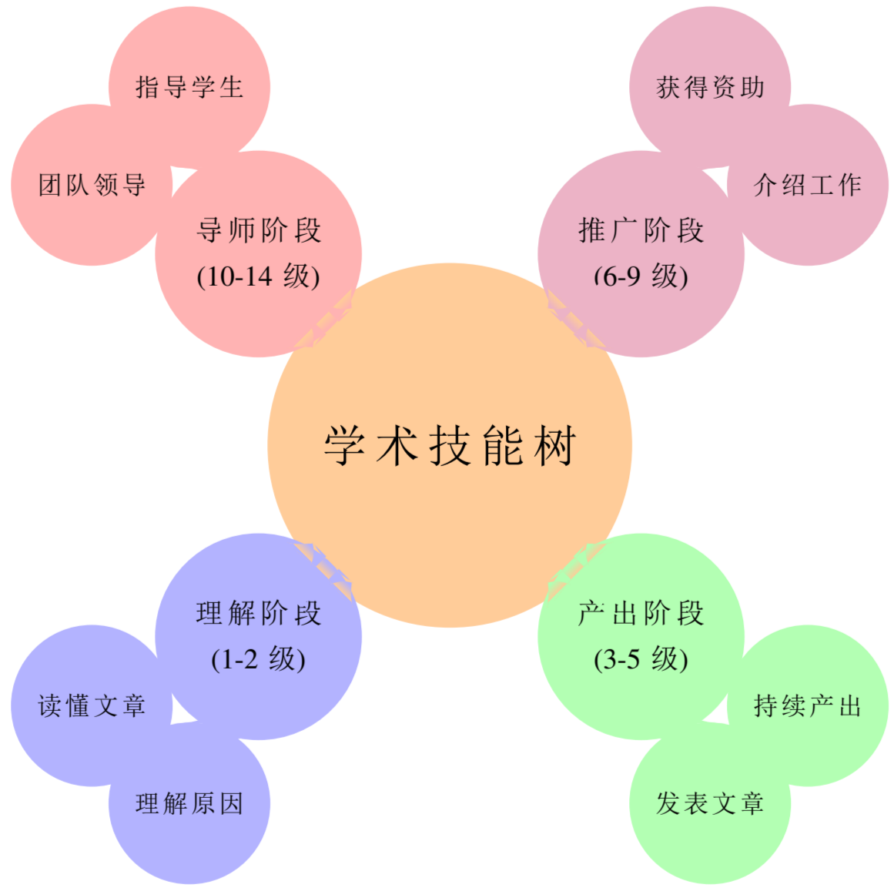

> AI-NLP组本次考核任务将全部使用Markdown（点击此处查看[什么是Markdown](https://markdown.com.cn/)）格式进行记录，最终提交结果为Markdown输出的pdf版本，请在2025年10月10日22时前发送已完成内容至2131693324@qq.com并命名为【二轮考核任务】学号\_姓名，再次提醒：考核任务不是必须每一项都完成，我们将从任务完成深度与广度共同评价你的进度！
>
> 在开始后文的阅读之前，我们希望你先阅读一下这两篇文章，这非！常！重！要！
>
> * [科研劝退信](https://jyywiki.cn/Letter.md)
>
> * [提问的智慧](https://github.com/ryanhanwu/How-To-Ask-Questions-The-Smart-Way/blob/main/README-zh_CN.md)

> AI-NLP组欢迎所有零基础的同学，但我们不提供基础（指python基础语法、开源库doc之类的）的自学路线，因为对当今的AI技术来说，每个人都是零基础，每个人又都拥有比前人都深厚的基础。我们希望大家接受并快速适应用到什么学习什么的学习模式。
>
> 你可以通过类似这样的prompt，让LLM成为你真正的老师：
>
> > 我是一名计算机专业的大二/大一本科生，目前没有计算机学习基础/简单学过一些c语法（学到了xx）/有丰富的计算机算法竞赛经验，曾经使用c语言参加过ioi竞赛并获xx，我希望了解xx语言/xx开源库/xx框架的大体内容，请你为我列出一份目录。
>
> > 我了解到xx语言/xx开源库/xx框架的大体内容有：#此处可copy刚刚得到的答案
> >
> > 我希望在xx天/xx月内完成对xx语言/xx开源库/xx框架的基本学习，请你为我列出一份具体时间表和TODO LIST
>
> > 我希望你以引导式的方式指导我的学习，具体来说分为三个步骤：
> >
> > 1. 先为我总结对应部分的知识点并给出例题
> >
> > 2. 在我确认知识点学习完毕后再给我对应的例题题目（注意此时不要给我答案）
> >
> > 3. 当我完成作答后，我将返回我的答案，请你评判正误并给出解析
>
> 当然，你也可以使用多agent协同、自建rag强化、搜索引擎api补充等方式丰富你的LLM老师的能力
>
> 这些方式将帮助你快速学习一门课程、一种语言、一个开源项目，对于AI领域来说，现在应当是摒弃书籍、视频资源，积极拥抱文本资料(paper、blog、social media...)的时代。
>
> 学会`用到什么学什么`将成为在大学乃至未来研究生生涯中，最为宝贵的一课。

> AI-NLP组提醒您：思考是通往真理的阶梯。

# 一、前语

> 我认为研究本就充满了挫折、失败和沮丧。实际上，它包含了你能想到的所有负面词汇，这就是事实。如果你没有经历过这些，那意味着你并没有进行最好的研究。——Kaiming He

恭喜🎉各位通过一面的筛选，开始了二面前的短期考核，在这里我们将开始一段真正成为AI-NLP组考核成员的必经之路。

在前语部分，我将结合学界工业界前沿观点，从我的视角介绍什么是AI、如何成为一名研究者、AI-NLP组的培养规划、计算机本科培养中不教但是不得不学的东西。

如果你已看完本部分想直接做考核，请转至Step1，如果尚未看完本部分，请务必看完本部分之后再开始考核，这将帮助你判断自己是否真正适合AI-NLP组，如想在二面前退出，请在2025年10月10日22时前发送邮件至2131693324@qq.com并命名主题为：【二轮考核放弃】学号\_姓名，并在正文中说明理由，以方便我们进行统计。

请注意，考核任务不是必须每一项都完成，我们将从任务完成深度与广度共同评价你的进度！

> AI-NLP组提醒您：思考是通往真理的阶梯。

## 1、什么是AI

AI（Artificial Intelligence，即人工智能）是当前的前沿计算机技术，可能看到本篇考核内容的各位对[CNN](https://arxiv.org/pdf/1511.08458)、[RNN](https://arxiv.org/pdf/1808.03314)，或者更进一步的[YOLO](https://arxiv.org/pdf/1506.02640)等模型会有初步的了解，但事实上，他们都是上一个时代的产物，因为当今的人工智能领域，特别是大语言模型，几乎完全由一种名为Transformer的架构所主导，这种架构已经取代了CNN和RNN在许多任务中的地位。

当前业界普遍认为，AI技术体系主要由三个部分组成，即算法、算力和数据，这三者是人工智能发展的三大支柱，相互依存、相互促进，共同推动了人工智能技术的进步和应用的拓展。

AI算法的产生起源于20世纪50年代，英国数学家艾伦·图灵提出了“图灵测试”来判断机器是否具有智能，随后在1956年的达特茅斯会议上，“人工智能”这一术语被正式提出，催生了早期的研究和算法。AI算法的重要转折是Google的《[Attention is all you need](https://arxiv.org/pdf/1706.03762)》，这篇论文指出其提出了一种全新的、仅基于注意力机制的简单网络架构——Transformer，完全摒弃了循环和卷积。从而掀起了一场AI领域的革命，Transformer架构凭借其并行计算能力和对长距离依赖关系的出色捕捉，迅速成为自然语言处理乃至更多AI领域的主流模型。在此基础上LLM、VLM、DiT等技术开始蓬勃发展，因为Transformer架构的可扩展性使其非常适合构建拥有数千亿甚至万亿参数的大规模模型。

随着算法拓展和模型深度的增加，算力需求开始急剧攀升，根据OpenAI的测算，自2012年以来，全球AI训练所用的计算量呈现指数级增长，平均每3.43个月便会翻一倍。

人类互联网的数据宝库看似取之不尽，但随着OpenAI团队在GPT系列上由于数据不足而训练受挫、DeepSeek在某些字符上表现出的bug，说明数据收集和数据清洗也成为了当前大模型发展的数据瓶颈。高质量数据的稀缺已经成为限制大语言模型能力提升的关键瓶颈。研究预测，到2028年左右，可用于训练AI模型的高质量数据可能会被耗尽，为了解决数据短缺问题，学界和工业界也正在探索使用合成数据等新的解决方案。

在算法、算力、数据上的异同，导致各个团队（中美是毫无疑问的引领AI浪潮的主力，我们以两国团队的整体方向为例，引自Jingyuan Liu）走向了不同的AI发展道路：

| 特征     | 美国AI实验室                | 中国AI实验室                                                   |
| ------ | ---------------------- | --------------------------------------------------------- |
| **算力** | 拥有大量GPU，能够进行更大规模的浮点运算。 | GPU资源非常有限 (例如，月之暗面在4k GPU上训练K2模型，DeepSeek在2k GPU上训练V3模型)。 |
| **算法** |                        |                                                           |
| **数据** | 认为数据和优化比模型架构更重要。       | 相比于数据的数量，更关心数据的质量。                                        |

总而言之，由于计算资源上的巨大差异，中美两国的AI研发团队展现出了不同的技术路径和价值观。

* **美国实验室**凭借其强大的算力优势，得以进行超大规模的计算，因此他们更加关注如何确保这些大规模训练的稳定性和可预测性，并将重点放在数据和优化上，倾向于相信用更多的数据和更强的优化可以带来更好的结果。

* **中国实验室**则因为算力资源受限，必须在有限的条件下寻求突破。这促使我们更加注重算法和模型架构本身的创新，致力于提升模型效率和token利用率，并在训练初期就考虑未来的推理成本。我们将更多的精力投入到数据质量的精细化运营上，试图用更高质量的数据来弥补算力的不足。

> - 如果你是大二及以上的同学，这将是你的第一个考核问题：
>
>   * 请给出你认为的Transformer架构的主要优势及问题，你可以给出很多答案，但我们希望你最终可以选出你认为的Transformer的一个最主要优势和一个最主要问题。
>
> - 如果你是大一的同学，请你在Step2中完成对上方问题的思考，无需在此处完成。
>
> 你当然可以选择询问LLM（这也是我们在所有任务、所有项目中鼓励的），但你也必须做好在二面时我们就你的回答做进一步询问的准备。运用AI是高效的，依赖AI是致命的。

成也萧何败也萧何，transformer缔造了AI辉煌时代，但transformer也限制了AI的进一步发展，包括AGI（Artificial General Intelligence，通用人工智能）。

我们希望通过你对Transformer的了解与反思，真正明白当代的AI究竟在实现什么，究竟在讲什么故事，最终尝试理解业界前沿对AI实现的改进。

> AI-NLP组再次提醒您：思考是通往真理的阶梯。

## 2、如何成为一名研究者

AI领域同传统的计算机领域不同，甚至说当代的AI领域（基于Transfomer的一系列实现）与传统的AI领域（RNN、CNN等）也有明显不同，*后文所指AI均是指基于Transfomer的一系列实现* ，最主要的区别是：

* 这样一个方兴未艾的领域，不存在长期（甚至一个月）不变的工作，不存在完全成熟的实现和框架，AI的迭代是以一周到一月为单位的，半年没有更新的公司，将远远落后其他公司至少一代。

这一点将大量未经过系统研发训练的、没有时刻跟随业界前沿的、不能持续反思并提出观点的开发者和公司拒之门外。就是说，科研训练是AI研发的必经之路。

***

那么如何成为一名合格的研究者呢？

一般我们认为，一名独立研究者的成长之路，会经过十四个主要阶段：



1. 你看懂了别人的文章。

2. 你知道了别人为什么能发这篇文章。

3) 你自己发表了一篇文章。

4) 你知道了自己为什么能发表这篇文章。

5. 你知道了怎么样能持续不断地发表文章。

6. 你能够介绍自己的工作。

7) 你能够宣传自己的工作。

8) 你能够凭借自己的工作拿到资助。

9. 你能够在资助下，完成自己当初画下的大饼。

10. 你能够指导学生毕业。

11) 你能够指导学生发表和你水准类似的文章。

12) 你能够说服学生接受你的愿景。

13. 你能够真正地培养学生，而不仅仅是使用他们。

14. 你能够领导一个团队，为了一个共同的目标努力。


我们希望通过一个学期到一年的培养，让各位考核成员拥有成体系的、系统化的1-2级能力，真正为参与并完成科研任务奠定基础。

我们将从追随业界热点、学习文献阅读、进行文献管理、定期组会讨论、完成科研调研、认可并反思现有实现、生产与验证简单的idea、动手实现完整Transformer等多角度让考核成员完成完备的科研训练。

同时，我们将用同期竞赛让考核成员完成从科研到项目，从学界到工业界的初步接触与转型，你们将从完成项目中学习如何讲好一个故事（这点是重要的、甚至可能是最重要的），学习如何在上层AI Agent领域中用前期所学原理与前沿科研视角发掘项目闪光点、打出差异化优势。

在完成考核之后，我们将择优选取考核成员成为正式成员，并真正开始向学界、工业界最前沿课题的冲刺，正式成员将大概率获得优质的算力资源、专业的科研指导、一流的合作机会，我们希望由此可以为各位培养起3-5级的能力，为各位的硕士生、博士生生涯做好完备且先进的前期准备。

> * 现在，这是第一个正式的考核问题（如果你是大二及以上的同学，这将是你的第二个考核问题）：
>
>   * 请寻找并总结追随业界热点、学习文献阅读、进行文献管理、定期组会讨论、完成科研调研、认可并反思现有实现、生产与验证简单的idea等科研关键步骤中的方法与工具，这将拓展你对如何做科研的认识。（当然我们组不一定会和你所寻找到的方法做的一致，我们也希望你在考核过程中提出建议帮助我们改进）
>
> 我们再次鼓励同学们使用LLM，但请务必有自己的思考，我们将询问你对找到的方法的看法，以及如何使用你找到的工具的想法。运用AI是高效的，依赖AI是致命的。

## 3、AI-NLP组的培养规划

想必各位在一轮面试中，都简要了解过了我们的基本培养规划：

1. 对于大二的同学，我们希望尽量在一学期（或尽可能短的时间内），完成基本的科研训练，并尽快转为生产力实现。

2. 对于大一的同学，我们希望在至少一学年的时间内，对各位考核成员进行较为完善的科研训练，当然一年的时间长度对于科研工作来说不长不短，我们将把中心仍旧放在培养考核成员基本的调研、理解、反思能力上，并期望各位能在大二学年或大一参加的竞赛中，将其转变为生产力。


具体而言，我们的培养将由三部分组成：

1. 例行组会

组会的目的有两个：`对齐进度`、`研讨论文`，我们将在确定考核成员后，以两周为固定周期，进行组会的召开。本学期预计将召开4-6次组会，每次组会预计2-3小时。当然，我们非常欢迎在组会后或两次组会间的探讨与交流（事实上，实际科研中的组会也是提出问题并集中讨论下一步做法的时间，一般性问题和非idea错误都会在两人或多人小会中解决，沟通也是科研的重要一环）。

两次组会之间，将留给各位完成我们的考核任务与调研任务的时间。这些时间是否真的被有效利用了，将在组会的进度汇报中被展示（当然，我们再次鼓励各位使用LLM加速你们的学习进度，也要再次提醒：运用AI是高效的，依赖AI是致命的。我们希望你真的有在思考并消化LLM提供给你的内容，并且有能力在组会的技术质疑中给出能说服别人的答案）。


* 文献阅读

我们目前预计将从我们组正在主攻的，或较为热门的AI技术领域中，选取三个主要话题（目前确定必然包含RL相关话题），作为课题调研的中轴，以1篇优质综述+多篇热点文章的形式，培养各位考核成员对英文文献、顶刊顶会（计算机领域主要是顶会）、技术报告的基本阅读能力，找出学界业界关心的焦点是什么？亟待解决的问题是什么？目前工作实现的优缺点是什么？可能的改进方向是什么？这些问题将在组会或平时中被讨论，我们欢迎讨论，讨论是打开真理的钥匙，思考是通往真理的阶梯。

当然，如果你对某个工作研究的足够透彻，相关的领域文章也基本了解之后，你将会发现有一些idea会自然而然的生发，如果你确信你的idea可能有效，且在学界中没有人在这方面做出工作（当然一般可能是早就被人做过了笑死，这就需要你进行充分且细致的工作前期调研），你可以详细告知组长你的实验方案和idea，如果可行的话，我们也将为你提供一些算力来验证你的猜想，并期待你完成属于你自己的工作。


* 工程实现

这部分内容我们将主要参考[happy-llm](https://github.com/datawhalechina/happy-llm)的教程内容，并进行一些改进，希望让各位同学在从头手搓一个transformer LLM的过程中，理解当代AI实现中最为基础也是最为重要的部分，从而进一步为各位理解后续各个论文的开源代码或框架实现奠定基础。

当然，除了实现transformer的这部分对于原理的探索，我们还将聚焦SOSD的特色内容，即各个同期竞赛，我们希望各位对于当代AI的理解和对前沿技术的实现的理解，能够为各位考核成员在参加比赛中提供助力，真正让评委看到其他队伍做不到的实现、讲不出来的故事、看不到的技术前景，这些将为各位的比赛项目提供制胜法宝。

## 4、Step 0: 计算机本科培养中不教但是不得不学的东西

这个标题并非是我危言耸听，实际上这是MIT的[The Missing Semester of Your CS Education](https://missing-semester-cn.github.io/)的课程中表达出的核心观点：大学里的计算机课程通常专注于讲授从操作系统到机器学习这些学院派的课程或主题，而对于如何精通工具这一主题则往往会留给学生自行探索。

这点极大损害了学生对于团队协作、版本控制等基本能力的了解与培养进程，我们很难想象，一个计算机专业学生在本科毕业加入团队后，居然无法使用git和团队进行协作，也不能通过ssh在linux生产环境中进行代码编写，但这确实是普遍发生的现象。

我们希望所有参加AI-NLP组考核的同学都能对基本工具的使用有充分的了解，使其成为你的生产力的助力而非阻碍，我们希望你至少能够完成对以下五个内容的基本掌握：

当然，其中有一些内容你可能并不认同，比如你可能觉得vim在ai时代早已过时，诸如此类，但是我们希望你对这些工具能够有最基本的了解，并在后续工作中熟悉他们的使用。

> 如果你是Windows 用户，请在[WSL](https://learn.microsoft.com/zh-cn/windows/wsl/)中完成下方任务
>
> 如果你是Mac用户，你的终端实现将与教程没有什么本质不同
>
> 如果你是Linux用户，那你将非常容易完成以下的任务

> * 考核任务二（我们以后任务序号将对齐大一同学顺序）：
>
>   * 请你完成对shell、vim、命令行环境、git的基本入门，我们不限制你的操作（事实上，完成一遍教程的流程就很好），但我们有如下限制：
>
>     * 请务必将你的机器重命名（或单开一个非管理员用户）为你的学号（即命令行终端开头应该不是root，而是10250000之类的学号）
>
>     * 你的结果应当截图（绝不应该拍屏）并插入markdown文档，配合少量文字说明
>
>     * 你提交的所有连接（如你尝试创建的github仓库的连接），都应该真实可访问，不应有任何权限问题
>
> 再次提醒：运用AI是高效的，依赖AI是致命的。

# 二、Step 1：最简单&最复杂——环境配置

如果你到达了这里，那你应该至少阅读完毕了之前的前语内容至少一遍，并做好了真正探索AI世界的准备，我们将从尝试从环境配置开始，完成这个最简单也是最复杂的部分。


我们将帮助你实现从安装cuda驱动和cuda toolkit，到完成pytorch环境的安装


你需要：

* 一台拥有 NVIDIA GPU 的计算机（如果笔记本没有独立显卡或显卡不是NVIDIA GPU，可以考虑从[autodl](https://www.autodl.com)租赁最为便宜的显卡）。

* 稳定的互联网连接（如遇到网络问题，可以考虑使用[清华源](https://mirrors.tuna.tsinghua.edu.cn/)）。


请按照以下步骤进行操作，并认真思考每一步引导问题的答案，它们将帮助你理解为什么要这么做（如果你的电脑或租赁的服务器已经拥有了NVIDIA 驱动程序和CUDA Toolkit，甚至是pytorch，请你直接在markdown文件中报告他们在你系统中的版本并回答步骤中的思考问题，同时通过验证测试即可）


**步骤 1：检查NVIDIA 驱动程序**

* **任务：** 确认你的 GPU 型号，并安装或更新至合适的 NVIDIA 驱动程序。

* **操作指引：**

  1. 打开命令提示符（Windows）或终端（Linux）。

  2. 输入命令 `nvidia-smi` 并回车。

* **引导与思考：**

  * **如果命令成功执行：** 代表你已经安装了驱动。请记录下输出信息中的 `Driver Version` 和 `CUDA Version`。这个 `CUDA Version` 是你的驱动最高支持的版本，不代表你已经安装了该版本的 CUDA Toolkit。

  * **如果命令提示不存在：** 这意味着你没有安装 NVIDIA 驱动。你需要访问 [NVIDIA 官方驱动下载页面](https://www.nvidia.cn/drivers/lookup/)，根据你的 GPU 型号和操作系统下载并安装。

  * **问题：** `nvidia-smi` 命令告诉了我们哪些关于 GPU 的关键信息？


**步骤 2：安装 CUDA Toolkit**

CUDA 是连接你的 GPU 和 PyTorch 的桥梁。PyTorch 需要特定版本的 CUDA Toolkit 才能在 GPU 上运行。

* **任务：** 访问 PyTorch 官网，确定当前稳定版 PyTorch 所推荐的 CUDA 版本，并下载安装。

* **操作指引：**

  1. 访问 [PyTorch 官网的安装页面](https://pytorch.org/get-started/locally/)。

  2. 在页面下方的 "Compute Platform" 选项中，查看推荐的 CUDA 版本（例如 CUDA 11.8 或 CUDA 12.1）。

  3) 请确保你在上一步中看到的驱动支持的 `CUDA Version` **大于或等于** PyTorch 推荐的版本。

  4) 访问 [NVIDIA CUDA Toolkit 归档页面](https://developer.nvidia.com/cuda-toolkit-archive) 下载并安装对应版本的 CUDA Toolkit。

* **引导与思考：**

  * **问题 1：** 为什么我们不能随意安装最新版的 CUDA Toolkit？PyTorch 和 CUDA 的版本之间是什么关系？

  * **问题 2：** 安装 CUDA Toolkit 的过程中，是否需要同时安装它捆绑的驱动程序？（提示：如果你的现有驱动更新，通常可以取消勾选）


**步骤 3：创建Python 虚拟环境**

为了不污染你系统的 Python 环境，并确保项目依赖的纯净，我们将为本次考核创建一个独立的虚拟环境。

* **任务：** 使用 `venv` 或 `conda` 创建并激活一个新的 Python 虚拟环境。

* **操作指引（以 venv 为例，[conda](https://docs.conda.io/en/latest/)和[miniconda](https://www.anaconda.com/docs/getting-started/miniconda/main)请自行探索）：**

  ```bash
  # 1. 在你的工作目录下创建一个名为 my_pytorch_env 的虚拟环境
  python -m venv my_pytorch_env

  # 2. 激活虚拟环境
  # Windows:
  my_pytorch_env\Scripts\activate
  # Linux/macOS:
  source my_pytorch_env/bin/activate
  ```

* **引导与思考：**

  * **问题：** 激活虚拟环境后，终端提示符发生了什么变化？这代表了什么？


**步骤 4：安装PyTorch**

* **任务：** 在已激活的虚拟环境中，使用 `pip` 安装与你的 CUDA 版本相匹配的 PyTorch。

* **操作指引：**

  1. 再次访问 [PyTorch 官网的安装页面](https://pytorch.org/get-started/locally/)。

  2. 选择 `Stable`（稳定版）、你的操作系统、`Pip`、`Python` 以及你安装的 `CUDA` 版本。

  3) 网站会自动生成一行安装命令，类似 `pip3 install torch torchvision torchaudio --index-url https://download.pytorch.org/whl/cu118`。

  4) 复制这行命令，在你的虚拟环境终端中执行。

* **引导与思考：**

  * **问题：** 对比 CPU 版本的 PyTorch 安装命令，GPU 版本的命令有什么关键区别？这个区别如何确保你安装的是正确的版本？


**四、 编写验证脚本**


环境配置是否成功，需要代码来检验。请新建一个名为 `verify_pytorch.py` 的文件，并将以下代码粘贴进去。

**`verify_pytorch.py`**

```python
import torch
import sys

def verify():
    """
    一个用于验证 PyTorch GPU 环境是否配置成功的函数。
    """
    print("--- PyTorch 环境验证开始 ---")
    print(f"Python 版本: {sys.version}")
    print(f"PyTorch 版本: {torch.__version__}")

    # 核心检查：CUDA 是否被 PyTorch 检测到
    is_cuda_available = torch.cuda.is_available()
    print(f"\nCUDA 是否可用: {'是' if is_cuda_available else '否'}")

    if is_cuda_available:
        # 如果可用，则打印更详细的 GPU 信息
        gpu_count = torch.cuda.device_count()
        print(f"检测到的 GPU 数量: {gpu_count}")
        
        current_gpu_id = torch.cuda.current_device()
        current_gpu_name = torch.cuda.get_device_name(current_gpu_id)
        print(f"当前默认 GPU (ID: {current_gpu_id}): {current_gpu_name}")

        # 创建一个简单的张量并移动到 GPU
        try:
            tensor_cpu = torch.randn(3, 3)
            print(f"\n在 CPU 上创建了一个tensor: \n{tensor_cpu}")
            tensor_gpu = tensor_cpu.to("cuda")
            print(f"已成功将tensor移动到 GPU ({tensor_gpu.device}): \n{tensor_gpu}")
            print("\n你的 PyTorch GPU 环境已成功配置！")
        except Exception as e:
            print(f"在尝试使用 GPU 时发生错误: {e}")
    else:
        # 如果不可用，提供排查建议
        print("\n[排查建议]:")
        print("1. 确认 NVIDIA 驱动已正确安装 (可运行 `nvidia-smi` 命令检查)。")
        print("2. 确认已安装了与 PyTorch 版本兼容的 CUDA Toolkit。")
        print("3. 确认你安装 PyTorch 时，使用的是带有 CUDA 后缀的命令 (例如, ...whl/cu118)，而不是 CPU 版本。")
        print("   如果安装错误，请先卸载 (`pip uninstall torch`) 再重新安装正确的版本。")

    print("--- 验证结束 ---")

if __name__ == "__main__":
    verify()
```

> * 考核任务三：
>
> 请你在markdown文件中写入以下两部分：
>
> 1. **环境配置报告：**
>
>    * 你的 GPU 型号、NVIDIA 驱动版本。
>
>    * 你安装的 CUDA Toolkit 的具体版本号（例如：11.8）。
>
>    * 你安装的 PyTorch 的具体版本号。
>
>    * 在配置过程中，你遇到了哪些挑战？你是如何通过查阅资料解决的？（简要描述即可）
>
> 2. **成功运行截图：**
>
>    * 在激活了虚拟环境的终端中，运行 `python verify_pytorch.py`。
>
>    * 将显示 **“你的 PyTorch GPU 环境已成功配置！”** 的完整终端界面截图并放入markdown文件。
>
> 再次提醒：运用AI是高效的，依赖AI是致命的。


> 现在，你已经完成了二面考核的第一部分，这部分主要是向你介绍AI-NLP组，并希望大家开始思考，并完成对一些基本工具、环境配置的了解与熟悉，为我们的第二部分做准备


# 三、Step 2：Attention is all you need

> Reference: [Attention is all you need](https://arxiv.org/pdf/1706.03762)

> 如何精读一篇文献
>
> 文献精读是科研开始时的必修课，没有大量阅读很难有实现研究目标的方法，没有大量批判性阅读很难产生前人未做过的、确实有实际成效的idea。
>
> 那么如何进行文献阅读呢？
>
> 一般我们认为精读一篇文献可以从以下七个方面着手：
>
> 1. 核心问题 (The Major Question)
>
>    * **目标**：精准识别并提炼出论文试图解决的最核心的科学问题或工程挑战。
>
>    * **摘要**：一篇优秀论文通常聚焦于一个明确、具体且有价值的问题。这个问题是贯穿全文的主线，定义了研究的边界。准确把握核心问题是理解作者研究动机和后续所有论证的前提。
>
> 2. 问题的重要性 (The Importance)
>
>    * **目标**：评估该核心问题在学术或实践领域的重要性。
>
>    * **摘要**：分析该问题为何值得研究。它是否是该领域长期悬而未决的难题？解决它是否能带来理论或技术的突破？评估其重要性有助于判断研究的潜在影响力及其对知识体系的贡献。
>
> 3. 研究背景 (The Background)
>
>    * **目标**：理解论文所处的学术上下文（state-of-the-art）。
>
>    * **摘要**：通过文献综述，了解该领域在论文发表前的研究现状。明确该研究建立在何种理论和技术基础之上，并识别出作者具体试图填补的知识空白（knowledge gap）。
>
> 4. 解决方案/研究方法 (The Approach)
>
>    * **目标**：深度分析作者为解决核心问题所采用的具体路径。
>
>    * **摘要**：详细梳理作者提出的理论模型、关键算法、实验设计或解决方案。关键在于理解“为什么这么做”，审视其方法论的细节、关键假设和创新点，这是评估研究可靠性的核心。
>
> 5. 主要结论 (The Conclusion)
>
>    * **目标**：清晰、准确地概括论文最终得出的核心观点。
>
>    * **摘要**：结论应是对引言中所提“核心问题”的直接回答，是研究成果的凝练。需注意区分客观的“结果”（results）与作者基于结果提炼出的主观“结论”（conclusion）。
>
> 6. 结论的支持度 (The Support)
>
>    * **目标**：以批判性思维检验结论的有效性。
>
>    * **摘要**：审慎评估论文提供的证据（数据、实验结果、理论证明）是否充分、有力地支持其结论。检查实验设计的严谨性、数据分析的合理性和论证逻辑的连贯性，并思考是否存在对结果的其他解释。
>
> 7. 未来展望 (The Future)
>
>    * **目标**：基于当前研究进行前瞻性思考。
>
>    * **摘要**：分析该研究存在的局限性、可改进之处，并思考基于此项研究的发现，未来可以探索哪些新的研究方向或问题。这有助于将论文知识融入自己的认知体系，并发现新的研究机遇。
>
> 通过系统性地应用这七个要点，我们可以构建对目标论文全面而深刻的认知。
>
> 当然，从这七个方面入手，完全的阅读和理解一篇文献是极其耗费时间的，一般我们后面只会在要做组会分享的时候这么做，这大概需要花费3-5天的时间去完全搞定一到多篇成体系的文献，不过一开始的精读还是非常有必要的。
>
> 当你阅读文献数量足够多时，尤其是同领域的工作足够多时，基本上可以通过阅读intro和abstract来确定文章的大体内容，并通过速读的方式来了解学界和工业界的前沿热点。

[Attention is all you need](https://arxiv.org/pdf/1706.03762)是一篇经典到不能再经典的论文了，现有的几乎所有sota实现，都或多或少的借鉴并改良了Attention is all you need 中的 transformer架构实现，我们希望通过七步法和设置问题的方式，引导各位精读一篇文献。这篇文献将作为后续考核成员的考核任务的重要基础，我们也希望各位可以在阅读中深入思考现有实现的优劣，进一步拓展去了解transformer架构在更多machine learing领域的应用与实现。

> AI-NLP组提醒您：思考是通往真理的阶梯。

***

我们按照七步法，设计了大约20个循序渐进的问题，希望通过这些问题能帮助大家深度研读《Attention Is All You Need》。这些问题形式多样，包含了概念理解、细节挖掘、伪代码填充、表格填写、简单编程思考和批判性思维等。再次提醒，考核任务不是必须每一项都完成，我们将从任务完成深度与广度共同评价你的进度！

#### **第一部分：核心问题 (What is the major question addressed?)**

**概念入门**：论文标题是“Attention Is All You Need” 。请用你自己的话解释，这个标题本身揭示了作者试图挑战或颠覆当时主流序列模型（sequence transduction models）的哪一个核心思想？

**精准定位**：根据摘要（Abstract）的第一句话，当时在sequence transduction任务中，占主导地位的模型是基于哪两种复杂的神经网络？

**核心论点识别**：阅读摘要和引言（Introduction）后，请用一句话总结：这篇论文提出的“Transformer”模型，其最核心、最具革命性的设计主张是什么？它完全摒弃了（dispensing with ... entirely）什么？

***

#### **第二部分：问题的重要性 (Why is it important?)**

**挖掘动机**：引言中提到，循环神经网络（Recurrent neural networks）具有一种“固有的顺序性”（inherently sequential nature）。这种特性为什么会成为一个“基本限制”（fundamental constraint），尤其是在处理长序列时？&#x20;

**价值评估**：根据摘要和引言，Transformer架构的提出主要带来了哪两个方面的显著优势？

**量化对比**：请根据论文中的**Table 1**，填写下表，直观对比Self-Attention和Recurrent两种网络层在关键特性上的差异。这个表格清晰地揭示了“为什么这个问题很重要”。

***

#### **第三部分：研究背景 (What is the background?)**

**追溯SOTA**：在引言部分，作者指出哪些模型在当时被“牢固地确立为最先进的方法”（firmly established as state of the art approaches）？这帮助我们理解Transformer出现前的技术基线。

**寻找知识空白**：作者提到，在之前的工作中，注意力机制通常是如何与循环网络结合使用的？Transformer与这些先前工作的根本区别在哪里？（提示：见论文第二节末尾）

**了解替代方案**：除了RNN，当时还有哪些模型（如ByteNet, ConvS2S）也试图减少顺序计算？与Transformer相比，它们在处理“远距离依赖”（dependencies between distant positions）问题上有什么样的局限性？

***

#### **第四部分：解决方案/研究方法 (What is the approach?)**

**宏观架构**：请基于**Figure 1** 的结构图，简要描述Transformer的Encoder和Decoder分别由哪些核心组件堆叠而成？（至少说出两个主要子层）

**核心机制（伪代码）**：论文的核心是“Scaled Dot-Product Attention”。请根据公式(1)和**Figure 2 (left)** (19) 的描述，填充下面的伪代码，以理解其计算过程。

```python
def scaled_dot_product_attention(Q, K, V):
  """
  计算缩放点积注意力
  Q: Queries a.k.a 查询矩阵
  K: Keys a.k.a 键矩阵
  V: Values a.k.a 值矩阵
  """
  d_k = K.shape[-1] # key的维度
  # 步骤1: 计算Q和K的点积
  scores = # ??? (提示: 矩阵乘法)
  # 步骤2: 进行缩放
  scaled_scores = scores / # ??? (提示: 使用d_k的平方根)
  # 步骤3: 应用Softmax获得注意力权重
  attention_weights = softmax(scaled_scores, axis=-1)

  # 步骤4: 用权重对V进行加权求和
  output = # ??? (提示: 矩阵乘法)return output, attention_weights
```

**设计巧思**：作者为什么不只用一个大的Attention，而是要设计“Multi-Head Attention”？根据3.2.2节的描述，这种设计允许模型做什么，解决了单一注意力机制的什么潜在问题？

**关键细节**：由于模型没有循环结构，作者引入了“Positional Encoding”来提供位置信息。你能否尝试用`numpy`或`torch`写出一个简单的函数 `get_positional_encoding(pos, d_model)` 的框架，它能根据公式(3.5节)计算出给定位置`pos`上的`d_model`维编码向量？（无需完美实现，旨在理解其数学原理）

**组件功能**：在Encoder和Decoder的每一层中，除了注意力子层，还有一个“Position-wise Feed-Forward Network”。它的具体结构是怎样的？为什么它被称为“Position-wise”？

***

#### **第五部分：主要结论 (What is the conclusion?)**

**核心成果**：根据**Table 2**，在WMT 2014英德翻译任务上，Transformer (big) 模型取得了多少BLEU分？这一分数相比于之前的最佳模型（包括集成模型）有何突破？

**成果泛化**：为了证明模型的泛化能力，作者还将Transformer应用到了哪个不同的NLP任务上？结果如何？

***

#### **第六部分：结论的支持度 (Is the conclusion supported by the results?)**

**消融实验**：分析**Table 3**，当注意力头（h）的数量从8个减少到1个时，BLEU分数发生了什么变化？这个结果如何强有力地支持了Multi-Head设计的有效性？

**参数敏感性**：观察**Table 3**中的(B)组实验，当把key的维度`d_k`减小时，模型质量受到了怎样的影响？ 这说明了什么？

**批判性思考**：作者在**Table 2**中对比了不同模型的训练成本。你认为他们估算训练成本的方法（FLOPS）是否足够公允？在比较不同团队、不同时期的模型训练成本时，是否存在一些潜在的干扰因素？

***

#### **第七部分：未来展望 (What can be done in the future?)**

**作者的蓝图**：在论文的结论（Conclusion）部分，作者明确提出了哪些未来工作的计划？（至少列举两项）

**思考局限**：Self-Attention的计算复杂度与序列长度n是什么关系？（见Table 1）这暗示了Transformer在处理极长序列（如整本书）时会遇到什么瓶颈？作者对此有什么初步设想？

**连接现在**：这篇论文发表于2017年。结合你对当前AI发展的了解，作者在文末所期待的“基于注意力的模型的未来” 是如何成为现实的？请举一个该论文发表后，基于Transformer架构并取得巨大成功的领域及模型。


> 以上就是二面考核part2的全部内容，当然，这些问题通过llm都可以轻松解决，我们非常鼓励你善用并多用llm解决任何科研中的任何问题，有的时候同llm对话也是一种产生idea的好方法。
>
> 但是请注意，这些问题的答案将仅作为你完成二面考核任务进度上的参考，我们将在面试时重点考察你next step的思考与调研情况，所以请尽可能广的拓展你的思维面，llm的世界才刚刚为你敞开一条缝隙，如果你确定要走入这条路，那么你终将拓宽人类的认知边疆。

